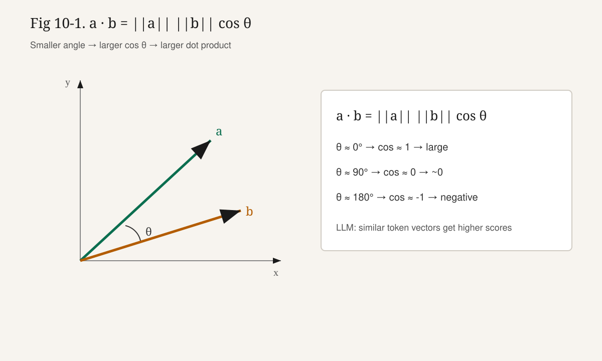

# 10강. 선형대수 기초 — 내적과 행렬곱

## 이번 강에서 배우는 내용

- **Dot Product(내적)**가 무엇인지, 왜 “유사도”처럼 쓰이는지
- **Matrix Multiplication(행렬곱)**을 작은 숫자로 한 칸씩 계산하는 법
- Linear Layer의 $y = Wx + b$ (또는 $y = xW + b$)
- NumPy / PyTorch에서 `@` 연산자가 하는 일
- Attention의 $QK^\top$가 왜 행렬곱인지

## 왜 중요한가?

딥러닝 연산의 대부분은 결국 한 문장으로 압축됩니다.

```text
곱하고 더한다. (multiply-add)
```

내적은 대응 성분을 곱한 뒤 전부 더합니다.

행렬곱은 그 내적을 표 형태로 늘어놓습니다.

Convolution과 Attention도 구현 깊숙한 곳에서는 거대한 행렬곱(또는 그에 상응하는 연산)으로 돌아갑니다.

GPU가 빠른 이유 중 하나도, 이 규칙적인 곱-합을 병렬로 잘 처리하기 때문입니다.

> **핵심**
>
> 10강을 끝내면 “Embedding 다음의 거의 모든 변환”과 “Attention 점수표”를 같은 언어로 읽을 수 있습니다.

## 선수 개념

- Vector / Matrix / Shape (9강)
- 곱셈과 덧셈
- NumPy 배열 생성 (8강)

아직 필요하지 않은 것:

- 고유값, 행렬식, QR 분해 등 고급 선형대수
- 미분 (11강 이후)

이 책은 LLM에 필요한 선형대수만, **계산 가능한 최소 세트**로 가져갑니다.

## 내적 (Dot Product)

**Dot Product(내적, 스칼라곱)**는 같은 길이의 두 벡터에서, 대응 성분을 곱해 모두 더한 **Scalar** 결과입니다.

$$
\mathbf{a} = [a_1,\ a_2,\ \ldots,\ a_n], \quad
\mathbf{b} = [b_1,\ b_2,\ \ldots,\ b_n]
$$

$$
\mathbf{a} \cdot \mathbf{b}
=
a_1 b_1 + a_2 b_2 + \cdots + a_n b_n
=
\sum_{i=1}^{n} a_i b_i
$$

위 식을 **내적 공식**이라고 부릅니다.

- $\mathbf{a}, \mathbf{b}$: 길이 $n$인 벡터
- $a_i, b_i$: 각 벡터의 $i$번째 성분
- 결과: Scalar 하나

왜 필요한가?

- “두 방향이 얼마나 같은 쪽을 보는가”를 숫자로 요약합니다.
- Embedding 공간에서 비슷한 단어는 내적이 큰 경향이 있습니다.
- 행렬곱의 **한 칸**이 곧 내적입니다.

### 기하 직관

2D에서

$$
\mathbf{a} \cdot \mathbf{b} = \|\mathbf{a}\| \|\mathbf{b}\| \cos \theta
$$

- $\|\mathbf{a}\|$: 벡터 길이(노름)
- $\theta$: 두 벡터 사이 각
- $\cos\theta$: 같은 방향이면 1에 가깝고, 직각이면 0, 반대면 $-1$에 가깝습니다

따라서 내적이 크다 ≈ (길이가 비슷할 때) 방향이 비슷하다.

LLM에서는 고차원이지만, “비슷한 표현끼리 큰 점수”라는 직관은 그대로 써먹습니다.

**그림 10-1. 벡터의 방향과 내적**



> 💡 **팁**
>
> 길이를 1로 맞춘 뒤 내적하면 **코사인 유사도**가 됩니다. 검색·임베딩 비교에서 자주 씁니다.

### 작은 숫자로 계산하기

$$
\mathbf{a} = [1,\ 2], \quad \mathbf{b} = [3,\ 4]
$$

$$
\mathbf{a}\cdot\mathbf{b} = 1\cdot 3 + 2\cdot 4 = 3 + 8 = 11
$$

한 번 더:

$$
\mathbf{u} = [1,\ 0,\ -1], \quad \mathbf{v} = [2,\ 5,\ 2]
$$

$$
\mathbf{u}\cdot\mathbf{v} = 1\cdot 2 + 0\cdot 5 + (-1)\cdot 2 = 0
$$

내적이 0이면 (유클리드 기하에서) 두 벡터는 **직교(orthogonal)** 합니다. “독립적인 방향” 감각입니다.

## 행렬곱 (Matrix Multiplication)

**Matrix Multiplication(행렬곱)**은 두 행렬 $A$, $B$를 규칙에 맞게 합쳐 새 행렬 $C = AB$를 만듭니다.

$$
(AB)_{ik} = \sum_{j} A_{ij} B_{jk}
$$

즉, **$C$의 $(i, k)$ 성분 = $A$의 $i$행과 $B$의 $k$열의 내적**입니다.

Shape 규칙:

```text
A: (m, n)
B: (n, p)
AB: (m, p)
```

가운데 $n$이 같아야 합니다. 다르면 행렬곱 불가입니다.

**그림 10-2. 행렬곱은 행·열 내적**


> ⚠️ **주의**
>
> `(3, 4) @ (3, 2)`는 실패합니다. 가운데 차원이 같아야 합니다.

### 2×2를 한 칸씩

$$
A = \begin{bmatrix} 1 & 2 \\ 3 & 4 \end{bmatrix},
\quad
B = \begin{bmatrix} 5 & 6 \\ 7 & 8 \end{bmatrix}
$$

$$
C_{11} = 1\cdot 5 + 2\cdot 7 = 19
$$

$$
C_{12} = 1\cdot 6 + 2\cdot 8 = 22
$$

$$
C_{21} = 3\cdot 5 + 4\cdot 7 = 43
$$

$$
C_{22} = 3\cdot 6 + 4\cdot 8 = 50
$$

$$
C = \begin{bmatrix} 19 & 22 \\ 43 & 50 \end{bmatrix}
$$

### 행렬 × 벡터

$$
W = \begin{bmatrix} 1 & 2 \\ 3 & 4 \\ 5 & 6 \end{bmatrix}\ (3\times 2),
\quad
\mathbf{x} = \begin{bmatrix} 1 \\ 0 \end{bmatrix}\ (2\times 1)
$$

$$
W\mathbf{x}
=
\begin{bmatrix}
1\cdot 1 + 2\cdot 0 \\
3\cdot 1 + 4\cdot 0 \\
5\cdot 1 + 6\cdot 0
\end{bmatrix}
=
\begin{bmatrix} 1 \\ 3 \\ 5 \end{bmatrix}
$$

해석: $\mathbf{x}=[1,0]^\top$이면 $W$의 **첫 번째 열**이 그대로 출력입니다.

## Linear Layer — $Wx + b$

**Linear Layer(선형층)**의 기본식:

$$
\mathbf{y} = W\mathbf{x} + \mathbf{b}
$$

코드에서는 행벡터 스타일로 자주 이렇게 씁니다.

$$
\mathbf{y} = \mathbf{x} W + \mathbf{b}
$$

이때 $W$의 Shape는 `(d_in, d_out)`입니다. **수식과 코드의 배치만 일치하면 됩니다.**

같은 $W\mathbf{x}=[1,3,5]^\top$에 $\mathbf{b}=[10, 20, 30]^\top$를 더하면

$$
\mathbf{y} = [11,\ 23,\ 35]^\top
$$

왜 필요한가?

- Embedding 조회 다음의 거의 모든 변환이 Linear입니다.
- Attention의 Q/K/V projection, MLP의 두 층, LM Head가 모두 $W$ 곱입니다.

## 행렬곱이 아닌 것들

### 요소별 곱 (Hadamard)

$$
\begin{bmatrix} 1 & 2 \\ 3 & 4 \end{bmatrix}
\odot
\begin{bmatrix} 5 & 6 \\ 7 & 8 \end{bmatrix}
=
\begin{bmatrix} 5 & 12 \\ 21 & 32 \end{bmatrix}
$$

NumPy/PyTorch에서 `*`는 보통 요소별 곱, `@`는 행렬곱입니다.

### 전치 (Transpose)

$$
K^\top:\ \text{행과 열을 바꿈}
$$

Attention 점수 $QK^\top$에서 $^\top$가 바로 이 연산입니다.

## Attention 점수처럼 — $QK^\top$ 미니 버전

토큰 2개, 차원 2:

$$
Q = \begin{bmatrix} 1 & 0 \\ 0 & 1 \end{bmatrix},
\quad
K = \begin{bmatrix} 1 & 2 \\ 3 & 4 \end{bmatrix}
$$

$$
K^\top = \begin{bmatrix} 1 & 3 \\ 2 & 4 \end{bmatrix}
$$

$$
QK^\top
=
\begin{bmatrix}
1 & 3 \\
2 & 4
\end{bmatrix}
$$

해석:

- $(0,0)=1$: 토큰0 쿼리 ↔ 토큰0 키
- $(0,1)=3$: 토큰0 쿼리 ↔ 토큰1 키

이 행렬이 “어디에 주의를 기울일지”의 점수표 초안입니다. (스케일·Softmax는 이후 강의)

> 📘 **심화**
>
> 37강 Dot-Product Attention에서 $QK^\top / \sqrt{d_k}$와 Softmax를 이어서 다룹니다.

## 실습 10-1. NumPy로 내적과 행렬곱

목표: `@`와 `*`의 차이를 숫자로 확인합니다.

```python
# lecture10_numpy_dot_matmul.py
import numpy as np

a = np.array([1.0, 2.0])
b = np.array([3.0, 4.0])
print("dot:", a @ b)          # 11.0
print("dot:", np.dot(a, b))

A = np.array([[1.0, 2.0],
              [3.0, 4.0]])
B = np.array([[5.0, 6.0],
              [7.0, 8.0]])
print("matmul:\n", A @ B)     # [[19,22],[43,50]]
print("hadamard:\n", A * B)   # [[5,12],[21,32]]
```

`a @ b`는 벡터 내적, `A @ B`는 행렬곱, `A * B`는 요소별 곱입니다.

배운 점: **기호 하나로 연산 종류가 갈립니다.** Attention 점수는 항상 `@` 쪽입니다.

## 실습 10-2. PyTorch Linear와 $QK^\top$

목표: `nn.Linear`와 점수 행렬 Shape를 확인합니다.

```python
# lecture10_torch_linear_qk.py
import torch
import torch.nn as nn

x = torch.tensor([[1.0, 0.0]])          # (1, 2) 한 토큰
linear = nn.Linear(2, 3, bias=True)
y = linear(x)
print("y shape:", y.shape)              # (1, 3)

Q = torch.tensor([[1.0, 0.0],
                  [0.0, 1.0]])
K = torch.tensor([[1.0, 2.0],
                  [3.0, 4.0]])
scores = Q @ K.T
print("scores:\n", scores)
print("scores shape:", scores.shape)    # (2, 2)
```

`nn.Linear`는 내부적으로 $xW^\top + b$ 형태(구현 관례)로 곱합니다. Shape만 맞으면 개념은 같습니다.

`Q @ K.T`의 Shape `(T, T)`는 “토큰 × 토큰” 점수표입니다.

## LLM에서는 어디에 사용될까?

토큰은 Embedding Matrix로 고차원 벡터가 됩니다.

그 다음 거의 모든 변환이 Linear($W$ 곱)입니다.

Self-Attention에서는 각 토큰 벡터를 $W_Q, W_K, W_V$로 투영한 뒤,

$$
\mathrm{scores} = QK^\top
$$

로 **토큰 간 관련 점수**를 만듭니다. 이는 내적·행렬곱의 직접 응용입니다.

LM Head도 숨은 상태 $\mathbf{h}\in\mathbb{R}^{d}$에 $(d, V)$ 행렬을 곱해 어휘 크기 logits를 만듭니다.

| 위치 | 연산 | Shape 감각 |
|---|---|---|
| Embedding 조회 | 인덱싱 | `(V, d)`에서 행 선택 |
| Q/K/V projection | Linear | `(T, d) @ (d, d_k)` |
| Attention 점수 | $QK^\top$ | `(T, d_k) @ (d_k, T) → (T, T)` |
| LM Head | Linear | `(d,) → (V,)` |

## 자주 하는 실수

1. `*`와 `@`를 혼동한다 — Attention 점수는 `@`.
2. Shape를 안 보고 곱한다 — 가운데 차원이 같아야 한다.
3. $AB$와 $BA$가 같다고 생각한다 — 일반적으로 다르다.
4. bias 길이를 출력 차원과 다르게 둔다.
5. 배치를 잊고 2D 공식만 외운다 — LLM은 `(B, T, d)` 뒤쪽 축으로 행렬곱한다.

## 핵심 요약

- 벡터는 방향과 크기를 가진다.
- 내적은 대응 성분 곱의 합이며 Scalar를 만든다.
- 행렬곱의 한 칸은 “행·열 내적”이다. Shape는 `(m,n)@(n,p)→(m,p)`.
- Linear Layer는 $y=xW+b$ (또는 $Wx+b$)로 입력을 재표현한다.
- NumPy/PyTorch의 `@`가 이 연산의 기본 도구다.
- Attention의 $QK^\top$는 토큰 간 내적 점수의 행렬이다.

## 용어 사전

| 용어 | 설명 |
|---|---|
| Dot Product (내적) | 대응 성분 곱의 합, Scalar |
| Matrix Multiplication | 행·열 내적으로 새 행렬 생성 |
| Hadamard Product | 요소별 곱 $\odot$ |
| Transpose $^\top$ | 행과 열을 바꿈 |
| Linear Layer | $y = xW + b$ 형태의 변환 |
| Weight $W$ | 학습되는 가중치 행렬 |
| Bias $b$ | 학습되는 편향 벡터 |
| Shape | 텐서의 차원 구조 |
| `@` | NumPy/PyTorch 행렬곱 연산자 |
| $QK^\top$ | Attention 점수(스케일·Softmax 전) |
| Embedding | 토큰을 벡터 공간으로 변환 |
| Orthogonal | 내적이 0인 관계(직교) |

## 연습문제

### 기초

다음 중 행렬곱이 **가능한** Shape 쌍은?

1. `(3, 4)` @ `(4, 2)`
2. `(3, 4)` @ `(3, 2)`
3. `(2, 3, 4)` @ `(4, 5)`

### 계산

$[1, 2]\cdot[2, 3]$을 구하시오.

$$
\begin{bmatrix}1&2\\0&1\end{bmatrix}
\begin{bmatrix}3&0\\1&2\end{bmatrix}
$$

을 손계산하시오.

### 코드

다음 코드의 출력은?

```python
import numpy as np
X = np.array([[1, 2],
              [3, 4]])
W = np.array([[1, 0],
              [0, 1]])
print(X @ W)
print(X * W)
```

### 응용

LM Head가 `(d, V)` 행렬 $W_U$와의 곱이라면, 한 토큰 벡터 $\mathbf{h}\in\mathbb{R}^{d}$에 대해 logits의 Shape와 의미를 설명하시오.

왜 Attention에서 $Q$와 $K$의 **내적**이 “관련 점수”가 될 수 있는지 두 문장으로 설명하시오.

---

## 정답 및 해설

### 기초

1과 3이 가능합니다. 1 → `(3, 2)`. 3은 뒤 두 축 `(3,4)@(4,5)→(2,3,5)` 형태로 해석합니다. 2는 가운데가 달라 실패합니다.

### 계산

$1\cdot 2 + 2\cdot 3 = 8$.

$$
\begin{bmatrix}5&4\\1&2\end{bmatrix}
$$

### 코드

`X @ W`는 단위행렬 곱이므로 `X` 그대로.  
`X * W`는 요소별 곱으로 `[[1, 0], [0, 4]]`.

### 응용

logits Shape는 `(V,)` (배치·시퀀스가 있으면 `(B, T, V)`). 각 성분은 해당 어휘 토큰이 다음에 올 점수(logit)입니다.

내적은 두 벡터가 비슷한 방향일수록(길이가 비슷할 때) 커집니다. 쿼리와 키가 비슷하면 해당 토큰 쌍에 높은 점수가 부여됩니다.

## 다음 강의와 연결

이번 강의에서 “앞으로 계산”을 했습니다.

다음 **11강. 미분과 편미분**에서는 “이 숫자를 조금만 바꾸면 출력이 얼마나 바뀌는가”를 배웁니다.

그 비율이 곧 Gradient로 이어지고, 파라미터가 학습되는 출발점이 됩니다.

> 곱하고 더할 줄 알면, 이제는 기울기를 볼 차례다.

<!-- LECTURE_NAV -->

---

### 강의 이동

- **이전 강:** [9강. Scalar, Vector, Matrix, Tensor](09강_Scalar_Vector_Matrix_Tensor.md)
- **다음 강:** [11강. 미분과 편미분](11강_미분과_편미분.md)

<!-- /LECTURE_NAV -->
