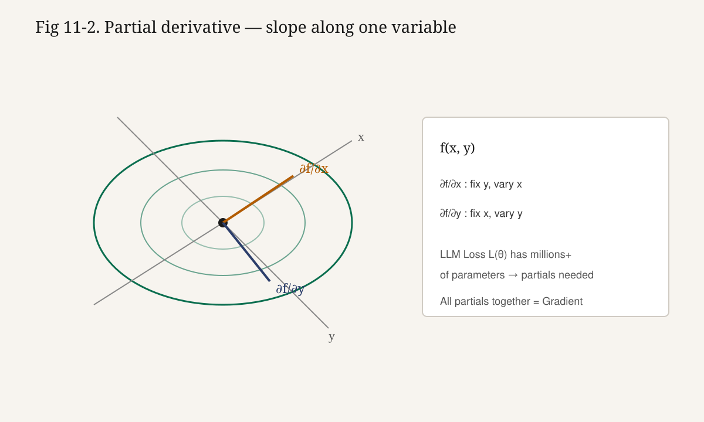

# 11강. 미분과 편미분

## 이번 강에서 배우는 내용

- **Derivative(미분, 도함수)**의 정의식과 기하적 의미
- 기본 미분 공식과 선형성을 손으로 적용하기
- **Partial Derivative(편미분)**의 정의와 다변수 계산
- Loss 곡선에서 미분 부호를 읽고 파라미터를 어느쪽으로 밀지 판단하기
- 수치 미분의 한계와 Autograd 미리보기
- Softmax·Cross Entropy가 “미분 가능”해야 하는 이유와 LLM 학습 연결

## 왜 중요한가?

학습(training)이란 대략 다음입니다.

```text
Loss가 작아지도록 Parameter를 조금 움직인다
```

“어느 방향으로, 얼마나”를 알려면 **Loss가 Parameter에 대해 얼마나 민감한지**를 알아야 합니다.

그 민감도가 바로 미분입니다.

미분을 “공식 암기”로만 지나면, `loss.backward()`가 무엇을 계산하는지 영원히 검게 남습니다.

이번 강의는 그 상자를 엽니다.

입력이 하나면 미분, 입력이 여러 개면 편미분입니다. LLM Parameter는 수백만~수천억 개이므로 실무에서는 거의 항상 편미분의 세계입니다.

> **핵심**
>
> 미분 = 순간 변화율. 편미분 = 여러 파라미터 중 **하나만** 볼 때의 변화율.

## 선수 개념

- 함수 $f(x)$: 입력 $x$를 받아 출력 $f(x)$를 준다
- 일차·이차함수의 그래프 감각
- Scalar / Vector (9강)
- 내적·행렬곱 (10강)

극한의 엄밀한 $\varepsilon$-$\delta$ 정의는 필요하지 않습니다. “$h$를 한없이 작게 만든다”는 직관이면 충분합니다.

---

## 미분 (Derivative)

**Derivative(미분계수/도함수)**는 함수가 어떤 점에서 **순간적으로 얼마나 가파른지**를 나타내는 값입니다.

정의식은 다음과 같습니다.

$$
f'(x) = \lim_{h \to 0} \frac{f(x+h) - f(x)}{h}
$$

위 식을 **미분의 정의식(Difference Quotient의 극한)**이라고 부릅니다.

기호를 하나씩 읽습니다.

- $h$: 아주 작은 입력 변화량
- $f(x+h)-f(x)$: 출력의 변화량
- 분수 $\dfrac{f(x+h)-f(x)}{h}$: “출력 변화 / 입력 변화” = **평균 변화율**
- $h\to 0$: 간격을 한없이 줄여 **순간** 변화율로 만든다
- $f'(x)$: $x$에서의 미분계수. $\dfrac{df}{dx}$와 같은 뜻

왜 필요한가?

- $f'(x)>0$이면 그 근처에서 $x$를 키울 때 $f$도 커집니다.
- $f'(x)<0$이면 $x$를 키울 때 $f$는 작아집니다.
- $|f'(x)|$가 클수록 민감합니다.

학습에서는 “Loss를 줄이려면 Parameter를 어느쪽으로 밀까?”에 바로 쓰입니다.

**그림 11-1. 미분은 접선의 기울기**


곡선 위의 한 점에서 접선을 그으면, 그 접선의 기울기가 $f'(x)$입니다. $h$가 크면 할선(secant), $h\to 0$이면 접선(tangent)입니다.

### 표기법

$$
f'(x),\quad \frac{df}{dx},\quad \frac{d}{dx}f(x)
$$

초보 단계에서는 $f'(x)$와 $\dfrac{df}{dx}$만 자유롭게 넘나들면 충분합니다. 다변수로 가면 편미분 기호 $\partial$를 씁니다.

---

## 정의로 완전히 전개하기 — $f(x)=x^2$ at $x=3$

정의식만 “외운다”고 하지 말고, 한 번은 끝까지 전개해 봅시다.

목표: $f(x)=x^2$일 때 $f'(3)$을 정의식으로 구합니다.

먼저 $x=3$을 넣고 $h$를 남겨 둡니다.

$$
f'(3)
=
\lim_{h \to 0}
\frac{f(3+h) - f(3)}{h}
=
\lim_{h \to 0}
\frac{(3+h)^2 - 3^2}{h}
$$

분자 $(3+h)^2$를 전개합니다.

$$
(3+h)^2 = 9 + 6h + h^2
$$

따라서

$$
(3+h)^2 - 9 = 6h + h^2
$$

분모 $h$로 나눕니다.

$$
\frac{6h + h^2}{h} = 6 + h \quad (h \neq 0)
$$

이제 극한을 취합니다.

$$
f'(3)
=
\lim_{h \to 0}(6 + h)
=
6
$$

공식 $f'(x)=2x$로도 $f'(3)=6$입니다. 정의식과 공식이 **일치**합니다.

수치로 $h=0.001$이면

$$
\frac{(3.001)^2 - 9}{0.001}
=
\frac{9.006001 - 9}{0.001}
=
6.001
$$

이미 6에 매우 가깝습니다. $h$를 더 줄이면 더 가까워지지만, 너무 작으면 부동소수점 문제가 생깁니다.

> 💡 **팁**
>
> “정의식 → 전개 → $h$ 약분 → 극한” 네 단계는 모든 다항 함수 미분의 원형입니다.

---

## 기본 미분 공식과 선형성

$c$는 상수입니다. 자주 쓰는 기본 공식입니다.

| 함수 | 도함수 |
|---|---|
| $f(x)=c$ | $f'(x)=0$ |
| $f(x)=x$ | $f'(x)=1$ |
| $f(x)=cx$ | $f'(x)=c$ |
| $f(x)=x^n$ | $f'(x)=n x^{n-1}$ |
| $f(x)=e^x$ | $f'(x)=e^x$ |
| $f(x)=\ln x$ | $f'(x)=1/x$ ($x>0$) |

거듭제곱 규칙이 가장 중요합니다. $f(x)=x^2$이면 $f'(x)=2x$, $f(x)=x^3$이면 $f'(x)=3x^2$입니다.

상수배와 합에 대한 **선형성(linearity)**도 함께 기억합니다.

$$
\frac{d}{dx}\big(af(x)+bg(x)\big) = a f'(x) + b g'(x)
$$

예: $f(x)=3x^2 + 5x - 2$이면 $f'(x)=6x+5$입니다. 식을 조각으로 나누어 각각 미분한 뒤 더하면 됩니다.

> 📘 **심화** — Chain Rule 한 줄 미리보기
>
> 합성함수 $y=f(g(x))$의 미분은
>
> $$
> \frac{d}{dx}f(g(x)) = f'(g(x))\cdot g'(x)
> $$
>
> 입니다. 겉함수의 미분 × 속함수의 미분입니다. 딥러닝 Backpropagation은 이 규칙을 층마다 반복 적용한 것이며, 본격 전개는 **14강. Chain Rule**에서 다룹니다.

---

## 직관 — 산의 기울기와 선형 근사

높이를 $f(x)$, 발밑 기울기를 $f'(x)$로 보면 직관이 선명해집니다.

```text
기울기 +2  → 오른쪽으로 한 걸음이면 높이 약 +2
기울기 -3  → 오른쪽으로 한 걸음이면 높이 약 -3
기울기  0  → 평지 (국소 최대/최소 후보)
```

산을 내려가려면 “오르막 방향의 **반대**”로 걸어야 합니다. Loss를 산의 높이로 보면 파라미터 업데이트 감각이 바로 나옵니다.

### 선형 근사 (Linear Approximation)

아주 작은 $h$에 대해 곡선 대신 **접선**으로 근사합니다.

$$
f(x+h) \approx f(x) + f'(x)\, h
$$

예: $f(x)=x^2$, $x=3$, $f'(3)=6$이면 $f(3.01)\approx 9+0.06=9.06$이고, 실제 $3.01^2=9.0601$로 거의 같습니다.

딥러닝 파라미터 업데이트도 이 1차 근사 감각 위에 있습니다. 한 스텝에서는 “지금 위치의 기울기”만 보고 조금 움직입니다.

> **핵심**
>
> 미분은 “지금 여기서 한 걸음 옮기면 출력이 대략 얼마나 변할까?”에 대한 가장 짧은 답입니다.

---

## 작은 숫자로 직접 계산하기

### 직선 $f(x)=3x+1$

$$
f'(x)=3
$$

어디서든 기울기가 3입니다. $x$를 1 키우면 $f$는 정확히 3 커집니다. 접선이 곧 함수 자신인 경우입니다.

### 전개로 미분 — $f(x)=(2x-1)^2$

합성함수처럼 보이지만, 지금은 전개로도 충분합니다.

$$
(2x-1)^2 = 4x^2 - 4x + 1
$$

따라서 $f'(x)=8x-4$입니다. $x=1$이면 $4$, $x=0$이면 $-4$입니다.

나중에 Chain Rule로 보면 $f'(x)=2(2x-1)\cdot 2=8x-4$로 같은 답이 나옵니다. 전개와 Chain Rule이 **같은 결과**를 준다는 점을 기억해 두세요.

### Loss처럼 보이는 1변수 예 — $L(w)=(2w-4)^2$

예측 $\hat{y}=wx$, 정답 $y$, 제곱오차를 단순화한 형태입니다.

입력 $x=2$, 정답 $y=4$로 고정하면

$$
L(w)=(2w-4)^2 = 4(w-2)^2
$$

전개하거나 Chain Rule로 미분하면

$$
L'(w)=2(2w-4)\cdot 2 = 8(w-2)
$$

또는 $L(w)=4(w-2)^2$에서 $L'(w)=8(w-2)$입니다.

부호를 해석합니다.

- $w=2$이면 $L'=0$ (이미 정답, 최솟값)
- $w=3$이면 $L'=8>0$ → $w$를 키우면 Loss가 커짐 → **줄이려면 $w$를 줄여야** 함
- $w=1$이면 $L'=-8<0$ → $w$를 키우면 Loss가 작아짐

**그림 11-3. Loss 곡선과 미분 부호**


곡선이 U자이면, 최솟값 오른쪽에서는 기울기가 양수, 왼쪽에서는 음수입니다.

Loss를 줄이려면 미분의 **반대** 방향으로 파라미터를 움직입니다.

$$
w \leftarrow w - \eta L'(w)
$$

이 한 줄이 12강 Gradient Descent의 씨앗입니다.

> ⚠️ **주의**
>
> Loss를 줄이려면 보통 파라미터가 미분의 **반대** 방향으로 움직입니다.
> $L'>0$이면 $w$를 줄이고, $L'<0$이면 $w$를 키웁니다.

$w=3$, $\eta=0.1$이면 $w_{\text{new}}=3-0.8=2.2$이고, Loss는 $L(3)=4$에서 $L(2.2)=0.16$으로 줄어듭니다. 한 스텝만으로도 부호를 맞게 읽었는지 확인할 수 있습니다.

---

## 편미분 (Partial Derivative)

입력이 여러 개일 때, **한 변수만** 움직이고 나머지는 상수로 둔 채 미분하는 것이 **Partial Derivative(편미분)**입니다.

이변수 함수 $f(x,y)$에 대해 정의는 다음과 같습니다.

$$
\frac{\partial f}{\partial x}
=
\lim_{h\to 0}
\frac{f(x+h,\ y) - f(x,y)}{h}
$$

$$
\frac{\partial f}{\partial y}
=
\lim_{h\to 0}
\frac{f(x,\ y+h) - f(x,y)}{h}
$$

기호를 읽습니다.

- $\partial$: 편미분 기호 (라운드 d, “파셜”)
- $\dfrac{\partial f}{\partial x}$: $y$를 고정한 채 $x$ 방향 기울기
- $\dfrac{\partial f}{\partial y}$: $x$를 고정한 채 $y$ 방향 기울기

왜 필요한가?

- LLM Parameter는 하나가 아닙니다. 수백만~수천억 개입니다.
- Loss는 그 모든 파라미터의 함수입니다.
- “$W_{17}$만 조금 바꾸면 Loss가 어떻게 되나?”가 곧 $\partial L / \partial W_{17}$입니다.

**그림 11-2. 편미분은 한 축만의 기울기**



산의 능선에서 동서·남북 기울기를 따로 재는 것과 같습니다. 한 축으로만 한 걸음 — 그것이 편미분입니다.

> 💡 **팁**
>
> 초보 단계에서는 “입력이 여러 개면 $\partial$”라고 기억해도 실무에 충분합니다. 나머지 변수는 **숫자 상수처럼** 취급하면 됩니다.

---

## 다변수 완전 예제 — $f(x,y)=x^2+3xy+y^2$ at $(1,2)$

함수

$$
f(x,y)=x^2 + 3xy + y^2
$$

을 해석적으로 편미분합니다.

$y$를 상수로 두고 $x$로 미분하면

$$
\frac{\partial f}{\partial x} = 2x + 3y
$$

$x$를 상수로 두고 $y$로 미분하면

$$
\frac{\partial f}{\partial y} = 3x + 2y
$$

점 $(1, 2)$를 대입합니다.

$$
\frac{\partial f}{\partial x}\bigg|_{(1,2)} = 2\cdot 1 + 3\cdot 2 = 8
$$

$$
\frac{\partial f}{\partial y}\bigg|_{(1,2)} = 3\cdot 1 + 2\cdot 2 = 7
$$

의미:

- $x$만 $+0.01$ → $f$는 약 $0.08$ 증가
- $y$만 $+0.01$ → $f$는 약 $0.07$ 증가

### 수치 검산

먼저 기준값을 구합니다.

$$
f(1,2)=1 + 6 + 4 = 11
$$

$x$만 $0.01$ 키웁니다.

$$
f(1.01, 2)=(1.01)^2 + 3\cdot 1.01\cdot 2 + 4 = 1.0201 + 6.06 + 4 = 11.0801
$$

증가량:

$$
11.0801 - 11 = 0.0801 \approx 0.08 = 8\cdot 0.01
$$

$y$만 $0.01$ 키웁니다.

$$
f(1, 2.01)=1 + 3\cdot 1\cdot 2.01 + (2.01)^2 = 1 + 6.03 + 4.0401 = 11.0701
$$

증가량:

$$
11.0701 - 11 = 0.0701 \approx 0.07 = 7\cdot 0.01
$$

해석적 편미분과 수치 근사가 잘 맞습니다. 선형 근사로 쓰면 $f(1+\Delta x,\ 2+\Delta y)\approx 11+8\Delta x+7\Delta y$입니다.

---

## 2파라미터 Loss — $L(w_1,w_2)=(w_1+w_2-5)^2$

입력 $x=1$, 정답 $y=5$라고 가정하고, 예측을 단순 합으로 둡니다.

$$
\hat{y} = w_1 + w_2, \quad
L(w_1, w_2) = (w_1 + w_2 - 5)^2
$$

$w_2$를 고정하고 $w_1$으로 편미분합니다.

$$
\frac{\partial L}{\partial w_1}
=
2(w_1 + w_2 - 5)\cdot 1
=
2(w_1 + w_2 - 5)
$$

$w_1$을 고정하고 $w_2$로 편미분합니다.

$$
\frac{\partial L}{\partial w_2}
=
2(w_1 + w_2 - 5)\cdot 1
=
2(w_1 + w_2 - 5)
$$

두 편미분이 **같은 식**입니다. 예측이 대칭 합이기 때문입니다.

$w_1=2$, $w_2=1$이면 $\hat{y}=3$, $L=(3-5)^2=4$입니다.

$$
\frac{\partial L}{\partial w_1}
=
\frac{\partial L}{\partial w_2}
=
2(3-5)=-4
$$

부호가 음수이므로, 각 파라미터를 **키우면** Loss가 줄어듭니다. 예: $w_1\leftarrow 2.1$, $w_2\leftarrow 1.1$이면 $\hat{y}=3.2$, $L=3.24$로 감소합니다.

12강에서는 이 두 숫자를 벡터로 묶어

$$
\nabla L
=
\begin{bmatrix}
\dfrac{\partial L}{\partial w_1} \\
\dfrac{\partial L}{\partial w_2}
\end{bmatrix}
=
\begin{bmatrix}
-4 \\
-4
\end{bmatrix}
$$

라고 부르고 **Gradient**라 합니다. 오늘은 “편미분 두 개”까지가 목표입니다.

---

## 수치 미분의 함정 — $h$가 너무 크거나 작을 때

수치 미분(전방차분)은 정의식을 그대로 코드로 옮긴 것입니다.

$$
f'(x) \approx \frac{f(x+h)-f(x)}{h}
$$

검증에는 매우 유용합니다. 하지만 $h$ 선택이 까다롭습니다.

| $h$ | 문제 |
|---|---|
| 너무 큼 ($10^{-1}$ 등) | 할선 오차(truncation). 접선이 아니라 멀리 떨어진 평균 기울기 |
| 적당 ($10^{-5}$~$10^{-6}$ 근처) | 많은 실습에서 무난 |
| 너무 작음 ($10^{-16}$ 등) | 부동소수점 반올림 오차. $f(x+h)\approx f(x)$가 되어 분자가 붕괴 |

$f(x)=x^2$, $x=3$에서 대략적인 경향입니다.

```text
h = 1e-1   → 약 6.1     (할선이 조금 큼)
h = 1e-5   → 약 6.00001 (매우 좋음)
h = 1e-16  → 0 또는 엉망 (정밀도 한계)
```

중앙차분

$$
f'(x)\approx\frac{f(x+h)-f(x-h)}{2h}
$$

는 전방차분보다 오차가 작은 경우가 많습니다. 검산용으로 자주 씁니다.

파라미터가 수십억이면 파라미터마다 수치 미분할 수 없습니다. 실무는 **해석적 미분 + Chain Rule + 역전파(Autograd)**를 쓰고, 수치 미분은 검산·디버깅용입니다.

> ⚠️ **주의**
>
> 수치 미분은 **검산 도구**이지 학습 엔진의 본체가 아닙니다. LLM 학습 루프에 넣으면 계산량이 감당되지 않습니다.

---

## Autograd 맛보기 — 손계산과 `backward()` 일치

앞의 Loss $L(w)=(2w-4)^2$에서 $w=3$이면 $L'(3)=8$이었습니다.

PyTorch Autograd로 같은 숫자를 확인합니다.

```python
import torch

w = torch.tensor(3.0, requires_grad=True)
L = (2 * w - 4) ** 2
L.backward()
print(w.grad)  # tensor(8.)
```

`requires_grad=True`는 “이 텐서를 따라 미분을 추적하라”는 뜻입니다.

`L.backward()`는 Loss에서부터 거꾸로 미분을 전파합니다.

결과는 손계산 $L'(3)=8$과 일치합니다.

편미분 예도 같습니다. $L=(w_1+w_2-5)^2$, $w_1=2$, $w_2=1$이면 둘 다 $-4$입니다.

```python
import torch

w1 = torch.tensor(2.0, requires_grad=True)
w2 = torch.tensor(1.0, requires_grad=True)
L = (w1 + w2 - 5.0) ** 2
L.backward()
print(w1.grad, w2.grad)  # tensor(-4.) tensor(-4.)
```

오늘은 “Autograd가 손계산과 같은 답을 준다”는 사실만 확인하면 됩니다. Computational Graph 등은 **20강. Autograd**에서 본격적으로 다룹니다.

> **핵심**
>
> `backward()`는 마법이 아닙니다. 정의식·공식·Chain Rule이 컴퓨터 안에서 기계적으로 실행된 결과입니다.

---

## LLM 연산은 왜 미분 가능해야 하는가?

LLM의 학습 파이프라인은 대략 다음과 같습니다.

```text
토큰 → Embedding → Transformer Block → Logit
      → Softmax → Cross Entropy Loss → backward → 파라미터 갱신
```

Loss에서 Parameter까지 기울기가 흐르려면, 그 경로의 **모든 연산이 미분 가능**(또는 실무적으로 거의 미분 가능)해야 합니다.

대표 예가 Softmax와 Cross Entropy입니다.

Softmax는 logit 벡터를 확률로 바꿉니다.

$$
p_i = \frac{e^{z_i}}{\sum_j e^{z_j}}
$$

지수와 나눗셈은 미분 가능합니다. 따라서 $\partial p_i/\partial z_k$를 구할 수 있습니다.

Cross Entropy는 정답 토큰 확률에 대한 음의 로그입니다.

$$
L = -\log p_{y}
$$

로그도 $p_y>0$에서 미분 가능합니다.

둘을 합치면 Loss에서 logit으로, logit에서 가중치로 기울기가 이어집니다. 중간에 “미분 불가능한 벽”이 있으면 그 앞단 Parameter는 학습되지 않습니다.

그래서 딥러닝은 Softmax·Cross Entropy처럼 매끄러운 연산/Loss를 기본으로 씁니다. (ReLU는 $0$에서 미분 불가능하지만 실무에서는 한쪽 기울기를 정해 학습합니다.)

> 📘 **심화**
>
> Softmax(33강)·Cross Entropy(34강)는 2권에서 자세히 다룹니다. 오늘은 “LLM 핵심 연산은 미분 가능해야 한다”는 원칙만 가져가면 됩니다.

---

## 자주 하는 실수

1. 평균 변화율과 순간 변화율을 혼동한다 — $h$가 크면 할선이다.
2. 편미분에서 다른 변수를 같이 움직인다 — $\partial f/\partial x$에서 $y$는 고정이다.
3. $f'$의 부호를 업데이트 방향과 반대로 읽는다 — Loss↓는 보통 미분의 반대 방향.
4. 합성함수인데 겉만 미분한다 — $(2x-1)^2$은 Chain Rule(또는 전개)이 필요하다.
5. 수치 미분의 $h$를 너무 크거나 작게 잡는다 — $10^{-5}$ 근처가 실습에 무난하다.
6. Autograd를 쓰면 미분을 몰라도 된다고 생각한다 — 디버깅은 손계산 감각이 있어야 한다.

---

### 실습 11-1. NumPy로 수치 미분하기

**목표:** 정의식으로 $f(x)=3x^2$의 기울기를 근사하고 공식과 비교합니다.

```python
# lecture11_numpy_numerical_diff.py
import numpy as np


def f(x):
    return 3.0 * x ** 2


def numerical_diff(f, x, h=1e-5):
    return (f(x + h) - f(x)) / h


x = 2.0
approx = numerical_diff(f, x)
exact = 6.0 * x  # f'(x) = 6x
print("approx:", approx)
print("exact :", exact)
print("error :", abs(approx - exact))
```

예상 출력은 `approx`가 `12.0`에 매우 가깝고, `error`가 $10^{-5}$ 규모로 작습니다.

$h$를 `1e-1`, `1e-5`, `1e-16`으로 바꿔 보며 오차 변화를 관찰해 보세요.

**배운 점:** 수치 미분은 검산에 훌륭하지만, $h$에 민감합니다. 학습 엔진의 본체가 아닙니다.

---

### 실습 11-2. PyTorch로 편미분 확인하기

**목표:** 2변수 Loss의 편미분을 Autograd로 확인하고 손계산과 대조합니다.

```python
# lecture11_torch_partial.py
import torch

w1 = torch.tensor(2.0, requires_grad=True)
w2 = torch.tensor(1.0, requires_grad=True)
y_hat = w1 + w2
L = (y_hat - 5.0) ** 2
L.backward()
print("L =", L.item())
print("∂L/∂w1 =", w1.grad)
print("∂L/∂w2 =", w2.grad)
```

손계산:

$$
\frac{\partial L}{\partial w_1}
=
\frac{\partial L}{\partial w_2}
=
2(w_1+w_2-5)=-4
$$

출력도 둘 다 `-4.`여야 합니다.

`requires_grad=True`인 텐서만 기울기가 쌓입니다.

입력을 `requires_grad=False`로 두면 `.grad`는 `None`입니다.

**배운 점:** Autograd 편미분 = 손계산 편미분. 기호만 달라도 수학은 같습니다.

---

### 실습 11-3. 다변수 수치 미분 vs 해석적 편미분

**목표:** $f(x,y)=x^2+3xy+y^2$에서 해석적 편미분과 수치 편미분을 비교합니다.

```python
# lecture11_multi_num_vs_analytic.py
import numpy as np


def f(x, y):
    return x**2 + 3 * x * y + y**2


def analytic_partials(x, y):
    dfdx = 2 * x + 3 * y
    dfdy = 3 * x + 2 * y
    return dfdx, dfdy


def numerical_partials(x, y, h=1e-5):
    dfdx = (f(x + h, y) - f(x, y)) / h
    dfdy = (f(x, y + h) - f(x, y)) / h
    return dfdx, dfdy


x, y = 1.0, 2.0
a_dx, a_dy = analytic_partials(x, y)
n_dx, n_dy = numerical_partials(x, y)

print("analytic :", a_dx, a_dy)
print("numerical:", n_dx, n_dy)
print("abs error:", abs(a_dx - n_dx), abs(a_dy - n_dy))
```

해석값은 $8$과 $7$입니다.

수치값도 거의 $8$, $7$에 수렴해야 합니다.

$h=1e-1$과 $h=1e-12$도 시험해 보면, “너무 큼/너무 작음”의 함정이 숫자로 보입니다.

**배운 점:** 다변수에서도 정의식은 동일합니다. 한 축만 흔들고 나머지를 고정하면 됩니다.

---

## LLM에서는 어디에 사용될까?

LLM의 Loss $L$는 모든 Parameter $\theta$의 함수입니다.

$$
L = L(\theta), \quad
\theta = \{W^{(1)}, b^{(1)}, W^{(2)}, \ldots\}
$$

학습에 필요한 것은

$$
\frac{\partial L}{\partial \theta_i}
\quad \text{for every } \theta_i
$$

입니다.

한 파라미터씩 수치 미분하면 너무 느립니다. 그래서 **해석적 미분 + Chain Rule + 역전파**로 한 번의 후진 계산에 모든 편미분을 구합니다.

Embedding·Attention·Softmax·LayerNorm도 미분이 가능해야 학습됩니다. “미분 가능성”이 딥러닝 연산 선택의 숨은 조건입니다.

| 단계 | 하는 일 | 관련 강 |
|---|---|---|
| 미분/편미분 | 민감도 숫자 (축마다) | 11강 (이번) |
| Gradient | 편미분을 벡터로 묶음 | 12강 |
| Chain Rule | 합성 경로로 기울기 전파 | 14강 |
| Backprop 손계산 | $\partial L/\partial W$ 직접 유도 | 17강 |
| Autograd | 자동으로 편미분 계산 | 20강 |

> **핵심**
>
> LLM 학습 = 모든 파라미터에 대한 $\partial L/\partial\theta_i$를 구해 그 반대 방향으로 조금 이동하는 일을 수십억 차원에서 반복하는 것입니다.

---

## 핵심 요약

- 미분은 “입력 변화에 대한 출력의 순간 민감도”입니다.
- 정의식 $f'(x)=\lim_{h\to 0}\frac{f(x+h)-f(x)}{h}$이 모든 출발점입니다.
- $f'(x)>0$이면 $x$ 증가 시 $f$ 증가 경향, $<0$이면 감소 경향입니다.
- 선형 근사 $f(x+h)\approx f(x)+f'(x)h$는 업데이트 직관의 기초입니다.
- 편미분은 다변수 함수에서 한 변수만의 민감도입니다.
- Loss를 줄이려면 보통 미분의 **반대** 방향으로 파라미터를 움직입니다.
- 수치 미분은 검증 도구, Autograd/역전파는 확장 가능한 계산 도구입니다.
- Softmax·Cross Entropy처럼 LLM 핵심 연산은 미분 가능해야 학습됩니다.
- 다음 연결: Gradient(12) → Chain Rule(14) → Backprop(17) → Autograd(20).

---

## 용어 사전

| 용어 | 설명 |
|---|---|
| Derivative (미분/도함수) | 순간 변화율 $f'(x)$ |
| Difference Quotient | $(f(x+h)-f(x))/h$ 평균 변화율 |
| Limit $h\to 0$ | 간격을 한없이 줄여 순간율로 만드는 과정 |
| Partial Derivative (편미분) | 다른 변수를 고정한 채 한 변수로 미분 |
| Gradient (예고) | 모든 편미분을 모은 벡터 (12강) |
| Linear Approximation | $f(x+h)\approx f(x)+f'(x)h$ |
| Numerical Differentiation | 작은 $h$로 미분을 근사 |
| Truncation Error | $h$가 커서 생기는 할선 오차 |
| Round-off Error | $h$가 너무 작아 생기는 부동소수점 오차 |
| Autograd | 자동 미분 시스템 |
| Loss $L$ | 예측이 정답과 얼마나 다른지 |
| Parameter $\theta$ | 학습되는 가중치·편향 등 |
| Chain Rule (예고) | 합성함수 미분 규칙 (14강) |
| Backward | 역방향으로 기울기를 전파 |
| Softmax | logit을 확률로 바꾸는 미분 가능 연산 |
| Cross Entropy | 확률 분포 차이를 재는 미분 가능 Loss |
| Sensitivity | 출력이 입력에 얼마나 민감한지 |

---

## 연습문제

### 기초

1. $f(x)=5x-2$의 도함수는 무엇입니까? $f'(10)$은?

2. 왜 LLM Loss에 대해 “그냥 미분”이 아니라 “편미분”을 말해야 합니까? (한두 문장)

3. $f'(x)>0$일 때, $x$를 아주 조금 키우면 $f$는 대략 어떻게 변합니까?

### 계산

4. $f(x)=x^2$에서 $x=4$, $h=0.1$일 때 전방차분 근사값을 구하고 $f'(4)$와 비교하시오.

5. 정의식을 전개하여 $f(x)=x^2$의 $f'(5)$를 구하시오. (중간 식 $6$ 대신 나오는 계수를 명시)

6. $f(x)=(2x-1)^2$을 전개하여 $f'(x)$를 구하고, $x=2$에서의 값을 구하시오.

7. $f(u,v)=u^2 v$에서 $\partial f/\partial u$, $\partial f/\partial v$를 쓰시오. $(u,v)=(2,3)$에서의 값도 구하시오.

8. $L(w_1,w_2)=(w_1+w_2-5)^2$에서 $w_1=4$, $w_2=3$일 때 두 편미분의 값과, Loss를 줄이려면 각 $w$를 키워야 하는지 줄여야 하는지 쓰시오.

### 코드

9. 다음 코드 실행 후 `w.grad`는?

```python
import torch
w = torch.tensor(1.0, requires_grad=True)
L = (3 * w - 6) ** 2
L.backward()
print(w.grad)
```

10. 실습 11-3의 `numerical_partials`에서 $h=1e-1$로 바꾸면, $(1,2)$에서 $\partial f/\partial x$ 근사는 해석값 $8$보다 커질까요 작아질까요? (직접 계산 또는 실행)

### 응용

11. $L(w)=(2w-4)^2$, $w=3$일 때 $L'(w)$의 부호를 보고, Loss를 줄이려면 $w$를 어떻게 바꿔야 하는지 설명하시오. $\eta=0.05$일 때 한 스텝 후의 $w$도 구하시오.

12. Transformer의 Linear 가중치 $W$ 한 원소 $W_{ij}$에 대해, “편미분 $\partial L/\partial W_{ij}$”가 학습 한 스텝에서 의미하는 바를 두 문장으로 쓰시오.

13. Softmax 대신 “가장 큰 logit만 1, 나머지는 0”인 hard argmax를 Loss 바로 앞에 넣으면 학습에 어떤 문제가 생깁니까? (미분 가능성 관점)

---

## 정답 및 해설

### 기초

1. $f'(x)=5$. 어디서든 $f'(10)=5$.

2. Loss가 수많은 파라미터의 함수이기 때문입니다. 한 파라미터의 영향을 말할 때는 나머지를 고정한 편미분이 자연스럽습니다.

3. $f$는 대략 증가합니다. 증가량은 약 $f'(x)\cdot\Delta x$입니다.

### 계산

4. 전방차분: $((4.1)^2 - 16)/0.1 = 8.1$. 정확한 $f'(4)=8$. 근사가 약간 큽니다.

5.
$$
\frac{(5+h)^2-25}{h}=\frac{10h+h^2}{h}=10+h \to 10
$$
이므로 $f'(5)=10$.

6. $(2x-1)^2=4x^2-4x+1$, $f'(x)=8x-4$. $f'(2)=12$.

7. $\partial f/\partial u=2uv$, $\partial f/\partial v=u^2$. $(2,3)$에서 $12$, $4$.

8. $w_1+w_2-5=2$이므로 두 편미분은 각 $4$. 양수이므로 Loss를 줄이려면 $w_1$, $w_2$를 **줄여야** 합니다.

### 코드

9. $L'(w)=2(3w-6)\cdot 3=18(w-2)$. $w=1$이면 $-18$. → `tensor(-18.)`

10. $f(1.1,2)=1.21+6.6+4=11.81$, $(11.81-11)/0.1=8.1$. 해석값 $8$보다 **큽니다**. (이차항 때문에 전방차분이 약간 과대 추정)

### 응용

11. $L'(3)=8>0$이므로 $w$를 키우면 Loss가 커집니다. 줄이려면 $w$를 감소시킵니다.
$$
w\leftarrow 3-0.05\cdot 8=2.6
$$

12. $\partial L/\partial W_{ij}$는 그 가중치만 아주 조금 키울 때 Loss가 얼마나 변하는지를 말합니다. 부호·크기를 보고 $W_{ij}$를 어느 쪽으로 얼마나 옮길지 정합니다.

13. hard argmax는 거의 모든 구간에서 기울기가 $0$이고, 경계에서만 불연속적으로 바뀝니다. Loss 기울기가 앞단으로 전달되지 않아 Embedding·Attention 가중치가 학습되지 않습니다. Softmax처럼 부드러운 확률화가 필요한 이유입니다.

---

## 다음 강의와 연결

이번 강의에서 “기울기라는 숫자”를 얻었습니다. 다음 **12강. Gradient와 Gradient Descent**에서는 편미분들을 **Gradient 벡터**로 묶어

$$
\theta \leftarrow \theta - \eta \nabla L
$$

로 파라미터를 갱신합니다. 민감도를 알았으면, 이제 산을 내려갑니다.

<!-- LECTURE_NAV -->

---

### 강의 이동

- **이전 강:** [10강. 선형대수 기초 — 내적과 행렬곱](10강_선형대수_기초_내적과_행렬곱.md)
- **다음 강:** [12강. Gradient와 Gradient Descent](12강_Gradient와_Gradient_Descent.md)

<!-- /LECTURE_NAV -->
