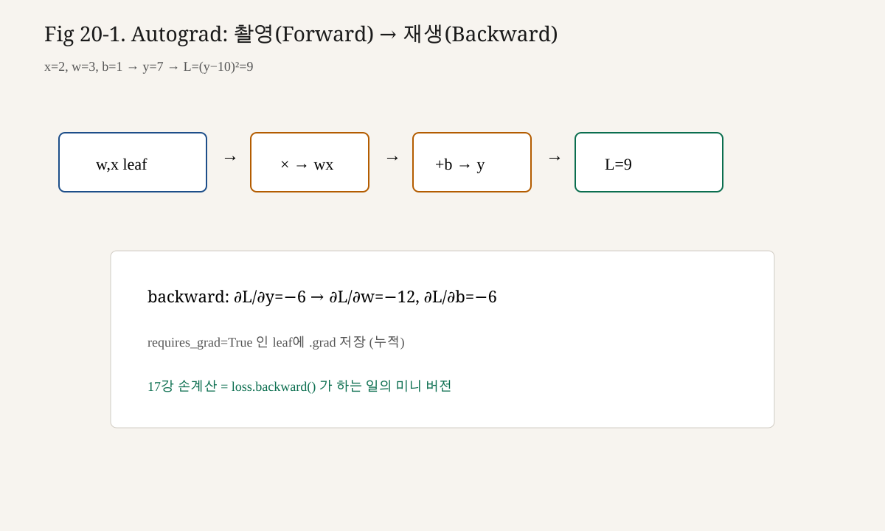

# 20강. Autograd — 자동 미분

## 이번 강에서 배우는 내용

- Autograd가 Computational Graph를 기록·역순회하는 엔진임을 설명
- `requires_grad`, `loss.backward()`, `tensor.grad`의 관계
- Loss → Graph → Chain Rule → Gradient → `Parameter.grad` 파이프라인
- `detach`, `torch.no_grad()`, inplace 함정의 의미
- 제17강 손계산 숫자와 `backward()` 결과가 일치함을 검증
- 수동 NumPy Backprop과 Autograd의 대응표

## 왜 중요한가?

LLM 학습 코드의 핵심 한 줄은 종종 다음입니다.

```python
loss.backward()
```

이 한 줄 뒤에서 실제로 일어나는 일은 제17강의 전부입니다.

```text
Loss
  → Computational Graph를 거꾸로 탐색
    → 각 연산의 Local Gradient 규칙 적용 (Chain Rule)
      → 잎(leaf) 텐서의 .grad에 누적
```

원리를 모르면 Gradient가 `None`인 이유, `no_grad` 때문에 학습이 안 되는 이유, `detach` 후 그래프가 끊기는 이유를 해석할 수 없습니다. 오늘은 그 해석력을 만듭니다.

> **핵심**
>
> Autograd = 17강 손계산의 자동 실행기.  
> 결과는 같은 숫자여야 합니다.

## 선수 개념

- Chain Rule (제14강)
- Forward cache와 δ (제16~17강)
- NumPy 수동 `backward` (제18강)
- `torch.tensor`의 shape/dtype/device (제19강)

---

## 핵심 개념

### 3.1 Autograd

**Autograd(Automatic Differentiation, 자동 미분)**는 연산이 실행될 때 계산 그래프를 기록하고, 나중에 `backward`로 각 입력에 대한 Gradient를 자동 계산하는 시스템입니다.

PyTorch는 주로 **Reverse-mode AD**(역모드 자동 미분)를 씁니다. 스칼라 Loss 하나에 대해 모든 파라미터 Gradient를 한 번에 구하기에 딥러닝과 잘 맞습니다.

### 3.2 requires_grad

```python
w = torch.tensor([0.5], requires_grad=True)
```

- `True`: 이 텐서에 의존하는 연산이 그래프에 기록됩니다.
- `False`(기본): 추적하지 않습니다.

`nn.Parameter`는 기본이 `requires_grad=True`입니다(제21강).

### 3.3 Computational Graph (동적)

PyTorch는 **Define-by-Run**입니다. Forward를 실행하는 순간 그래프가 만들어집니다.

```text
leaf(w, b, x) → mul/add → … → loss(scalar)
```

`loss.backward()`는 이 링크를 타고 내려갑니다.

### 3.4 backward와 grad

**`loss.backward()`**는 스칼라 `loss`에 대해 $\partial L/\partial(\text{leaf})$를 계산해 leaf 텐서의 **`.grad`**에 저장(기본은 누적)합니다.

역모드 AD는 출력 차원 1일 때 모든 입력 Gradient를 효율적으로 줍니다. 학습 Loss는 스칼라로 만드는 것이 표준입니다.

### 3.5 Leaf / Non-leaf

- **Leaf**: 사용자가 만든 텐서. `requires_grad=True`이면 `.grad`가 채워집니다.
- **Non-leaf**: 연산 결과. 기본적으로 `.grad`는 안 찹니다.

### 3.6 detach / no_grad / zero_grad

- **`detach()`**: 그래프에서 끊긴 같은 값의 텐서
- **`torch.no_grad()`**: 블록 안 그래프 기록 끄기 (Inference)
- **`.grad` 누적**: 매 step 시작에 `zero_grad()`로 비움

### 3.7 파이프라인 한 줄

```text
1) Forward: 연산이 Graph에 기록 (requires_grad=True 경로)
2) Loss 스칼라 획득
3) loss.backward(): VJP = Chain Rule 적용
4) Leaf parameter의 .grad에 ∂L/∂θ 저장
5) θ ← θ - η · θ.grad
```

제17강의 손계산이 곧 3)~4)입니다.

---

## 직관적으로 이해하기

Autograd를 **블랙박스 카메라**로 생각합시다.

1. `requires_grad=True`인 재료를 쓰면 Forward 때 **촬영(그래프 기록)**이 켜집니다.
2. 마지막에 Loss라는 성적표를 얻습니다.
3. `backward()`는 필름을 **거꾸로 재생**하며 쪽지(`.grad`)를 붙입니다.
4. `detach`/`no_grad`는 “이 구간은 촬영하지 마”입니다.

NumPy 수동 구현은 카메라 없이 직접 쪽지를 쓰는 일입니다. 결과는 같아야 합니다.

---

## 수학적으로 이해하기 — 그래프와 VJP

스칼라 $L(w)$, 중간 $u=f(w)$, $L=g(u)$이면

$$
\frac{\partial L}{\partial w}
=
\frac{\partial L}{\partial u}
\cdot
\frac{\partial u}{\partial w}
$$

일반적 **Vector-Jacobian Product (VJP)**:

$$
\mathbf{v}^{\top} \frac{\partial \mathbf{f}}{\partial \mathbf{x}}
$$

`backward`가 위에서 내려보내는 upstream $\mathbf{v}$와 로컬 Jacobian을 곱해 아래 입력을 갱신합니다.  
제17강의 “Upstream × Local”과 동일합니다.

다중 경로가 있으면 기여분을 **더합니다**. Residual이 많은 Transformer에서 이 합 규칙이 핵심입니다.

### 5.1 연산 노드별 Local 규칙 (복습)

곱셈 $u=ab$:

$$
\frac{\partial L}{\partial a}=\frac{\partial L}{\partial u}\cdot b
,\quad
\frac{\partial L}{\partial b}=\frac{\partial L}{\partial u}\cdot a
$$

덧셈 $u=a+b$:

$$
\frac{\partial L}{\partial a}=\frac{\partial L}{\partial u}
,\quad
\frac{\partial L}{\partial b}=\frac{\partial L}{\partial u}
$$

ReLU $a=\max(0,z)$:

$$
\frac{\partial L}{\partial z}
=
\frac{\partial L}{\partial a}\cdot \mathbf{1}_{z>0}
$$

matmul $Y=XW^{\top}$의 Weight Gradient는 배치에서 $(\partial L/\partial Y)^{\top}X$ 형태입니다(18강).

---

## 작은 숫자로 직접 계산하기 — 손미분과 Autograd 대조

### 6.1 초미니 워밍업

$x=2,\; w=3,\; b=1$, $y=wx+b=7$, $L=(y-10)^2=9$.

$$
\begin{aligned}
\frac{\partial L}{\partial y} &= 2(y-10) = -6 \\
\frac{\partial L}{\partial w} &= -6\cdot x = -12 \\
\frac{\partial L}{\partial x} &= -6\cdot w = -18 \\
\frac{\partial L}{\partial b} &= -6
\end{aligned}
$$

그래프:

```text
w,x → (×) → wx → (+) → y → (−10) → □² → L
         b ─┘
```

Backward: $L$에서 $-6$이 $y$로, 곱 노드에서 $x$와 $w$로 나뉩니다.

### 6.2 2-2-1 (17강과 동일)

```text
x=[1.0, 0.5], y=1.0
W1=[[0.3,-0.2],[0.4,0.1]], b1=[0.1,-0.1]
W2=[[0.5,-0.4]], b2=[0.2]
Loss = 1/2 (ŷ - y)^2
```

Forward:

$$
z^{(1)}=\begin{bmatrix}0.30\\0.35\end{bmatrix}
,\quad
a^{(1)}=\begin{bmatrix}0.30\\0.35\end{bmatrix}
,\quad
\hat{y}=0.21
,\quad
L=0.31205
$$

해석적 Gradient:

$$
\frac{\partial L}{\partial W^{(2)}}
=
\begin{bmatrix}-0.237 & -0.2765\end{bmatrix}
,\quad
\frac{\partial L}{\partial b^{(2)}}=-0.79
$$

$$
\frac{\partial L}{\partial W^{(1)}}
=
\begin{bmatrix}
-0.395 & -0.1975 \\
0.316 & 0.158
\end{bmatrix}
,\quad
\frac{\partial L}{\partial \mathbf{b}^{(1)}}
=
\begin{bmatrix}-0.395\\0.316\end{bmatrix}
$$

Autograd의 `.grad`가 위와 같아야 합니다.

### 6.3 한 원소만 Chain Rule로 다시

$W^{(1)}_{11}$ 경로:

$$
\frac{\partial L}{\partial W_{11}}
=
\frac{\partial L}{\partial\hat{y}}
\cdot
\frac{\partial\hat{y}}{\partial a_1}
\cdot
\frac{\partial a_1}{\partial z_1}
\cdot
\frac{\partial z_1}{\partial W_{11}}
=
(-0.79)\cdot(0.5)\cdot(1)\cdot(1.0)
=
-0.395
$$

`W1.grad[0,0]`이 $-0.395$이면 엔진이 같은 Chain Rule을 수행한 것입니다.

---

## 그래프를 손으로 따라가기 — mul/add/relu

2-2-1 Forward의 일부를 노드로 분해합니다.

$$
u = w^{(2)}_1 a^{(1)}_1
,\quad
v = w^{(2)}_2 a^{(1)}_2
,\quad
\hat{y}=u+v+b^{(2)}
$$

숫자: $a_1=0.30$, $a_2=0.35$, $w_1=0.5$, $w_2=-0.4$, $b=0.2$.

$$
u=0.15,\quad v=-0.14,\quad \hat{y}=0.21
$$

$L=\frac12(\hat{y}-y)^2$, $y=1$이면 $\partial L/\partial\hat{y}=-0.79$입니다.

덧셈 노드는 Gradient를 복사합니다.

$$
\frac{\partial L}{\partial u}=-0.79
,\quad
\frac{\partial L}{\partial v}=-0.79
,\quad
\frac{\partial L}{\partial b^{(2)}}=-0.79
$$

곱셈 노드:

$$
\frac{\partial L}{\partial w^{(2)}_1}
=
\frac{\partial L}{\partial u}\cdot a^{(1)}_1
=
(-0.79)\cdot 0.30
=
-0.237
$$

$$
\frac{\partial L}{\partial a^{(1)}_1}
=
\frac{\partial L}{\partial u}\cdot w^{(2)}_1
=
(-0.79)\cdot 0.5
=
-0.395
$$

이 값이 `W2.grad[0,0]`, 그리고 은닉으로 흘러가는 upstream의 첫 성분과 같습니다.  
Autograd는 각 `MulBackward`/`AddBackward`에서 위 규칙을 적용할 뿐입니다.

> 📘 **심화**
>
> Residual $y=x+f(x)$이면 Backward에서 $\partial L/\partial x$에
> $\partial L/\partial y$가 **한 번 더** 더해집니다. Transformer 전역 Gradient 흐름의 핵심입니다.

## 코드로 구현하기

### 7.1 최소 예제

```python
"""20강: Autograd 최소 예제."""

import torch

x = torch.tensor(2.0, requires_grad=True)
w = torch.tensor(3.0, requires_grad=True)
b = torch.tensor(1.0, requires_grad=True)

y = w * x + b          # 7
L = (y - 10) ** 2      # 9
L.backward()

print(float(x.grad))  # -18
print(float(w.grad))  # -12
print(float(b.grad))  # -6
```

### 7.2 2-2-1을 Autograd로

```python
import torch

x = torch.tensor([1.0, 0.5])
y = torch.tensor(1.0)
W1 = torch.tensor([[0.3, -0.2], [0.4, 0.1]], requires_grad=True)
b1 = torch.tensor([0.1, -0.1], requires_grad=True)
W2 = torch.tensor([[0.5, -0.4]], requires_grad=True)
b2 = torch.tensor([0.2], requires_grad=True)

z1 = x @ W1.T + b1
a1 = torch.relu(z1)
y_hat = (a1 @ W2.T + b2).squeeze()
loss = 0.5 * (y_hat - y) ** 2
print("y_hat", float(y_hat), "loss", float(loss))

loss.backward()

assert torch.allclose(W2.grad, torch.tensor([[-0.237, -0.2765]]), atol=1e-6)
assert torch.allclose(b2.grad, torch.tensor([-0.79]), atol=1e-6)
assert torch.allclose(
    W1.grad,
    torch.tensor([[-0.395, -0.1975], [0.316, 0.158]]),
    atol=1e-6,
)
assert torch.allclose(b1.grad, torch.tensor([-0.395, 0.316]), atol=1e-6)
print("17강 손계산과 일치")
```

> 💡 **팁**
>
> assert가 통과하면 “Autograd를 믿는다”가 아니라  
> “이 fixture에서 엔진과 손계산이 같다”를 확인한 것입니다.

### 7.3 수치 미분과 교차 검증

```python
def autograd_vs_numeric():
    params = {
        "W1": torch.tensor([[0.3, -0.2], [0.4, 0.1]], requires_grad=True),
        "b1": torch.tensor([0.1, -0.1], requires_grad=True),
        "W2": torch.tensor([[0.5, -0.4]], requires_grad=True),
        "b2": torch.tensor([0.2], requires_grad=True),
    }
    x = torch.tensor([1.0, 0.5]); y = torch.tensor(1.0)

    def forward_loss():
        z1 = x @ params["W1"].T + params["b1"]
        a1 = torch.relu(z1)
        y_hat = (a1 @ params["W2"].T + params["b2"]).squeeze()
        return 0.5 * (y_hat - y) ** 2

    loss = forward_loss(); loss.backward()
    eps = 1e-6
    for name, t in params.items():
        g_ana = t.grad.detach().clone()
        g_num = torch.zeros_like(t)
        for i in range(t.numel()):
            orig = float(t.view(-1)[i].detach())
            t.view(-1)[i].data = orig + eps
            lp = float(forward_loss().detach())
            t.view(-1)[i].data = orig - eps
            lm = float(forward_loss().detach())
            g_num.view(-1)[i] = (lp - lm) / (2 * eps)
            t.view(-1)[i].data = orig
        for p in params.values():
            if p.grad is not None:
                p.grad.zero_()
        rel = (g_ana - g_num).abs().max() / g_ana.abs().max().clamp_min(1e-12)
        print(name, "max_rel", float(rel))
```

### 7.4 detach

```python
a = torch.tensor([1.0, 2.0], requires_grad=True)
b = a * 3
c = b.detach()
print(c.requires_grad)  # False
```

### 7.5 no_grad와 수동 SGD

```python
with torch.no_grad():
    y_eval = torch.relu(x @ W1.T + b1) @ W2.T + b2

# 학습 한 스텝
loss = 0.5 * ((torch.relu(x @ W1.T + b1) @ W2.T + b2).squeeze() - y) ** 2
loss.backward()
lr = 0.1
with torch.no_grad():
    W1 -= lr * W1.grad
    b1 -= lr * b1.grad
    W2 -= lr * W2.grad
    b2 -= lr * b2.grad
for t in (W1, b1, W2, b2):
    t.grad.zero_()
```

업데이트 자체는 그래프가 필요 없으므로 `no_grad` 안에서 수행합니다.

### 7.6 누적과 zero_grad

```python
W = torch.tensor([1.0], requires_grad=True)
for i in range(2):
    loss = (W * 2).sum()
    loss.backward()
    print("step", i, "grad", W.grad.clone())  # 2.0 그다음 4.0
W.grad.zero_()
```

### 7.7 retain_graph / create_graph

```python
w = torch.tensor(2.0, requires_grad=True)
loss = w ** 2
loss.backward(retain_graph=True)
loss.backward()  # 두 번째 가능 (grad 누적)
```

초보 단계에서는 이름만 기억하면 충분합니다.

### 7.8 inplace 함정

```python
x = torch.tensor([1.0, 2.0], requires_grad=True)
y = x * 2
# x += 1   # inplace — RuntimeError 가능
x = x + 1  # 새 텐서 할당이 안전
```

### 7.9 NumPy vs Autograd 대응표

| NumPy (18강) | Autograd (20강) |
|---|---|
| `cache` 딕셔너리 | 엔진이 자동 저장 |
| `backward(cache)` | `loss.backward()` |
| `grads["W2"]` | `W2.grad` |
| `sgd_update` | `no_grad` + `W -= lr*W.grad` / Optimizer |
| `relu_grad` 수동 | `torch.relu` Backward 내장 |

---

## 학습 미니 루프 (Autograd판)

```python
def train_toy_regression(steps=200, lr=0.05):
    torch.manual_seed(0)
    X = torch.randn(64, 2)
    y = (2 * X[:, 0] - 3 * X[:, 1] + 0.5).unsqueeze(1)
    W1 = (torch.randn(2, 2) * 0.3).requires_grad_(True)
    b1 = torch.zeros(2, requires_grad=True)
    W2 = (torch.randn(1, 2) * 0.3).requires_grad_(True)
    b2 = torch.zeros(1, requires_grad=True)
    history = []
    for step in range(steps):
        pred = torch.relu(X @ W1.T + b1) @ W2.T + b2
        loss = 0.5 * torch.mean((pred - y) ** 2)
        loss.backward()
        with torch.no_grad():
            W1 -= lr * W1.grad; b1 -= lr * b1.grad
            W2 -= lr * W2.grad; b2 -= lr * b2.grad
            for p in (W1, b1, W2, b2):
                p.grad.zero_()
        history.append(float(loss.detach()))
        if step % 40 == 0 or step == steps - 1:
            print(f"step {step:4d}  loss={history[-1]:.6f}")
    return history
```

**성공 기준:** 마지막 Loss가 초깃값보다 명확히 작습니다.  
특정 숫자 벤치마크는 주장하지 않습니다.

> ⚠️ **주의**
>
> `float(loss)`로 로그를 남기면 그래프가 끊깁니다.  
> 학습 중 로그는 `float(loss.detach())`를 쓰세요.

---

## Autograd가 채우는 것 / 안 채우는 것

| 채운다 | 안 채움 |
|---|---|
| `requires_grad=True` leaf의 `.grad` | 입력 토큰 ID (보통 False) |
| Loss에 연결된 경로 | `detach` / `no_grad` / freeze 층 |

디버깅 질문: “이 텐서가 Loss까지 **미분 가능한 길로 연결**돼 있는가?”

---


<!-- visual-example-20 -->
## 숫자로 따라가기 — Autograd = 손미분



초미니: $x=2$, $w=3$, $b=1$, $y=wx+b=7$, $L=(y-10)^2=9$.

$$
\frac{\partial L}{\partial y}=-6,\quad
\frac{\partial L}{\partial w}=-12,\quad
\frac{\partial L}{\partial b}=-6
$$

| 기호 | 값 | Autograd 대응 |
|---|---|---|
| $w,x,b$ | leaf | `requires_grad=True` |
| $y$ | $7$ | 중간 노드 |
| $L$ | $9$ | 스칼라 → `backward()` |
| $w.\mathrm{grad}$ | $-12$ | leaf에 저장(누적) |

17강의 2-2-1도 같은 방식으로 `loss.backward()` 후 `.grad`가 손계산 표와 일치해야 합니다. `zero_grad()`를 빼면 누적됩니다.

## LLM에서는 어디에 사용될까?

```python
outputs = model(input_ids=batch["input_ids"], labels=batch["labels"])
loss = outputs.loss
optimizer.zero_grad()
loss.backward()
torch.nn.utils.clip_grad_norm_(model.parameters(), 1.0)
optimizer.step()
```

생성:

```python
model.eval()
with torch.no_grad():
    logits = model(input_ids)
```

| LLM 기법 | Autograd 관점 |
|---|---|
| Mixed Precision | 스케일된 Loss로 backward 후 unscale |
| Gradient Checkpointing | Forward 저장↓, Backward 때 재계산 |
| LoRA | 일부만 `requires_grad=True` |
| Grad Accumulation | `backward` 여러 번 누적 후 한 번 `step` |

---

## 실습

### 실습 1 — 17강 assert

7.2의 네 파라미터 Gradient를 모두 통과시킵니다.

### 실습 2 — requires_grad 끄기

`W2.requires_grad_(False)` 후 `W2.grad is None`인지 확인합니다.

### 실습 3 — detach 실험

`pred.detach()`를 타깃처럼 쓰면 학습 파라미터로 Gradient가 안 흐릅니다.

### 실습 4 — no_grad 평가

매 40 step마다 `no_grad`로 full-batch Loss를 출력합니다.

### 실습 5 — zero_grad 잊기

고의로 제거하고 `.grad`가 커지는 장면을 본 뒤 복구합니다.

### 실습 6 — NumPy와 교차

18강 `grads["W1"]`와 `W1.grad.numpy()`를 같은 초기값에서 비교합니다.

### 실습 7 — 한 스텝 후 Loss

$\eta=0.1$로 한 번 업데이트한 뒤 Loss가 $0.31205$보다 작아지는지 확인합니다.

---

## 자주 하는 실수

1. **스칼라 아닌 Tensor에 `.backward()`** — `mean`/`sum`으로 줄입니다.
2. **`zero_grad` 누락** — Gradient가 step마다 합쳐집니다.
3. **`no_grad` 안에서 학습 Forward** — `.grad`가 비거나 backward 실패.
4. **non-leaf의 `.grad` 기대** — `retain_grad()` 또는 `torch.autograd.grad`.
5. **GPU 텐서를 바로 numpy** — `.detach().cpu().numpy()`.
6. **inplace로 그래프 파괴**.
7. **두 번 backward without retain_graph**.
8. **Loss를 Python float로 바꿔 버림**.

---

## 자주 하는 디버깅 체크리스트

1. `loss` shape가 `()` 인가?
2. 파라미터 `requires_grad`가 True인가?
3. Forward가 `no_grad` 밖인가?
4. `backward` 후 `.grad`가 존재하는가?
5. `zero_grad` 타이밍이 step 시작인가?
6. 17강 fixture assert가 통과하는가?

---

## 핵심 요약

- Autograd는 Reverse-mode 자동 미분으로, Forward 때 그래프를 기록하고 `backward`로 Chain Rule을 적용합니다.
- 파이프라인: **Loss → Graph → Chain Rule → `.grad` → 갱신**.
- `requires_grad`가 추적 스위치, `detach`/`no_grad`가 차단, `zero_grad`가 누적 초기화입니다.
- 제17강 손계산·제18강 NumPy 결과와 Autograd는 같은 숫자를 내야 합니다.
- LLM 학습·추론의 `backward`/`no_grad`는 이 강의의 직접 확장입니다.

## 용어 사전

| 용어 | 의미 |
|---|---|
| Autograd | 연산 그래프 기반 자동 미분 엔진 |
| requires_grad | 텐서 추적 여부 플래그 |
| backward() / .grad | Gradient 전파 호출 / 저장 슬롯 |
| Leaf Tensor | 사용자가 생성한, grad가 쌓이는 텐서 |
| detach / no_grad | 그래프 차단 / 기록 없는 실행 |
| zero_grad | Gradient 버퍼 초기화 |
| VJP | Vector-Jacobian Product |
| Reverse-mode AD | 스칼라 출력 기준 전 입력 Gradient 효율 계산 |

## 연습문제

### 문제 1 (개념)

`loss.backward()`가 수행하는 일을 Loss, Graph, Chain Rule, `.grad` 단어로 한 문장 정리하시오.

### 문제 2 (계산)

$x=2,w=3,b=1$, $L=(wx+b-10)^2$일 때 $w.grad$와 $x.grad$는?

### 문제 3 (개념)

Validation에서 `torch.no_grad()`를 쓰는 이유 두 가지를 쓰시오.

### 문제 4 (코드)

`zero_grad` 없이 두 번 `backward`하면 두 번째 `.grad`는?

### 문제 5 (연결)

제18강 `grads["W1"]`는 Autograd에서?

### 문제 6 (응용)

LoRA처럼 일부만 학습할 때 무엇을 끄면 되는가?

### 문제 7 (계산)

2-2-1 예제에서 `b2.grad`의 기댓값은?

### 문제 8 (계산)

$W^{(1)}_{11}$의 손미분 결과와 `W1.grad[0,0]`이 같아야 하는 값은?

---

## 정답 및 해설

### 문제 1

스칼라 Loss에서 시작해 기록된 Computational Graph를 역방향으로 순회하며 Chain Rule(VJP)을 적용해 leaf 텐서의 `.grad`에 Gradient를 저장합니다.

### 문제 2

$w.grad=-12$, $x.grad=-18$.

### 문제 3

(1) 불필요한 그래프 기록 방지 (2) 실수 학습 경로 분리

### 문제 4

이전 Gradient 위에 더해져 커집니다(누적).

### 문제 5

`W1.grad`.

### 문제 6

학습하지 않을 파라미터의 `requires_grad=False`.

### 문제 7

$-0.79$.

### 문제 8

$-0.395$.

## 다음 강의와 연결

이번 강의에서 `backward()`의 정체를 수동 Backprop과 나란히 놓았습니다.

다음 **제21강. nn.Module로 모델 만들기**에서는 `nn.Linear`, `nn.ReLU`, `nn.Module` 서브클래스로 모델을 조립합니다.  
파라미터 등록과 `model.parameters()`가 Autograd와 어떻게 붙는지 이어서 봅니다.

> 손계산으로 엔진을 이해했고, Autograd로 엔진키를 받았습니다. 이제 차체(`nn.Module`)를 얹읍시다.

<!-- LECTURE_NAV -->

---

### 강의 이동

- **이전 강:** [19강. PyTorch Tensor](19강_PyTorch_Tensor.md)
- **다음 강:** [21강. nn.Module로 모델 만들기](21강_nn_Module로_모델_만들기.md)

<!-- /LECTURE_NAV -->
