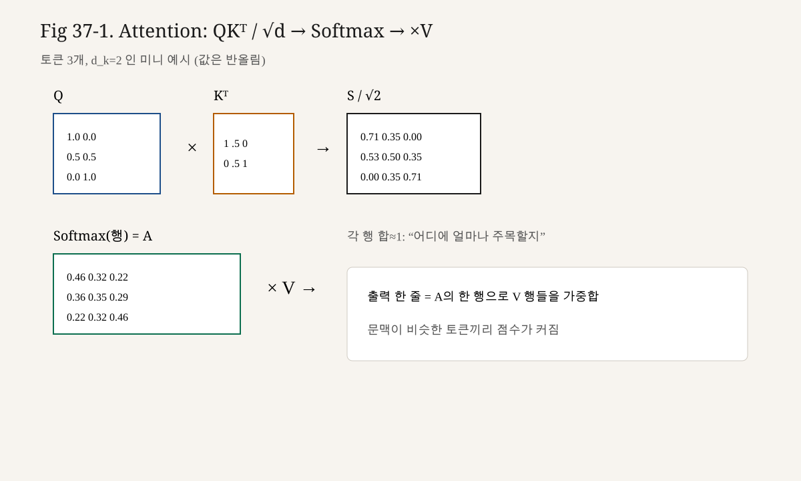

# 37강. Dot-Product Attention 계산
## 이번 강에서 배우는 내용

- Dot-Product Attention에서 점수가 $\mathbf{q}\cdot\mathbf{k}$인 이유
- 행렬 형태 $S = QK^\top$의 Shape와 한 칸의 의미
- Scaled Dot-Product: $S = QK^\top / \sqrt{d_k}$와 스케일이 필요한 이유
- 토큰 2~3개, 차원 2짜리로 손계산하기
- Softmax 전 단계까지를 코드로 재현하기

## 왜 중요한가?
Attention 공식의 중심에는 내적이 있다.

$$

\mathrm{Attention}(Q,K,V)=\mathrm{softmax}\!\left(\frac{QK^\top}{\sqrt{d_k}}\right)V

$$

많은 사람이 Softmax와 $V$만 기억하고, $QK^\top/\sqrt{d_k}$를 “그냥 있는 식”으로 넘긴다.  
그런데 버그·수치 불안정·마스크 적용 위치는 대부분 **이 점수 행렬**에서 결정된다.

점수를 손으로 한 칸씩 채워 본 사람만, 이후 Causal Mask(40강)와 Multi-Head(41강)를 안전하게 다룬다.

> **핵심**
>
> Dot-Product Attention의 점수는 $S = QK^\top / \sqrt{d_k}$입니다.  
> $\sqrt{d_k}$는 Softmax 포화을 완화하는 분산 스케일입니다.

## 선수 개념
- 내적·행렬곱 (1권 10강)
- Q, K, V 투영 (36강)
- Softmax는 “다음에” (33강 복습 + 38강 본적용)
- Shape 브로드캐스팅 감각 (1권 8~9강)

기호 고정:

| 기호 | 의미 |
|---|---|
| $T$ | 시퀀스 길이 (토큰 수) |
| $d_k$ | Query/Key 차원 |
| $Q \in \mathbb{R}^{T\times d_k}$ | Query 행렬 |
| $K \in \mathbb{R}^{T\times d_k}$ | Key 행렬 |
| $S \in \mathbb{R}^{T\times T}$ | 점수 행렬 |
| $s_{ij}$ | 위치 $i$가 $j$를 보는 점수 |

## 핵심 개념
### 3.1 Dot-Product Attention이란?

**Dot-Product Attention(닷 프로덕트 어텐션)**은 Query와 Key의 **내적**으로 유사도 점수를 매기는 Attention이다.

위치 $i$와 $j$에 대해

$$

s_{ij} = \mathbf{q}_i \cdot \mathbf{k}_j = \sum_{c=1}^{d_k} q_{ic}\, k_{jc}

$$

왜 내적인가?

- 같은 방향·큰 성분을 공유하면 값이 커진다 → “관련 있음”의 간단 척도
- 행렬곱으로 모든 $(i,j)$를 한 번에 계산할 수 있다 → GPU 친화적
- Additive Attention 등 다른 점수 함수도 있으나, Transformer 표준은 내적이다

### 3.2 행렬로 한 번에: $QK^\top$

$$

S_{\mathrm{raw}} = Q K^\top

$$

- $Q$: $(T, d_k)$
- $K^\top$: $(d_k, T)$
- 결과 $S_{\mathrm{raw}}$: $(T, T)$

$S_{\mathrm{raw}}$의 $(i,j)$ 원소 = $i$번째 Query와 $j$번째 Key의 내적.

행 $i$: “나는 토큰 $i$다. 각 토큰을 얼마나 볼까?”의 raw score 목록.  
열 $j$: “토큰 $j$가 각 Query에게 받은 점수” 목록.

### 3.3 Scaling: $\sqrt{d_k}$로 나누기

**Scaled Dot-Product Attention**은 내적 점수를 $\sqrt{d_k}$로 나눈다.

$$

S = \frac{Q K^\top}{\sqrt{d_k}}

$$

왜 나누는가? (직관)

- $d_k$가 커지면 내적 합의 **분산이 커지기 쉽다**
- Softmax는 입력이 커지면 거의 one-hot처럼 뾰족해진다
- Gradient가 아주 작아지는 구간으로 들어가기 쉽다
- 스케일로 Softmax 입력을 완화한다

정규 분포 가정이 들어가는 설명도 있으나, 실무 메시지는 명확하다.

> $d_k$가 작지 않으면, 나누지 않은 raw 내적은 Softmax에 너무 거칠 수 있다.

$d_k=1$이면 $\sqrt{1}=1$이라 변화가 없다.  
$d_k=64$면 $\sqrt{64}=8$로 나눈다. GPT류에서 흔한 헤드 차원이다.

### 3.4 Softmax는 아직 하지 않는다

이번 강의의 산출물은 **점수 행렬 $S$**다.  
가중치 $\alpha=\mathrm{softmax}(S)$와 $O=\alpha V$는 38강.

마스크를 쓸 때는 Softmax **직전**의 $S$에 $-\infty$를 넣는 것이 표준이다 (40강).  
그래서 점수 단계를 분리해 이해하는 것이 중요하다.

## 직관적으로 이해하기
### 4.1 성적표 비유

$T\times T$ 점수 행렬은 교실 성적표와  alike하다.

- 행: 질문하는 학생 (Query 위치)
- 열: 답을 줄 수 있는 학생 (Key 위치)
- 칸의 숫자: 관련도 점수 (아직 비율 아님)

Softmax는 “행마다 점수를 비율로 바꿔 합이 1이 되게” 하는 다음 단계다.

### 4.2 왜 $K^\top$인가?

$Q$의 한 행과 $K$의 한 행을 내적하려면, $K$를 전치해 “행·열 내적” 형태로 맞춰야 한다.

```text
Q (T × d)  @  K^T (d × T)  =  S (T × T)
     행i · 열j  =  토큰i↔토큰j 점수
```

### 4.3 스케일 직관 — 온도에 가까운 효과

Softmax 입력을 상수로 나누는 것은 **온도(temperature)**를 올리는 것과 비슷하다.  
분포가 덜 뾰족해져, 초기에 여러 Key를 고루 볼 여지가 생긴다.

## 수학적으로 이해하기
### 5.1 정의 정리

$$

s_{ij} = \frac{\mathbf{q}_i \cdot \mathbf{k}_j}{\sqrt{d_k}}

$$

$$

S = \frac{QK^\top}{\sqrt{d_k}} \in \mathbb{R}^{T \times T}

$$

### 5.2 분산 스케일 스케치

성분 $q_c, k_c$가 대략 평균 0, 분산 1이고 독립에 가깝다고 가정하면

$$

\mathbf{q}\cdot\mathbf{k} = \sum_{c=1}^{d_k} q_c k_c

$$

의 분산은 대략 $d_k$ 스케일로 커진다.  
$\sqrt{d_k}$로 나누면 분산을 대략 상수 근처로 되돌리는 효과가 있다.

엄밀한 가정은 학습 표현에 항상 맞지는 않는다.  
그래도 “차원이 커질수록 스케일이 필요해진다”는 설계 동기는 유효하다.

### 5.3 배치 Shape

배치까지 넣으면

$$

Q,K \in \mathbb{R}^{B \times T \times d_k}

$$

$$

S = \frac{Q K^\top}{\sqrt{d_k}} \in \mathbb{R}^{B \times T \times T}

$$

구현: `S = (Q @ K.transpose(-2, -1)) / math.sqrt(d_k)`.

Multi-Head면 보통 `(B, h, T, d_k)` (41강).

## 작은 숫자로 직접 계산하기

> **핵심**
>
> $QK^\top$의 한 칸이 $\mathbf{q}_i\cdot\mathbf{k}_j$임을 작은 행렬로 끝까지 계산합니다.

### 6.1 설정 A — 토큰 2개, $d_k=2$

토큰: `나`(0), `책`(1)

$$

Q = \begin{bmatrix} 1 & 0 \\ 0 & 1 \end{bmatrix},\quad
K = \begin{bmatrix} 1 & 0 \\ 0 & 1 \end{bmatrix}

$$

$d_k=2$, $\sqrt{d_k}=\sqrt{2}\approx 1.4142$.

**Step 1. raw $QK^\top$**

$$

QK^\top = \begin{bmatrix} 1\cdot1+0\cdot0 & 1\cdot0+0\cdot1 \\ 0\cdot1+1\cdot0 & 0\cdot0+1\cdot1 \end{bmatrix}
= \begin{bmatrix} 1 & 0 \\ 0 & 1 \end{bmatrix}

$$

**Step 2. scale**

$$

S = \frac{1}{\sqrt{2}}\begin{bmatrix} 1 & 0 \\ 0 & 1 \end{bmatrix}
\approx \begin{bmatrix} 0.7071 & 0 \\ 0 & 0.7071 \end{bmatrix}

$$

해석: 각자 자신에게만 양의 점수. 교차는 0.

### 6.2 설정 B — 교차 점수가 있는 2토큰

$$

Q = \begin{bmatrix} 1 & 2 \\ 0 & 1 \end{bmatrix},\quad
K = \begin{bmatrix} 1 & 0 \\ 1 & 1 \end{bmatrix}

$$

**칸 (0,0):** $\mathbf{q}_0\cdot\mathbf{k}_0 = 1\cdot1 + 2\cdot0 = 1$  
**칸 (0,1):** $1\cdot1 + 2\cdot1 = 3$  
**칸 (1,0):** $0\cdot1 + 1\cdot0 = 0$  
**칸 (1,1):** $0\cdot1 + 1\cdot1 = 1$

$$

QK^\top = \begin{bmatrix} 1 & 3 \\ 0 & 1 \end{bmatrix}

$$

$$

S = \frac{1}{\sqrt{2}}\begin{bmatrix} 1 & 3 \\ 0 & 1 \end{bmatrix}
\approx \begin{bmatrix} 0.707 & 2.121 \\ 0 & 0.707 \end{bmatrix}

$$

토큰0(`나`)은 토큰1(`책`)에 raw 3으로 더 높은 점수 → Softmax 후 책에 더 주목할 가능성이 크다 (38강에서 확인).

### 6.3 설정 C — 토큰 3개 손계산 (필수)

토큰: `고양이`(0), `가`(1), `잠자다`(2)

$$

Q = \begin{bmatrix} 1 & 0 \\ 0 & 1 \\ 1 & 1 \end{bmatrix},\quad
K = \begin{bmatrix} 1 & 0 \\ 0 & 1 \\ 1 & 1 \end{bmatrix}

$$

(설명용으로 $Q=K$. 실제로는 다를 수 있다.)

**raw $QK^\top = QQ^\top$** (이 특수 경우):

| $i\backslash j$ | 0 | 1 | 2 |
|---|---|---|---|
| 0 | $1\cdot1+0\cdot0=1$ | $1\cdot0+0\cdot1=0$ | $1\cdot1+0\cdot1=1$ |
| 1 | $0\cdot1+1\cdot0=0$ | $0\cdot0+1\cdot1=1$ | $0\cdot1+1\cdot1=1$ |
| 2 | $1\cdot1+1\cdot0=1$ | $1\cdot0+1\cdot1=1$ | $1\cdot1+1\cdot1=2$ |

$$

QK^\top = \begin{bmatrix} 1 & 0 & 1 \\ 0 & 1 & 1 \\ 1 & 1 & 2 \end{bmatrix}

$$

$\sqrt{d_k}=\sqrt{2}\approx 1.4142$로 나눈 $S$:

$$

S \approx \begin{bmatrix}
0.707 & 0 & 0.707 \\
0 & 0.707 & 0.707 \\
0.707 & 0.707 & 1.414
\end{bmatrix}

$$

관찰:

- `잠자다`(행2)는 자기 자신 점수가 가장 큼 (1.414)
- `고양이`와 `잠자다`도 서로 0.707로 연결
- Softmax 전이지만, “동사가 주어·자신과 점수를 나눈다”는 그림이 보인다

### 6.4 설정 D — $d_k$가 클 때 스케일 효과

같은 패턴의 내적이라도 차원을 키우면 raw 합이 커질 수 있다.  
극단 예: 모든 성분 1인 $\mathbf{q},\mathbf{k}\in\mathbb{R}^{d_k}$

$$

\mathbf{q}\cdot\mathbf{k} = d_k,\quad
\frac{\mathbf{q}\cdot\mathbf{k}}{\sqrt{d_k}} = \sqrt{d_k}

$$

$d_k=64$면 raw 64, scaled 8.  
Softmax에 넣기 전 입력이 한없이 커지는 것을 완화한다.

### 6.5 한 행만 골라 Softmax 예고 계산

설정 B의 행0: $[0.707,\ 2.121]$

아직 Softmax 전이지만, 차이 $2.121-0.707=1.414$가 이미 크다.  
38강에서 $e^{2.121}/(e^{0.707}+e^{2.121})$를 계산하면 책에 쏠림이 보인다.

## 코드로 구현하기
```python
# lecture37_dot_product_scores.py
# Scaled Dot-Product의 점수 행렬만 계산한다.

import numpy as np

def attention_scores(Q: np.ndarray, K: np.ndarray) -> np.ndarray:
    """
    Q, K: (T, d_k) 또는 (B, T, d_k)
    return S: (..., T, T) = QK^T / sqrt(d_k)
    """
    d_k = Q.shape[-1]
    # 마지막 두 축 기준으로 K 전치
    KT = np.swapaxes(K, -1, -2)
    raw = Q @ KT
    return raw / np.sqrt(d_k)

def manual_pair_scores(Q: np.ndarray, K: np.ndarray) -> np.ndarray:
    """이중 루프로 한 칸씩 — 검증용."""
    T, d_k = Q.shape
    S = np.zeros((T, T), dtype=np.float64)
    scale = np.sqrt(d_k)
    for i in range(T):
        for j in range(T):
            # 내적을 성분 합으로
            s = 0.0
            for c in range(d_k):
                s += Q[i, c] * K[j, c]
            S[i, j] = s / scale
    return S

if __name__ == "__main__":
    Q = np.array([[1.0, 2.0], [0.0, 1.0]])
    K = np.array([[1.0, 0.0], [1.0, 1.0]])

    S_fast = attention_scores(Q, K)
    S_slow = manual_pair_scores(Q, K)
    print("S_fast:\n", np.round(S_fast, 4))
    print("S_slow:\n", np.round(S_slow, 4))
    print("max abs diff:", np.max(np.abs(S_fast - S_slow)))

    # 3토큰 예제
    Q3 = np.array([[1.0, 0.0], [0.0, 1.0], [1.0, 1.0]])
    K3 = Q3.copy()
    print("S 3x3:\n", np.round(attention_scores(Q3, K3), 4))
```

손계산과 `max abs diff == 0`인지 확인한다.

## PyTorch로 구현하기
```python
# lecture37_scores_torch.py

import math
import torch

def attention_scores_torch(Q: torch.Tensor, K: torch.Tensor) -> torch.Tensor:
    # Q,K: (B, T, d_k) or (T, d_k)
    d_k = Q.size(-1)
    return (Q @ K.transpose(-2, -1)) / math.sqrt(d_k)

if __name__ == "__main__":
    Q = torch.tensor([[1.0, 2.0], [0.0, 1.0]])
    K = torch.tensor([[1.0, 0.0], [1.0, 1.0]])
    S = attention_scores_torch(Q, K)
    print(S)

    # 배치 차원
    Qb = Q.unsqueeze(0).repeat(2, 1, 1)  # (2,2,2)
    Kb = K.unsqueeze(0).repeat(2, 1, 1)
    Sb = attention_scores_torch(Qb, Kb)
    print("batch S shape:", Sb.shape)  # (2,2,2)
```

`torch.nn.functional.scaled_dot_product_attention`은 Softmax·V·마스크까지 한 번에 처리하는 API다.  
학습 목적이므로 지금은 점수만 분리한다.

## 수식 보강 — Scaled Dot-Product

$$
\mathrm{Attention}(Q,K,V)=\mathrm{softmax}\Big(\frac{QK^\top}{\sqrt{d_k}}\Big)V
$$

스케일 $\sqrt{d_k}$는 내적 분산이 $d_k$에 비례해 커지는 것을 완화합니다.


<!-- visual-example-37 -->
## 숫자로 따라가기 — Attention 한 방



토큰 3개, $d_k=2$라고 가정합니다.

1. 점수: $S = QK^\top / \sqrt{d_k}$
2. 행마다 Softmax → 가중치 $A$ (각 행 합 $=1$)
3. 출력: $A V$ (과거/문맥 벡터의 가중합)

손으로 볼 포인트는 하나면 충분합니다.

$$
A_{2,:}\approx [0.36,\,0.35,\,0.29]
\quad\Rightarrow\quad
\text{2번째 토큰은 세 곳을 비슷하게 봄}
$$

$$
A_{1,:}\approx [0.46,\,0.32,\,0.22]
\quad\Rightarrow\quad
\text{1번째는 자기/앞에 더 주목}
$$

“미지수 $Q,K,V$”는 **학습되는 선형 변환**이고, 추론 때는 위 숫자 흐름만 반복됩니다.

## LLM에서는 어디에 사용될까?
### 9.1 매 Attention 층의 핵심 GEMM

학습·추론 모두에서 $QK^\top$는 거대한 행렬곱이다.  
길이 $T$가 커지면 $(T,T)$ 점수 행렬의 메모리·연산이 도드라진다 (52강).

### 9.2 스케일은 하이퍼파라미터가 아니라 표준 상수

보통 $\sqrt{d_k}$로 고정한다.  
별도 temperature를 샘플링에 쓰는 것(추론)과 혼동하지 말 것.

### 9.3 마스크는 점수에 적용

Causal / padding mask는 Softmax 전 $S$에 더하거나 `masked_fill(-inf)`한다 (40강).  
점수를 이해해야 마스크 위치를 실수하지 않는다.

### 9.4 Multi-Head

헤드마다 $d_k$가 작아지고, 스케일도 헤드의 $d_k$를 쓴다 (41강).

## 실습
### 실습 1 — 2×2 손계산

$$

Q=\begin{bmatrix}2&0\\0&2\end{bmatrix},\ 
K=\begin{bmatrix}1&0\\0&1\end{bmatrix}

$$

의 $QK^\top$와 $S=QK^\top/\sqrt{2}$를 구하시오.

### 실습 2 — 한 원소

$\mathbf{q}=[1,1,1],\ \mathbf{k}=[2,0,1]$, $d_k=3$일 때 scaled score를 구하시오.

### 실습 3 — Shape

$B=4,T=16,d_k=64$일 때 $S$의 Shape는?

### 실습 4 — 코드 검증

8절의 `attention_scores`와 `manual_pair_scores`가 설정 C(3토큰)에서도 일치하는지 확인하시오.

### 실습 5 — 스케일 비교

설정 B에서 scale 없는 raw와 scaled $S$를 나란히 적고, Softmax에 넣었을 때 어느 쪽이 더 뾰족할지 예상하시오. (계산은 38강)

### 실습 6 — transpose 버그

`Q @ K` (전치 없음)를 하면 Shape/의미가 어떻게 깨지는지 $T=3,d_k=2$로 설명하시오.

## 자주 하는 실수
1. **$KK^\top$나 $QQ^\top$만 쓰고 Q/K가 다른 경우를 잊는다**  
   일반식은 $QK^\top$다. $Q=K$는 특수 예제다.

2. **$\sqrt{d_{\mathrm{model}}}$로 나눈다**  
   스케일은 보통 **헤드의 $d_k$**다. Multi-Head에서 혼동하기 쉽다.

3. **Softmax까지 한 방에 하고 점수를 디버깅하지 않는다**  
   마스크·스케일 버그는 $S$를 출력해 보는 편이 빠르다.

4. **행/열 의미 혼동**  
   행 = Query 위치(보는 쪽), 열 = Key 위치(보이는 쪽).

5. **정수 나눗셈**  
   코드에서 `1/2`가 아니라 `1/math.sqrt(d_k)` (실수).

6. **배치 축까지 transpose**  
   `K.T`는 2D에서만 안전. 3D+는 `transpose(-2,-1)`.

## 핵심 요약
- Dot-Product Attention의 점수는 Query–Key 내적이다.
- 행렬로 $S_{\mathrm{raw}}=QK^\top\in\mathbb{R}^{T\times T}$.
- Scaled 버전은 $S=QK^\top/\sqrt{d_k}$로 Softmax 입력을 완화한다.
- $(i,j)$ 칸은 “토큰 $i$가 토큰 $j$를 보는 점수”다.
- 다음 단계는 행 Softmax로 가중치를 만들고 $V$를 섞는 것 (38강).

## 용어 사전
| 용어 | 의미 |
|---|---|
| Dot-Product Attention | 내적으로 점수를 내는 Attention |
| Score / Logit (attention) | Softmax 전 점수 $s_{ij}$ |
| $QK^\top$ | 모든 위치 쌍의 내적 점수 행렬 |
| Scaled Dot-Product | $1/\sqrt{d_k}$ 스케일을 적용한 형태 |
| $d_k$ | Query/Key 차원 |
| GEMM | 일반 행렬곱; Attention 점수의 구현 뼈대 |

## 연습문제
### 문제 1 (계산)

$\mathbf{q}=[2,0],\ \mathbf{k}=[0,3]$, $d_k=2$일 때 scaled score는?

### 문제 2 (계산)

설정 A의 $S$에서 $s_{01}$은?

### 문제 3 (개념)

왜 $d_k$가 클수록 스케일이 중요해지는가?

### 문제 4 (Shape)

$Q\in\mathbb{R}^{2\times3\times8},\ K$ 동 Shape일 때 $S$ Shape는?

### 문제 5 (연결)

40강 Causal Mask는 이 강의의 어느 텐서에 적용되는가? Softmax 전인가 후인가?

---

## 정답 및 해설
### 문제 1

내적 $2\cdot0+0\cdot3=0$, scaled도 $0$.

### 문제 2

$0$ (스케일 후에도 0).

### 문제 3

내적 합의 크기(분산)가 차원과 함께 커지기 쉬워 Softmax가 과도하게 뾰족·포화될 수 있어서다.

### 문제 4

$(2,3,3)$.

### 문제 5

점수 행렬 $S$ (또는 raw scores)에 Softmax **전**에 적용한다.

## 다음 강의와 연결
점수가 생겼다.  
다음 **제38강. Softmax Attention과 작은 숫자 예제**에서는

1. 행마다 Softmax로 $\alpha$를 만들고  
2. $O=\alpha V$를 손계산하며  
3. NumPy/PyTorch 결과와 대조한다.

36강의 Q/K/V + 37강의 $S$ + 38강의 Softmax·$V$가 한 세트가 된다.

> 성적표를 채웠으면, 이제 점수를 비율로 바꿔 내용을 섞자.

---

## 부록 A. 성분 전개

$$

(QK^\top)_{ij} = \sum_{c=1}^{d_k} Q_{ic} K_{jc}

$$

$K_{jc}$는 $K^\top$의 $(c,j)$가 아니라 **Key 행렬의 행 $j$ 성분 $c$**다.  
전치는 “곱 순서”를 맞출 뿐, 내적의 정의는 $\mathbf{q}_i\cdot\mathbf{k}_j$다.

## 부록 B. Additive Attention과의 차이 (참고)

초기 Attention 일부는 $v^\top \tanh(W_q q + W_k k)$ 같은 **덧셈형** 점수를 썼다.  
Transformer는 내적형으로 단순·고속화했다. 이 책은 Dot-Product만 깊게 간다.

## 부록 C. 수치 예시 — raw vs scaled Softmax 예고

행 점수 raw $[10, 12]$ vs scaled (예: /8) $[1.25, 1.5]$.

대략:

- Softmax([10,12]) ≈ $[0.119, 0.881]$
- Softmax([1.25,1.5]) ≈ $[0.438, 0.562]$

같은 “어느 쪽이 더 큰지” 순서는 유지되면서, 분포 뾰족함이 달라진다.  
(정밀 값은 38강에서 `exp`로 재현.)

## 부록 D. 단위 테스트 체크리스트

구현 후 항상:

1. Shape `(..., T, T)`
2. $d_k=1$이면 scale=1
3. $Q=I,K=I$면 $S=I/\sqrt{d_k}$ (정사각·차원 일치 시)
4. 이중 루프와 행렬곱 일치
5. dtype float32/float64 혼선 없는지

## 부록 E. 3토큰 추가 변형

$K$만 바꿔 본다.

$$

K'=\begin{bmatrix}0&1\\1&0\\1&1\end{bmatrix}

$$

$Q$는 설정 C와 동일.

손계산 일부:

- $s^{\mathrm{raw}}_{20}=\mathbf{q}_2\cdot\mathbf{k}'_0=[1,1]\cdot[0,1]=1$
- $s^{\mathrm{raw}}_{21}=[1,1]\cdot[1,0]=1$
- $s^{\mathrm{raw}}_{22}=[1,1]\cdot[1,1]=2$

행2 raw는 `[1,1,2]`. 스케일 후 `[0.707,0.707,1.414]`.  
Key 설계(학습)가 바뀌면 동사가 보는 대상 점수가 바뀐다.

## 부록 F. 복잡도 미리보기

점수 계산만으로도:

- 연산: $O(B \cdot h \cdot T^2 \cdot d_k)$ (헤드 포함 시)
- 메모리: 점수만 $O(B\cdot h\cdot T^2)$

긴 컨텍스트에서 이 항이 지배적이 된다. “왜 효율적 Attention이 연구되나”의 출발점이다.

## 부록 G. 기호 $d_k$ vs $d_{\mathrm{model}}$ 다시 강조

| 상황 | 스케일에 쓰는 값 |
|---|---|
| Single-head, $d_k=d_{\mathrm{model}}$ | $\sqrt{d_{\mathrm{model}}}$ |
| Multi-head | $\sqrt{d_k}$ ($d_{\mathrm{model}}/h$) |

코드를 읽을 때 `head_dim`에 스케일하는지 확인한다.

## 부록 H. 연습 답 — 실습 1

$$

QK^\top=\begin{bmatrix}2&0\\0&2\end{bmatrix},\quad
S=\begin{bmatrix}\sqrt{2}&0\\0&\sqrt{2}\end{bmatrix}
\approx\begin{bmatrix}1.414&0\\0&1.414\end{bmatrix}

$$

## 부록 I. 연습 답 — 실습 2

내적 $1\cdot2+1\cdot0+1\cdot1=3$, $\sqrt{3}\approx1.732$, scaled $\approx 1.732$.

## 부록 J. Query 한 줄 vs 전체

추론의 KV cache 상황에서는 새 토큰의 $Q_t \in \mathbb{R}^{1\times d_k}$만 있고,

$$

s_t = \frac{Q_t K_{1:t}^\top}{\sqrt{d_k}} \in \mathbb{R}^{1\times t}

$$

처럼 **한 행 점수**만 계산하기도 한다.  
학습 때 보는 $(T,T)$는 그 일반형이다.

## 부록 K. 요약 도식

```text
Q (T, d_k)
K (T, d_k) --transpose--> K^T (d_k, T)
        \                 /
         \--- matmul ----/
                 |
            raw scores (T, T)
                 |
            divide by sqrt(d_k)
                 |
            S (T, T)  →  (다음) Softmax → α → αV
```

## 부록 L. 자주 묻는 “왜 전치인가” 체크

내적 $\sum_c q_c k_c$를 행렬곱으로 쓰려면  
왼쪽 행렬의 **열 수** = 오른쪽 행렬의 **행 수** = $d_k$ 여야 한다.

- $Q$는 $(T,d_k)$로 이미 “행=토큰, 열=성분”
- $K$도 $(T,d_k)$이므로 그대로 곱하면 $(T,d_k)@(T,d_k)$로 **불일치**
- 그래서 $K^\top=(d_k,T)$가 필요

## 부록 M. 다음 강으로 넘기기 전 자가 퀴즈

1. $S$의 행의 의미는?  
2. $\sqrt{d_k}$는 어디에 붙는가?  
3. 토큰 3개 예제에서 $s_{22}$ raw 값은?  
4. Softmax는 오늘 필수인가?

답: 1) Query 위치의 점수 목록 2) 내적 점수 나눗셈 3) 2 4) 아니오(38강).


---

## 부록. 분산 스케일 유도 (스케치)

성분이 평균 0·분산 1로 독립이면

$$

\mathrm{Var}(\mathbf{q}\cdot\mathbf{k}) \approx d_k,\qquad
\mathrm{Var}\!\left(\frac{\mathbf{q}\cdot\mathbf{k}}{\sqrt{d_k}}\right) \approx 1

$$

> ⚠️ **주의**
>
> 스케일은 기본 처방이지 만능 해결이 아닙니다.

## 부록. $T=3$ 점수 행렬 손계산

$$

Q=\begin{bmatrix}1&0\\0&1\\1&1\end{bmatrix},\ 
K=\begin{bmatrix}1&0\\0&1\\1&0\end{bmatrix}

$$

$$

QK^\top=\begin{bmatrix}1&0&1\\0&1&0\\1&1&1\end{bmatrix},\quad
S=\frac{QK^\top}{\sqrt{2}}
\approx
\begin{bmatrix}0.707&0&0.707\\0&0.707&0\\0.707&0.707&0.707\end{bmatrix}

$$

Shape: $Q,K\in\mathbb{R}^{B\times T\times d_k}$ → $S\in\mathbb{R}^{B\times T\times T}$.


<!-- LECTURE_NAV -->

---

### 강의 이동

- **이전 강:** [36강. Query, Key, Value](36강_Query_Key_Value.md)
- **다음 강:** [38강. Softmax Attention과 작은 숫자 예제](38강_Softmax_Attention과_작은_숫자_예제.md)

<!-- /LECTURE_NAV -->
