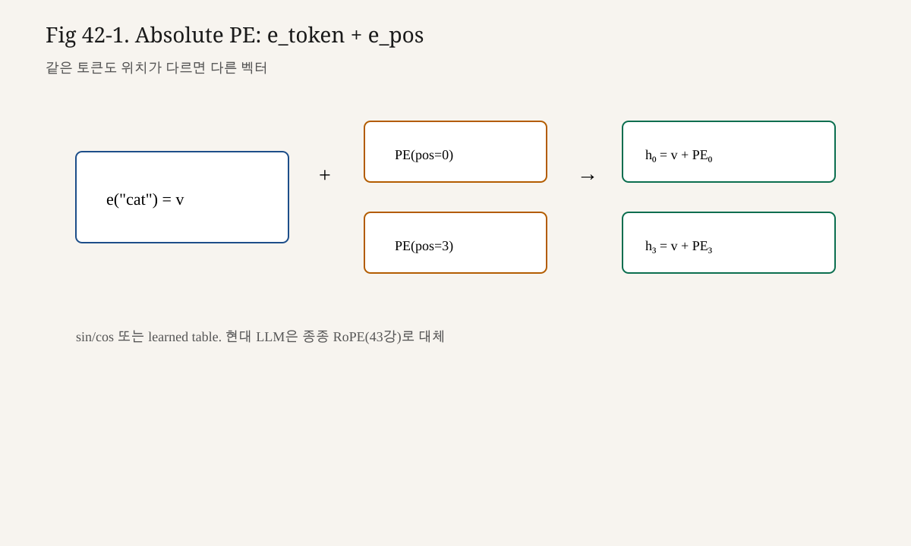

# 42강. Positional Encoding
## 이번 강에서 배우는 내용

- 왜 Attention에 위치 정보가 별도로 필요한지
- Sinusoidal PE의 직관과 수식
- 작은 숫자로 PE 벡터를 직접 계산하는 방법
- 토큰 임베딩에 PE를 더하는(add) 방식
- Sinusoidal PE의 한계와, 제43강 RoPE로 넘어가는 이유
- 현대 LLM에서 absolute PE가 차지하던 위치(사실과 해석을 구분)

## 왜 중요한가?
언어에서 순서는 의미입니다.

```text
"개가 사람을 물었다"
"사람이 개를 물었다"
```

토큰 집합은 비슷해도 순서가 다르면 문장이 달라집니다.  
RNN은 시간 순서대로 읽으므로 위치가 암묵적으로 들어갑니다.  
Self-Attention은 모든 토큰을 한꺼번에 보므로, **위치를 명시적으로 넣지 않으면** 모델이 “몇 번째 토큰인지”를 알기 어렵습니다.

Positional Encoding은 그 명시적 신호입니다.

> **핵심**
>
> Attention이 “무엇을 볼지”를 정한다면, Positional Encoding은 “그것이 어디에 있는지”를 심습니다.  
> 둘 중 하나만으로는 언어 모델이 완성되지 않습니다.

LLM 연결:

```text
token id
  → Embedding (의미 벡터)
    → + Positional Encoding (위치 벡터)   ← 오늘
      → Transformer Block (MHA + FFN)
```

제43강의 RoPE는 이 문제를 **더하기**가 아니라 **회전**으로 푸는 현대적 해법이다.  
오늘은 그 이전 세대의 표준을 정확히 이해한다.

## 선수 개념
- Embedding: 토큰 id → $d_{\text{model}}$ 벡터 (제31강)
- Self-Attention / MHA (제39~41강)
- $\sin, \cos$의 기본 성질 (주기, 위상)
- 브로드캐스팅으로 $(T, d)$와 $(T, d)$를 더하기

아직 깊게 몰라도 되는 것:

- RoPE의 복소 회전 형식 (제43강)
- ALiBi 등 다른 상대 위치 방법 (제53강 힌트)

## 핵심 개념
### 3.1 위치 정보가 없는 Attention의 문제

입력 시퀀스 $X = [x_1, x_2, x_3]$에 대해 Self-Attention은 (마스크·특수 구조를 제외하면) 토큰 쌍의 유사도에 의존한다.  
$x_1$과 $x_2$를 교환한 시퀀스에서도, 각 벡터가 그대로면 “누가 어디에 있었는지”를 연산이 자동으로 복원하지 못한다.

따라서 보통:

$$

z_t = e_t + p_t

$$

처럼 **토큰 임베딩 $e_t$**에 **위치 벡터 $p_t$**를 더한다.  
$t$는 위치(0부터 $T-1$), $e_t, p_t \in \mathbb{R}^{d_{\text{model}}}$이다.

### 3.2 Absolute Positional Encoding

**Absolute PE**는 “이 토큰은 절대 위치 $t$에 있다”는 신호를 준다.

종류:

1. **Sinusoidal PE**: $\sin/\cos$ 공식으로 고정 생성 (학습 안 함)
2. **Learned PE**: 위치마다 학습 가능한 벡터 테이블

원 논문 Transformer는 sinusoidal을 기본으로 제시했고, learned도 실험했다.  
GPT-2 등은 learned absolute position embedding을 사용한 바 있다.  
(모델마다 다르므로, “모든 GPT가 sinusoidal”이라고 말하면 사실이 아니다.)

### 3.3 Sinusoidal Positional Encoding 공식

차원 인덱스 $i = 0, 1, \ldots, d_{\text{model}}/2 - 1$에 대해:

$$

PE_{(t, 2i)} = \sin\!\left(\frac{t}{10000^{2i/d_{\text{model}}}}\right)

$$

$$

PE_{(t, 2i+1)} = \cos\!\left(\frac{t}{10000^{2i/d_{\text{model}}}}\right)

$$

읽는 법:

- 짝수 차원(0,2,4,…) → sine
- 홀수 차원(1,3,5,…) → cosine
- $t$: 토큰 위치
- $i$: 차원 쌍의 번호
- $10000^{2i/d_{\text{model}}}$: 차원마다 다른 파장(주기)을 만드는 항

직관:

- 낮은 차원(작은 $i$): 파장이 짧아 위치가 조금만 바뀌어도 값이 빨리 변한다 → 세밀한 위치
- 높은 차원(큰 $i$): 파장이 길어 천천히 변한다 → 거친 위치

여러 주파수의 $\sin/\cos$를 쌓으면, 각 위치 $t$가 **고유한 지문 벡터**를 갖는다.

### 3.4 왜 sin/cos인가 (원 논문의 동기)

논문이 강조한 포인트:

1. **결정적**: 학습 없이도 임의 길이 위치에 대해 값을 만들 수 있다.
2. **상대 위치 힌트**: 고정 오프셋 $k$에 대해 $PE_{t+k}$를 $PE_t$의 선형 함수로 나타낼 수 있는 구조적 성질이 있다.  
   (완벽히 “상대 위치 Attention”과 같다는 뜻은 아니다. **성질상 상대 정보를 표현하기 쉽다**는 동기이다.)
3. **Extrapolate 가능성**: 학습 때 본 길이보다 긴 시퀀스에도 공식을 확장할 여지는 있다.  
   다만 실전에서 길이 외삽이 항상 잘 된다는 보장은 없다.

### 3.5 더하기(Add) 인터페이스

Sinusoidal PE는 보통 Embedding과 **같은 차원**을 갖고, 요소별 합으로 들어간다.

$$

X = E + PE

$$

- $E$: `(T, d_model)` 토큰 임베딩
- $PE$: `(T, d_model)` 위치 인코딩
- 이후 MHA/FFN은 $X$만 보면 된다

곱하기나 concat을 쓰는 변종도 있으나, 원 논문과 많은 구현은 add다.

## 직관적으로 이해하기
시계열에 여러 메트로놈을 붙인다고 상상한다.

```text
위치 t=0,1,2,3,...

빠른 메트로놈(sin 단주기): 톡톡톡톡
느린 메트로놈(sin 장주기): 톡……톡……
코사인 파트너: 위상만 다른 쌍둥이
```

위치 5는 “빠른 시계 값 + 느린 시계 값 + …”의 조합으로 다른 위치와 구분된다.

Attention은 이 지문이 섞인 벡터로 Q/K/V를 만들므로, **내용이 비슷한 토큰도 위치가 다르면** Key/Query가 달라질 수 있다.

## 수학적으로 이해하기
### 5.1 주파수 정의

$$

\omega_i = \frac{1}{10000^{2i/d_{\text{model}}}}

$$

이면

$$

PE_{(t, 2i)} = \sin(t \omega_i),\quad
PE_{(t, 2i+1)} = \cos(t \omega_i)

$$

$\omega_i$는 차원 쌍 $i$의 각주파수다.

### 5.2 상대 오프셋과의 관계 (스케치)

각도 덧셈 공식:

$$

\sin(t\omega + k\omega) = \sin(t\omega)\cos(k\omega) + \cos(t\omega)\sin(k\omega)

$$

$$

\cos(t\omega + k\omega) = \cos(t\omega)\cos(k\omega) - \sin(t\omega)\sin(k\omega)

$$

즉 $PE_{t+k}$의 한 쌍은 $PE_t$의 한 쌍에 대한 **선형 변환**(회전·혼합)으로 쓸 수 있다.  
이 성질이 “상대 위치 표현에 유리하다”는 설명의 수학적 배경이다.

주의:

- 이 성질이 있다고 해서 모델이 반드시 상대 위치를 학습한다는 **보장은 아니다**.
- 제43강 RoPE는 상대 위치를 **내적 계산에 직접** 넣는 쪽으로 더 명확히 설계된다.

### 5.3 Learned PE와의 비교

| | Sinusoidal | Learned Absolute |
|---|---|---|
| 파라미터 | 없음(공식) | 약 `max_len × d_model` |
| 길이 확장 | 공식상 가능 | 테이블 밖은 별도 처리 필요 |
| 유연성 | 고정 패턴 | 데이터가 패턴을 학습 |
| 대표 예 | 원 논문 Transformer | GPT-2 등 |

## 작은 숫자로 직접 계산하기
### 6.1 설정

- $d_{\text{model}} = 4$
- 위치 $t = 0, 1$
- $i = 0, 1$ (차원 쌍 2개)

주파수의 지수:

$$

10000^{2i/4} = 10000^{i/2}

$$

- $i=0$: $10000^{0} = 1$ → $\omega_0 = 1$
- $i=1$: $10000^{0.5} = 100$ → $\omega_1 = 0.01$

### 6.2 $t=0$

$$

\begin{aligned}
PE_{(0,0)} &= \sin(0 \cdot 1) = 0 \\
PE_{(0,1)} &= \cos(0 \cdot 1) = 1 \\
PE_{(0,2)} &= \sin(0 \cdot 0.01) = 0 \\
PE_{(0,3)} &= \cos(0 \cdot 0.01) = 1
\end{aligned}

$$

$$

PE_0 = [0,\ 1,\ 0,\ 1]

$$

### 6.3 $t=1$

$$

\begin{aligned}
PE_{(1,0)} &= \sin(1) \approx 0.8415 \\
PE_{(1,1)} &= \cos(1) \approx 0.5403 \\
PE_{(1,2)} &= \sin(0.01) \approx 0.0100 \\
PE_{(1,3)} &= \cos(0.01) \approx 0.99995
\end{aligned}

$$

$$

PE_1 \approx [0.8415,\ 0.5403,\ 0.0100,\ 0.99995]

$$

### 6.4 임베딩에 더하기

토큰 임베딩이

$$

E =
\begin{bmatrix}
0.1 & 0.2 & 0.3 & 0.4 \\
0.5 & 0.6 & 0.7 & 0.8
\end{bmatrix}

$$

이면

$$

X = E + PE
\approx
\begin{bmatrix}
0.1 & 1.2 & 0.3 & 1.4 \\
1.3415 & 1.1403 & 0.7100 & 1.79995
\end{bmatrix}

$$

같은 내용 임베딩이라도 위치가 다르면 $X$의 행이 달라지고, 이후 Q/K도 달라진다.

## 코드로 구현하기
```python
# sinusoidal_pe.py
"""Sinusoidal Positional Encoding (NumPy)."""

from __future__ import annotations

import numpy as np

def sinusoidal_pe(seq_len: int, d_model: int) -> np.ndarray:
    """Return PE with shape (seq_len, d_model)."""
    assert d_model % 2 == 0, "이 구현은 짝수 d_model을 가정"
    position = np.arange(seq_len)[:, None]  # (T, 1)
    i = np.arange(0, d_model, 2)[None, :]   # (1, d_model/2)
    # div_term = 10000^(2i/d_model) = exp( (2i/d_model) * log(10000) )
    div_term = np.exp((i / d_model) * np.log(10000.0))
    angles = position / div_term            # (T, d_model/2)

    pe = np.zeros((seq_len, d_model), dtype=np.float64)
    pe[:, 0::2] = np.sin(angles)
    pe[:, 1::2] = np.cos(angles)
    return pe

def add_position(token_emb: np.ndarray, pe: np.ndarray) -> np.ndarray:
    """token_emb: (B, T, C) or (T, C)."""
    return token_emb + pe[: token_emb.shape[-2]]

if __name__ == "__main__":
    pe = sinusoidal_pe(seq_len=2, d_model=4)
    print(np.round(pe, 4))
    # t=0: [0, 1, 0, 1]
    # t=1: [sin1, cos1, sin0.01, cos0.01]
```

PyTorch 버전:

```python
import torch
import math
import torch.nn as nn

class SinusoidalPositionalEncoding(nn.Module):
    def __init__(self, d_model: int, max_len: int = 2048):
        super().__init__()
        pe = torch.zeros(max_len, d_model)
        position = torch.arange(0, max_len, dtype=torch.float).unsqueeze(1)
        div_term = torch.exp(
            torch.arange(0, d_model, 2).float() * (-math.log(10000.0) / d_model)
        )
        pe[:, 0::2] = torch.sin(position * div_term)
        pe[:, 1::2] = torch.cos(position * div_term)
        self.register_buffer("pe", pe.unsqueeze(0))  # (1, max_len, d)

    def forward(self, x: torch.Tensor) -> torch.Tensor:
        # x: (B, T, C)
        return x + self.pe[:, : x.size(1)]
```

`register_buffer`로 두면 학습 파라미터는 아니지만 `state_dict`/device 이동에 포함된다.

## 한계 — 왜 다음이 RoPE인가
Sinusoidal/Learned absolute PE는 강력하지만 한계가 있다.

1. **절대 위치 중심**  
   “위치 17” 자체보다 “두 토큰이 3칸 떨어짐”이 중요한 경우가 많다.

2. **길이 외삽**  
   공식/테이블을 넘어가는 긴 컨텍스트에서 품질이 떨어질 수 있다.

3. **임베딩과 위치의 합**  
   의미 벡터와 위치 벡터를 같은 공간에 더하므로, 정보가 얽인다.  
   (장점이자 모호함의 원인)

4. **현대 LLM의 선택**  
   LLaMA 등 많은 최신 모델은 absolute PE 대신 **RoPE**를 사용한다.  
   이것은 “sinusoidal이 틀렸다”기보다, **Q/K 회전이 상대 위치에 더 직접적**이라는 설계 선택의 결과에 가깝다.

제43강에서 이 한계를 회전으로 돌파한다.


<!-- visual-example-42 -->
## 숫자로 따라가기 — Absolute PE



같은 토큰 벡터 $\mathbf{v}$에 위치 벡터를 **더합니다**.

$$
\mathbf{h}_0=\mathbf{v}+\mathrm{PE}(0),\quad
\mathbf{h}_3=\mathbf{v}+\mathrm{PE}(3)
$$

장난감 ($d=2$, 각도만 표시):

| 위치 $t$ | $\mathrm{PE}(t)$ 예 | $\mathbf{h}_t$ 직관 |
|---|---|---|
| $0$ | $[\sin 0,\ \cos 0]=[0,1]$ | $\mathbf{v}$와 다른 방향 |
| $1$ | $[\sin\theta,\ \cos\theta]$ | 한 칸 회전 |
| $3$ | $[\sin 3\theta,\ \cos 3\theta]$ | 더 먼 위상 |

Self-Attention은 순서를 모름 → PE가 “몇 번째인지”를 명시합니다. 현대 LLM은 종종 RoPE(43강)로 대체합니다.

## LLM에서는 어디에 사용될까?
사실:

- 원 논문 Transformer(기계번역 Encoder-Decoder)는 sinusoidal PE를 사용했다.
- GPT-2는 learned absolute position embedding을 사용했다.
- 최근 decoder-only LLM 다수는 RoPE 계열을 사용한다.

설명:

- “PE를 더한다”는 인터페이스는 이해하기 쉬운 교육용 표준이다.
- 실전 최신 LLM을 재현할 때는 모델 카드/논문의 위치 방식을 확인해야 한다.

제48강 Causal LM 구조를 그릴 때, 위치 모듈이 Embedding 바로 다음(또는 Attention 내부)에 들어가는 지점을 표시하게 된다.

## 실습
1. `sinusoidal_pe(8, 4)`를 출력해 각 행(위치)이 서로 다른지 확인하라.
2. 같은 토큰 임베딩 `[0.2, 0.1, -0.1, 0.0]`를 위치 0과 3에 두고 PE를 더한 뒤 차이를 계산하라.
3. `d_model=8`에서 $i$가 커질수록 인접 위치 간 PE 차이가 작아지는 차원을 관찰하라.
4. Learned PE용 `nn.Embedding(max_len, d_model)`과 sinusoidal을 같은 모델에 바꿔 끼울 인터페이스를 스케치하라.
5. (선택) $PE_{t}$와 $PE_{t+1}$의 코사인 유사도가 $t$에 따라 어떻게 변하는지 그려 보라.

## 자주 하는 실수
1. **PE를 concat하고도 d_model을 안 바꿈**  
   add가 아니라 concat이면 차원이 두 배가 된다.

2. **0-based / 1-based 위치 혼동**  
   구현과 논문 예제가 0부터인지 확인한다.

3. **홀수 d_model**  
   짝수 차원 쌍 가정이 깨진다. 패딩 차원을 두거나 공식을 조정한다.

4. **배치 차원에 PE를 잘못 브로드캐스트**  
   `(T, C)`를 `(B, T, C)`에 더할 때 축을 맞춘다.

5. **“현대 LLM = 무조건 sinusoidal”**  
   사실이 아니다. 모델별 위치 인코딩을 확인한다.

## 핵심 요약
- Self-Attention은 위치 신호가 없으면 순서에 둔감하다.
- Positional Encoding은 위치 $t$를 벡터로 만들어 임베딩에 더한다.
- Sinusoidal PE는 차원마다 다른 주파수의 sin/cos로 고유 지문을 만든다.
- 상대 오프셋에 대한 선형 관계 성질이 있지만, 상대 위치 전용 메커니즘은 아니다.
- 한계를 보완하는 현대적 대표 해가 제43강 RoPE다.

## 용어 사전
| 용어 | 설명 |
|---|---|
| Positional Encoding (PE) | 토큰 위치를 벡터로 표현하는 방법 |
| Absolute PE | 절대 인덱스 $t$에 기반한 위치 신호 |
| Sinusoidal PE | sin/cos 공식으로 만드는 고정 PE |
| Learned PE | 위치 테이블을 학습하는 absolute PE |
| Wavelength / Frequency | 차원별 주기·주파수. 세밀/거친 위치 해상도 |

## 연습문제
**문제 1.** Attention에 위치 인코딩이 필요한 이유를 한 문장으로 쓰라.

**문제 2.** $d_{\text{model}}=4$, $t=0$일 때 sinusoidal PE의 값은?

**문제 3.** 짝수/홀수 차원에 각각 어떤 함수가 쓰이는가?

**문제 4.** Sinusoidal PE의 한계를 두 가지 쓰라.

**문제 5.** GPT-2가 원 논문과 같은 sinusoidal을 쓴다고 단정할 수 있는가?

### 정답과 해설

1. Self-Attention만으로는 토큰 순서를 본질적으로 알 수 없어, 위치 신호를 명시적으로 넣어야 하기 때문이다.

2. $[0, 1, 0, 1]$.

3. 짝수 차원 sine, 홀수 차원 cosine.

4. 예: 절대 위치 중심이라 상대 거리가 간접적이다 / 긴 길이 외삽이 보장되지 않는다 / 의미와 위치가 같은 공간에 더해져 얽힌다.

5. 없다. GPT-2는 learned absolute position embedding을 사용했다.

## 다음 강의와 연결
오늘은 “위치를 더한다”.  
다음은 “Query/Key를 위치만큼 회전한다”.

제43강 **RoPE**는 현대 LLM의 위치 인코딩을 이해하는 핵심입니다.  
사실(어떤 모델이 쓰는지)과 설명(왜 상대 위치에 유리한지)을 분명히 구분하며 진행합니다.

---

## 부록 A. $t=2$까지 손계산을 이어가기

$d_{\text{model}}=4$, $\omega_0=1$, $\omega_1=0.01$일 때 $t=2$:

$$

\begin{aligned}
PE_{(2,0)} &= \sin(2) \approx 0.9093 \\
PE_{(2,1)} &= \cos(2) \approx -0.4161 \\
PE_{(2,2)} &= \sin(0.02) \approx 0.0200 \\
PE_{(2,3)} &= \cos(0.02) \approx 0.9998
\end{aligned}

$$

$$

PE_2 \approx [0.9093,\ -0.4161,\ 0.0200,\ 0.9998]

$$

$t=0,1,2$를 행으로 쌓으면:

$$

PE =
\begin{bmatrix}
0 & 1 & 0 & 1 \\
0.8415 & 0.5403 & 0.0100 & 0.99995 \\
0.9093 & -0.4161 & 0.0200 & 0.9998
\end{bmatrix}

$$

> ⚠️ **주의**
>
> 첫 두 차원은 빠르게 진동하고, 뒤 두 차원은 거의 선형에 가깝게 천천히 변합니다.  
> 이것이 “다중 해상도 위치 지문”의 정체입니다.

## 부록 B. 인접 위치 차이 벡터

$$

\Delta_t = PE_{t+1} - PE_t

$$

$t=0$이면

$$

\Delta_0 \approx
\begin{bmatrix}
0.8415 & -0.4597 & 0.0100 & -0.00005
\end{bmatrix}

$$

고주파 성분(앞쪽)의 변화가 저주파(뒤쪽)보다 큽니다.  
Attention이 가까운 위치를 구분할 때 앞쪽 차원이 더 민감하게 기여할 여지가 있습니다.

## 부록 C. 배치 Shape와 브로드캐스트

LLM 입력 텐서:

$$

E \in \mathbb{R}^{B \times T \times d},\qquad
PE \in \mathbb{R}^{1 \times T \times d}\ \text{또는}\ \mathbb{R}^{T \times d}

$$

$$

X = E + PE

$$

예: $B=2$, $T=3$, $d=4$이면 $E$는 `(2,3,4)`, $PE`는 `(3,4)`를 `(1,3,4)`로 올려 더합니다.  
배치마다 같은 절대 위치를 공유하는 것이 기본입니다.

## 부록 D. Learned PE 파라미터 수

$$

|\theta|_{\mathrm{learned\ PE}} = L_{\max} \cdot d_{\mathrm{model}}

$$

예: $L_{\max}=1024$, $d=768$이면 약 $1024\times 768 = 786{,}432$개입니다.  
임베딩 테이블($V\times d$)보다는 작지만, **길이 한도**가 파라미터에 묶입니다.

Sinusoidal은 $|\theta|=0$이고 공식만으로 $t$를 확장합니다(품질 보장은 별개).

## 부록 E. 각주파수 표 ($d=8$ 스케치)

$d_{\text{model}}=8$이면 $i=0,1,2,3$:

$$

\omega_i = 10000^{-2i/8} = 10000^{-i/4}

$$

| $i$ | $2i/d$ | $10000^{2i/d}$ | $\omega_i$ |
|---|---|---|---|
| 0 | 0 | 1 | 1 |
| 1 | 0.25 | $10$ | 0.1 |
| 2 | 0.5 | $100$ | 0.01 |
| 3 | 0.75 | $1000$ | 0.001 |

한 위치 $t$의 PE는 네 쌍의 $(\sin t\omega_i,\ \cos t\omega_i)$입니다.

$$

PE_t =
\big[
\sin(t\omega_0),\ \cos(t\omega_0),\ 
\sin(t\omega_1),\ \cos(t\omega_1),\ 
\sin(t\omega_2),\ \cos(t\omega_2),\ 
\sin(t\omega_3),\ \cos(t\omega_3)
\big]

$$

## 부록 F. 상대 오프셋 행렬 형태 (2D 회전)

한 주파수 $\omega$에 대해

$$

\begin{bmatrix}
PE_{(t+k,2i)} \\
PE_{(t+k,2i+1)}
\end{bmatrix}
=
\begin{bmatrix}
\cos(k\omega) & \sin(k\omega) \\
-\sin(k\omega) & \cos(k\omega)
\end{bmatrix}
\begin{bmatrix}
PE_{(t,2i)} \\
PE_{(t,2i+1)}
\end{bmatrix}

$$

(부호 규약은 $\sin/\cos$ 배치에 따라 동등한 회전·반사로 다시 쓸 수 있습니다.)  
핵심은 **고정 $k$에 대한 선형 변환**이 존재한다는 점입니다.

## 부록 G. PE를 뺀 순열 불변성 (사상 실험)

마스크가 없고 PE도 없다면, 토큰 순열 $\pi$에 대해

$$

\mathrm{Attn}(P_\pi X) = P_\pi\,\mathrm{Attn}(X)

$$

형태의 **순열 동변(permutation equivariance)**이 (이상화된) Self-Attention에 성립합니다.  
PE를 더하면 $X\mapsto E+PE$가 되어 순열 동변이 깨지고, 위치 의존이 생깁니다.

> **핵심**
>
> Causal Mask도 순서를 강제하지만, “미래 차단”과 “위치 좌표”는 다릅니다.  
> 마스크는 볼 수 있는 집합을, PE는 표현 공간의 좌표를 바꿉니다.

## 부록 H. Embedding + PE 후 Q 형성

$$

z_t = e_t + p_t,\qquad
\mathbf{q}_t = z_t W_Q

$$

작은 예: $e_0=[0.1,0.2]$, $p_0=[0,1]$, $W_Q=I$이면

$$

z_0=[0.1,1.2],\quad \mathbf{q}_0=[0.1,1.2]

$$

같은 $e_0$를 $t=1$에 두면 $p_1$이 달라 $\mathbf{q}$도 달라집니다.  
**내용이 같아도 위치가 다르면 Query가 달라질 수 있습니다.**

## 부록 I. 수치 안정·범위

$\sin,\cos$ 출력은 $[-1,1]$입니다.  
토큰 임베딩 스케일과 맞춰지지 않으면 초기 Attention이 위치 신호에 과도하게(또는 과소하게) 반응할 수 있습니다.  
실무에서는 임베딩 초기화·학습률·(선택) PE 스케일 계수가 이 균형을 맞춥니다.

## 부록 J. GPT-2식 Learned PE 스케치

```python
import torch
import torch.nn as nn

class LearnedPE(nn.Module):
    def __init__(self, max_len: int, d_model: int):
        super().__init__()
        self.pe = nn.Embedding(max_len, d_model)

    def forward(self, x, positions=None):
        # x: (B, T, C)
        B, T, _ = x.shape
        if positions is None:
            positions = torch.arange(T, device=x.device)
        return x + self.pe(positions)[None, :, :]
```

Sinusoidal과 인터페이스를 같게 두면 42↔43 실험이 쉽습니다.

## 부록 K. 연습 — $t=3$, $d=4$ 빈칸

$\omega_0=1$, $\omega_1=0.01$일 때:

$$

\begin{aligned}
PE_{(3,0)} &= \sin(3) \approx \_\_\_ \\
PE_{(3,1)} &= \cos(3) \approx \_\_\_ \\
PE_{(3,2)} &= \sin(0.03) \approx \_\_\_ \\
PE_{(3,3)} &= \cos(0.03) \approx \_\_\_
\end{aligned}

$$

참고값: $\sin 3\approx 0.1411$, $\cos 3\approx -0.98999$, $\sin 0.03\approx 0.0300$, $\cos 0.03\approx 0.9996$.

## 부록 L. LLM Shape 체크리스트

| 단계 | Shape |
|---|---|
| token id | `(B, T)` |
| token emb $E$ | `(B, T, d)` |
| PE | `(T, d)` 또는 `(1, T, d)` |
| $X=E+PE$ | `(B, T, d)` |
| MHA 입력 | `(B, T, d)` |
| head 분할 | `(B, h, T, d_k)`, $d=h\cdot d_k$ |

가짜 벤치마크 수치 없이, **차원만으로도** 파이프라인을 검증할 수 있습니다.

## 부록 M. 한 줄 요약

> Absolute PE는 “위치 $t$의 지문 벡터”를 만들어 임베딩에 더하고,  
> Sinusoidal은 그 지문을 학습 없이 $\sin/\cos$ 다중 주파수로 생성합니다.  
> 한계를 상대 회전으로 푸는 다음 장이 RoPE입니다.

<!-- LECTURE_NAV -->

---

### 강의 이동

- **이전 강:** [41강. Multi-Head Attention](41강_Multi_Head_Attention.md)
- **다음 강:** [43강. RoPE](43강_RoPE.md)

<!-- /LECTURE_NAV -->
