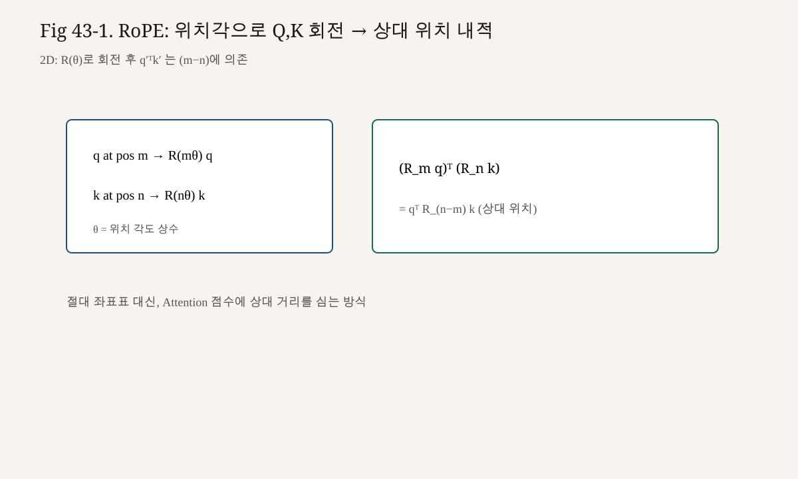

# 43강. RoPE
## 이번 강에서 배우는 내용

- 2D 회전 행렬이 벡터에 하는 일
- RoPE가 $Q, K$에만 적용되고 $V$에는 보통 적용하지 않는 이유(설계 관점)
- 회전 후 내적이 상대 위치에 의존하게 되는 핵심 아이디어
- 작은 숫자로 한 쌍의 차원을 직접 회전·내적해 보기
- 다차원으로 확장하는 짝(pair) 구조
- 현대 LLM에서 RoPE 사용의 사실과, 상대 위치 설명의 해석을 구분하기

## 왜 중요한가?
현대 decoder-only LLM을 읽다 보면 거의 반드시 RoPE가 나온다.

사실(관측):

- LLaMA, LLaMA 2/3, PaLM의 일부 계열, 그리고 다수의 공개 LLM이 RoPE 또는 그 변형을 사용한다.
- GPT-2식 learned absolute PE만으로 최신 모델을 설명하면 부족하다.

왜 관심이 큰가(설명):

- Attention score의 핵심은 $q^\top k$다.
- 두 벡터를 각각의 위치각으로 회전하면, 내적이 **절대 위치 두 개**가 아니라 **위치 차**에 더 직접적으로 의존하는 형태가 된다.
- 긴 컨텍스트·상대 의존에 유리하다는 설계 직관이 있다.

주의:

- “RoPE를 쓰면 무조건 장거리 성능이 보장된다”는 과장이다.
- 길이 확장에는 NTK-aware scaling, YaRN 등 **추가 기법**이 붙는 경우가 많다(상세는 제53강 힌트).

제48강 Causal LM 구조를 그릴 때, 위치 모듈이 Embedding add가 아니라 **Attention 내부의 Q/K 회전**으로 들어갈 수 있음을 알아야 한다.

## 선수 개념
- 벡터 내적 (제10강)
- $Q, K$와 scaled dot-product (제36~38강)
- 삼각함수 덧셈 공식
- 2×2 회전 행렬
- 제42강 absolute PE의 한계

복소수 표기는 선택 사항이다. 없어도 따라올 수 있게 쓴다.

## 핵심 개념
### 3.1 용어

**RoPE (Rotary Position Embedding, 회전 위치 임베딩)**는 위치 $t$에 따라 Query/Key를 블록 대각 회전 행렬로 변환하는 위치 인코딩이다.

원 아이디어 출처: RoFormer 논문(Su et al.).

### 3.2 2D 회전부터

2D 벡터 $v = (x, y)$를 각도 $\theta$만큼 회전:

$$

R(\theta)
=
\begin{bmatrix}
\cos\theta & -\sin\theta \\
\sin\theta & \cos\theta
\end{bmatrix}

$$

$$

R(\theta)
\begin{bmatrix}
x \\ y
\end{bmatrix}
=
\begin{bmatrix}
x\cos\theta - y\sin\theta \\
x\sin\theta + y\cos\theta
\end{bmatrix}

$$

성질:

- 길이는 보존: $\|R(\theta)v\| = \|v\|$
- $R(\theta_1)R(\theta_2) = R(\theta_1+\theta_2)$
- $R(\theta)^\top = R(-\theta)$

### 3.3 RoPE의 적용 대상

위치 $m$의 Query $q_m$, 위치 $n$의 Key $k_n$에 대해:

$$

\tilde{q}_m = R_m q_m,\quad
\tilde{k}_n = R_n k_n

$$

Attention score에 들어가는 내적:

$$

\tilde{q}_m^\top \tilde{k}_n
=
(R_m q_m)^\top (R_n k_n)
=
q_m^\top R_m^\top R_n k_n
=
q_m^\top R_{n-m} k_n

$$

마지막 줄이 핵심이다.

$$

R_m^\top R_n = R_{-m} R_n = R_{n-m}

$$

즉, 회전을 거친 내적은 **상대 위치 $n-m$**에 의존하는 형태로 정리된다.

Value $v$에는 보통 RoPE를 적용하지 않는다.  
가중합의 “내용 벡터”는 위치 회전 없이 두고, **누가 누구를 볼지(score)**에 상대 위치를 심는 설계다.

### 3.4 Absolute PE와의 인터페이스 차이

| | Absolute PE (제42강) | RoPE |
|---|---|---|
| 어디에 넣나 | 보통 Embedding에 더함 | Attention 직전/내부의 Q,K |
| 절대/상대 | 절대 위치 신호 | 내적에서 상대 위치가 자연스럽게 등장 |
| V에 영향 | 간접(입력이 바뀌므로) | 직접 회전은 보통 안 함 |
| 구현 위치 | Embedding 층 근처 | MHA 내부 |

### 3.5 다차원: 짝지어 회전

$d_k$가 2보다 크면, 벡터를 2차원씩 묶는다.

$$

(q_0, q_1),\ (q_2, q_3),\ \ldots

$$

각 쌍 $i$에 서로 다른 주파수 $\theta_i$를 둔다.

위치 $m$에서 쌍 $i$의 회전각:

$$

m \theta_i

$$

주파수의 전형적인 선택(RoFormer/LLaMA류):

$$

\theta_i = 10000^{-2i/d}

$$

여기서 $i = 0, 1, \ldots, d/2 - 1$, $d = d_k$(head 차원).

제42강 sinusoidal의 $10000^{2i/d}$와 **같은 가족**의 주파수 설계다.  
차이는 “임베딩에 sin/cos를 더하느냐” vs “Q/K를 회전하느냐”다.

## 직관적으로 이해하기
시계 바늘을 생각하자.

- Query 시계: 토큰이 선 위치에 따라 바늘이 돌아 있다.
- Key 시계: 다른 토큰의 위치에 따라 바늘이 돌아 있다.
- 두 바늘의 **상대각**이 내적(정렬)에 영향을 준다.

같은 내용 벡터라도, 서로 3칸 떨어졌을 때와 30칸 떨어졌을 때 정렬 점수가 달라질 수 있다.

비유를 과도하게 확장하지는 말자.  
수학적으로 붙잡을 문장은 하나면 충분하다.

> 회전을 통과한 $q^\top k$는 $R_{n-m}$을 통해 상대 위치에 의존한다.

## 수학적으로 이해하기
### 5.1 한 쌍에 대한 내적 전개

$q = (q_0, q_1),\ k = (k_0, k_1)$라 하고,  
Query는 각도 $m\theta$, Key는 $n\theta$로 회전한다.

$$

\tilde{q}
=
\begin{bmatrix}
q_0\cos m\theta - q_1\sin m\theta \\
q_0\sin m\theta + q_1\cos m\theta
\end{bmatrix}

$$

$$

\tilde{k}
=
\begin{bmatrix}
k_0\cos n\theta - k_1\sin n\theta \\
k_0\sin n\theta + k_1\cos n\theta
\end{bmatrix}

$$

내적 $\tilde{q}^\top\tilde{k}$를 전개하면 $\cos((n-m)\theta),\ \sin((n-m)\theta)$ 항으로 정리된다.  
절대각 $m, n$이 따로 남지 않고 **차 $n-m$**만 남는다.

### 5.2 복소 표기 (선택)

쌍을 복소수 $q_0 + i q_1$로 보면, 회전은 $e^{im\theta}$ 곱과 같다.  
내적은 상대 위상 $e^{i(n-m)\theta}$에 의존한다.  
편하면 쓰고, 불편하면 2D 행렬만으로도 충분하다.

### 5.3 Softmax Attention에 들어가는 위치

Head 하나에서:

$$

\mathrm{score}_{mn}
=
\frac{\tilde{q}_m^\top \tilde{k}_n}{\sqrt{d_k}}

$$

Causal Mask(제40강)는 그 위에 그대로 더해진다.  
RoPE는 위치 인코딩이고, Causal Mask는 미래 차단이다. **역할이 다르다.**

```text
Q,K 생성
  → RoPE 회전 (위치)
    → 내적 / sqrt(d_k)
      → Causal Mask (제40강)
        → Softmax
          → × V
```

### 5.4 상대 위치 “보장”의 정확한 의미

사실:

- 수식상 $\tilde{q}_m^\top\tilde{k}_n = q_m^\top R_{n-m} k_n$ 형태가 된다.

설명:

- 이 형태가 상대 위치 정보를 **주입하기 유리한 구조**라는 뜻이다.
- 모델이 항상 “상대 거리만 본다”거나, 절대 위치를 전혀 쓰지 않는다는 뜻은 아니다.
- 다른 층·FFN·특수 토큰 등 추가 경로가 절대적 단서를 줄 수도 있다.

사실과 해석을 섞지 않는 것이 이 강의의 태도다.

## 작은 숫자로 직접 계산하기
### 6.1 설정

- head 차원 $d_k = 2$ (한 쌍만)
- $\theta = \pi/2$ (과장된 각도. 계산 명확화용)
- Query 내용 $q = [1,\ 0]$
- Key 내용 $k = [1,\ 0]$
- Query 위치 $m=0$, Key 위치 $n=1$

### 6.2 회전

$m=0$:

$$

R_0 = I,\quad \tilde{q} = [1,\ 0]

$$

$n=1,\ \theta=\pi/2$:

$$

R_1
=
\begin{bmatrix}
\cos\pi/2 & -\sin\pi/2 \\
\sin\pi/2 & \cos\pi/2
\end{bmatrix}
=
\begin{bmatrix}
0 & -1 \\
1 & 0
\end{bmatrix}

$$

$$

\tilde{k}
=
R_1
\begin{bmatrix}
1 \\ 0
\end{bmatrix}
=
\begin{bmatrix}
0 \\ 1
\end{bmatrix}

$$

### 6.3 내적

$$

\tilde{q}^\top \tilde{k} = 1\cdot 0 + 0\cdot 1 = 0

$$

위치 차가 0일 때($m=n=0$):

$$

\tilde{q}^\top\tilde{k} = 1

$$

같은 내용 벡터인데, **상대 위치가 바뀌자 내적이 1 → 0으로 변했다.**  
RoPE가 score에 위치를 심는다는 최소 데모다.

### 6.4 상대각으로 바로 보기

$$

R_{n-m} = R_1

$$

$$

q^\top R_{1} k
=
\begin{bmatrix}1 & 0\end{bmatrix}
\begin{bmatrix}0 \\ 1\end{bmatrix}
= 0

$$

동일하다.

### 6.5 더 작은 각도

실전 $\theta$는 $\pi/2$처럼 극단적이지 않다.  
$\theta = 0.1$, $n-m=1$이면 내적 변화는 완만하다.  
여러 주파수 쌍이 모여 **다양한 거리 스케일**을 표현한다.

## 코드로 구현하기
### 7.1 NumPy: 한 head, 짝 회전

```python
# rope_numpy.py
"""교육용 RoPE (NumPy)."""

from __future__ import annotations

import numpy as np

def build_theta(d_k: int, base: float = 10000.0) -> np.ndarray:
    """theta_i for i=0..d_k/2-1"""
    assert d_k % 2 == 0
    i = np.arange(0, d_k, 2, dtype=np.float64)
    return base ** (-i / d_k)

def apply_rope(x: np.ndarray, positions: np.ndarray, theta: np.ndarray) -> np.ndarray:
    """
    x: (B, H, T, D) or (T, D)
    positions: (T,)
    theta: (D/2,)
    """
    x = np.asarray(x, dtype=np.float64)
    squeeze = False
    if x.ndim == 2:
        x = x[None, None, :, :]
        squeeze = True

    B, H, T, D = x.shape
    assert D % 2 == 0
    assert theta.shape[0] == D // 2

    # angles: (T, D/2)
    angles = positions[:, None] * theta[None, :]
    cos = np.cos(angles)[None, None, :, :]  # (1,1,T,D/2)
    sin = np.sin(angles)[None, None, :, :]

    x_even = x[..., 0::2]
    x_odd = x[..., 1::2]

    rot_even = x_even * cos - x_odd * sin
    rot_odd = x_even * sin + x_odd * cos

    out = np.empty_like(x)
    out[..., 0::2] = rot_even
    out[..., 1::2] = rot_odd

    if squeeze:
        return out[0, 0]
    return out

if __name__ == "__main__":
    q = np.array([[1.0, 0.0]])  # T=1, D=2  → 사실상 한 벡터
    # 데모: T=2 시퀀스에서 위치 0,1
    q = np.array([[1.0, 0.0], [1.0, 0.0]])
    theta = np.array([np.pi / 2])  # 과장 주파수
    pos = np.arange(2)
    q_rot = apply_rope(q, pos, theta)
    print("q_rot\n", q_rot)

    # score between m=0 and n=1
    score = q_rot[0] @ q_rot[1]
    print("score", score)  # 약 0.0
```

### 7.2 PyTorch 스케치 (MHA에 꽂기)

```python
# rope_torch_sketch.py
import torch
import torch.nn as nn
import math

def rotate_half(x: torch.Tensor) -> torch.Tensor:
    # (..., D) where D even: [-x1, x0, -x3, x2, ...] 형태 구현도 가능
    x1 = x[..., 0::2]
    x2 = x[..., 1::2]
    # interleave (-x2, x1)
    out = torch.stack((-x2, x1), dim=-1).flatten(-2)
    return out

def apply_rope_torch(x: torch.Tensor, cos: torch.Tensor, sin: torch.Tensor) -> torch.Tensor:
    # x, cos, sin: broadcastable to (B,H,T,D)
    return x * cos + rotate_half(x) * sin

class RopeCache(nn.Module):
    def __init__(self, d_k: int, max_len: int = 2048, base: float = 10000.0):
        super().__init__()
        assert d_k % 2 == 0
        inv_freq = 1.0 / (base ** (torch.arange(0, d_k, 2).float() / d_k))
        t = torch.arange(max_len).float()
        freqs = torch.outer(t, inv_freq)  # (T, D/2)
        # duplicate to D dims for simpler multiply form
        emb = torch.cat([freqs, freqs], dim=-1)  # 구현 스타일에 따라 다름
        self.register_buffer("cos", emb.cos()[None, None, :, :], persistent=False)
        self.register_buffer("sin", emb.sin()[None, None, :, :], persistent=False)

    def get(self, T: int):
        return self.cos[..., :T, :], self.sin[..., :T, :]
```

주의:

- 공개 구현마다 `rotate_half` 방식(짝·홀 교차 vs 앞뒤 반 분할)이 다르다.
- **수학적 동치인 다른 배치**가 존재한다. 한 구현을 고르면 일관되게 유지한다.
- 위 스케치는 개념용이다. 제49~50강 Mini Transformer에서 하나로 고정한다.

## MHA와의 결합 위치
제41강 MHA 흐름에 RoPE를 끼우면:

```text
x → Wq,Wk,Wv → split heads
  → q,k에 RoPE(positions)
  → scores = q @ k^T / sqrt(d_k)
  → causal mask
  → softmax → @ v
  → merge → Wo
```

Positional Encoding을 Embedding에 더하는 코드를 쓰던 모델은, RoPE 모델에서 그 add를 **제거**하는 경우가 많다.  
위치를 두 방식으로 중복 주입하지 않는 것이 일반적이다(모델별 예외 가능).

## 수식 보강 — RoPE 회전

2D 부분공간에서 위치 $m$ 회전:

$$
\begin{pmatrix}x'\\y'\end{pmatrix}
=
\begin{pmatrix}\cos m\theta & -\sin m\theta\\ \sin m\theta & \cos m\theta\end{pmatrix}
\begin{pmatrix}x\\y\end{pmatrix}
$$

상대 위치 $m-n$이 내적에 인코딩됩니다.


<!-- visual-example-43 -->
## 숫자로 따라가기 — RoPE 회전



2D에서 위치 $m$의 쿼리·위치 $n$의 키를 각도 $\theta$로 회전:

$$
\mathbf{q}'=R(m\theta)\mathbf{q},\quad
\mathbf{k}'=R(n\theta)\mathbf{k}
$$

내적은 상대 위치에 의존합니다.

$$
(\mathbf{q}')^{\top}(\mathbf{k}')
=
\mathbf{q}^{\top} R\bigl((n-m)\theta\bigr)\mathbf{k}
$$

| 기호 | 의미 | 숫자 직관 |
|---|---|---|
| $m,n$ | 토큰 위치 | $0,1,2,\ldots$ |
| $\theta$ | 주파수 상수 | 짝 차원마다 다름 |
| $R(\cdot)$ | 2D 회전 | $\begin{bmatrix}\cos&-\sin\\ \sin&\cos\end{bmatrix}$ |
| $n-m$ | 상대 거리 | Attention 점수에 심김 |

절대 PE 표를 더하는 대신, Q/K를 돌려 **상대 위치**를 점수에 넣습니다.

## LLM에서는 어디에 사용될까?
### 9.1 사실

- RoFormer가 RoPE를 제안했다.
- LLaMA 계열 등 다수 LLM이 RoPE를 채택했다.
- GPT-2는 RoPE가 아니라 learned absolute position embedding이다.
- “모든 LLM = RoPE”는 사실이 아니다.

### 9.2 설명

- RoPE가 인기인 이유로는 상대 위치 친화적 내적 구조, 길이 확장 연구와의 연결, 구현 친화성 등이 거론된다.
- 하지만 성능의 전부 RoPE 하나만으로 결정되지 않는다. 데이터·스케일·아키텍처·학습 레시피가 함께 간다.

### 9.3 길이 확장 (맛보기)

컨텍스트를 학습 길이보다 늘릴 때:

- 주파수 스케일 조정(NTK-aware 등)
- interpolation / extrapolation 기법
- YaRN 같은 복합 방법

상세 알고리즘은 제53강 개요로 미룬다.  
오늘은 “RoPE의 $\theta$를 만지면 길이 특성이 바뀐다” 정도만 기억한다.

### 9.4 제40강·제48강과 같이 놓기

```text
제40강 Causal Mask : 미래를 가린다
제43강 RoPE         : 위치(상대)를 score에 심는다
제48강 Causal LM    : 둘을 포함한 decoder-only 스택
```

둘은 대체재가 아니라 **동시에 쓰는 부품**이다.

## 5 생성 루프와 위치 인덱스 (맛보기)
오토리그레시브 생성에서는 토큰을 한 개씩 늘린다.

```text
t=0: prompt의 첫 토큰
t=1: 다음 토큰
…
t=T-1: 방금 샘플링한 토큰
```

RoPE는 각 토큰의 **절대 인덱스 $t$**로 각을 만든다.  
KV 캐시를 쓰는 추론에서는, 과거에 캐시된 Key에 이미 해당 위치의 회전이 적용되어 있어야 한다.

사실:

- 위치 오프셋이 한 칸만 어긋나도 Attention score가 체계적으로 틀어진다.

설명:

- 이는 RoPE가 “상대 위치 구조”를 갖는 것과 별개로, **구현상 절대 인덱스를 정확히 공급**해야 함을 뜻한다.

제48~50강·추론 장에서 캐시와 위치를 다시 만난다.  
오늘은 “RoPE 각 = 위치 인덱스의 함수”만 고정한다.

## 6 제42강과의 숫자 감각 연결
Sinusoidal PE는 $\sin(t\omega),\cos(t\omega)$를 임베딩에 더한다.  
RoPE는 같은 계열의 $\omega$로 $R_{t}$를 만들어 Q/K에 곱한다.

같은 주파수 가족이라도:

| | 신호가 붙는 곳 | score에 미치는 경로 |
|---|---|---|
| Sinusoidal | 입력 합 | WQ/WK를 통해 간접 |
| RoPE | Q/K 직접 회전 | 내적에 상대각으로 직접 |

이 차이가 “왜 현대 LLM이 RoPE를 자주 택하는지”를 설명할 때 가장 안전한 수준이다.  
그 이상의 성능 단정은 하지 않는다.

## 실습
1. 제7절 숫자 예제를 NumPy로 재현해 score가 0에 가까운지 확인하라.
2. $m=n$일 때 같은 $q,k$의 score가 회전 전 내적과 같은지 확인하라.
3. `d_k=4`로 두 쌍을 두고, 주파수 $\theta_0>\theta_1$일 때 위치 1 이동의 영향이 첫 쌍에서 더 큰지 관찰하라.
4. MHA 코드에 `apply_rope(q)`, `apply_rope(k)`를 끼워 shape가 보존되는지 확인하라.
5. (선택) V에도 잘못 적용해 보면 어떤 일이 생기는지 shape/실험적으로만 관찰하고, 표준 설계와 비교하라.

## 자주 하는 실수
1. **Embedding에 PE를 더하고 RoPE도 적용**  
   중복일 수 있다. 모델 설계를 확인한다.

2. **V까지 회전**  
   표준 RoPE Attention은 Q/K 중심이다.

3. **짝수 차원 가정 무시**  
   head 차원은 짝수여야 2D 쌍이 맞다.

4. **위치 인덱스를 1부터 두어 캐시와 불일치**  
   KV cache·생성 루프에서 position offset이 어긋나기 쉽다.

5. **구현 스타일 혼용**  
   half-rotation 규칙이 다른 코드를 섞으면 회전이 깨진다.

6. **‘상대 위치 보장’을 과대해석**  
   수식 형태와 학습된 행동를 구분한다.

## 핵심 요약
- RoPE는 Q/K를 위치각으로 회전하는 위치 인코딩이다.
- 회전 후 내적은 $R_{n-m}$을 통해 상대 위치에 의존하는 형태가 된다.
- 다차원에서는 2D 쌍마다 다른 주파수로 회전한다.
- Causal Mask와는 별개 부품이며 함께 쓰인다.
- 현대 LLM 다수가 채택하지만, 모든 모델의 법칙은 아니다.
- Absolute PE(add)와 구현 위치가 다르다.

## 용어 사전
| 용어 | 설명 |
|---|---|
| RoPE | Rotary Position Embedding. Q/K 회전 위치 인코딩 |
| Rotation Matrix | 각 $\theta$만큼 벡터를 돌리는 행렬 |
| Relative Position | 두 토큰 위치 차 $n-m$ |
| Frequency $\theta_i$ | 차원 쌍별 회전 각속도 |
| Absolute PE | 임베딩에 더하는 절대 위치 방식(제42강) |

## 연습문제
**문제 1.** RoPE를 보통 어디에 적용하는가?

**문제 2.** $\tilde{q}_m^\top\tilde{k}_n = q_m^\top R_{n-m} k_n$이 의미하는 바는?

**문제 3.** 제7절에서 $q=k=[1,0]$, $m=0,n=1,\theta=\pi/2$일 때 내적은?

**문제 4.** RoPE와 Causal Mask의 역할을 한 줄씩 구분하라.

**문제 5.** “LLaMA가 RoPE를 쓴다”는 사실인가, 해석인가?

**문제 6.** Absolute sinusoidal PE와 RoPE의 공통점 하나는?

### 정답과 해설

1. Query와 Key (보통 Value는 제외).

2. Attention 내적이 절대 위치 쌍이 아니라 상대 위치 회전 $R_{n-m}$에 의존하는 형태로 정리됨.

3. 0.

4. RoPE: 위치 정보를 score에 주입. Causal Mask: 미래 토큰을 차단.

5. 사실(모델 설계/구현에 대한 관측).

6. $10000^{-2i/d}$ 계열의 다중 주파수 설계를 공유하는 점(가족 닮음).

## 다음 강의와 연결
위치까지 넣었다.  
다음으로 층을 깊게 쌓기 위한 **Residual과 LayerNorm(및 RMSNorm)**을 제44강에서 다룬다.

그다음 제45강 FFN, 제46강에서 Attention+Norm+Residual+FFN을 하나의 Transformer Block으로 조립한다.  
RoPE는 그 블록 안의 MHA 내부에 옵션으로 꽂힌다.

<!-- LECTURE_NAV -->

---

### 강의 이동

- **이전 강:** [42강. Positional Encoding](42강_Positional_Encoding.md)
- **다음 강:** [44강. LayerNorm과 Residual Connection](44강_LayerNorm과_Residual_Connection.md)

<!-- /LECTURE_NAV -->
