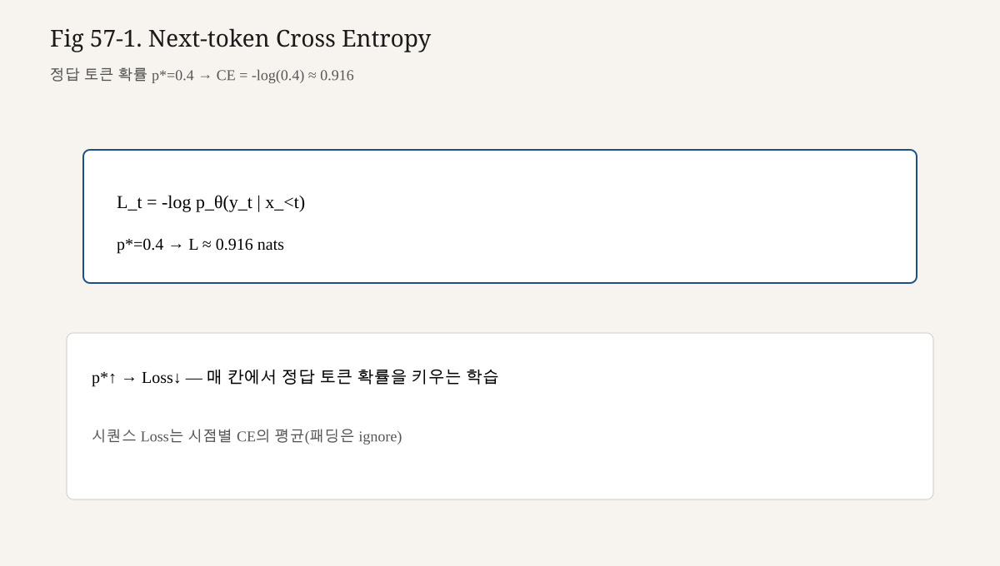

# 57강. Causal LM Training 목표
## 이번 강에서 배우는 내용

- Causal LM 목표 $\max \sum_t \log p(x_t\mid x_{<t})$를 문장·수식으로 쓴다
- 입력 $x$와 라벨 $y$를 한 칸 시프트로 맞춘다
- Softmax + NLL이 Cross Entropy(CE)와 같음을 복습·연결한다 (제33~34강)
- 작은 logit 벡터로 CE를 손계산한다
- PyTorch `F.cross_entropy`를 `[B,T,V]`에 맞게 reshape하여 적용한다
- 패딩·ignore_index·마스크가 Loss에 어떻게 들어가는지 설명한다

## 왜 중요한가?
모델 클래스가 있어도 목표가 흐리면 학습이 가짜가 된다.

```text
x와 y를 동일하게 둠     → 자기 자신 복사
시프트를 반대로 둠       → 과거 토큰 예측이라는 이상한 과제
padding을 Loss에 포함    → 가짜로 Loss↓
미래 토큰을 봄(마스크↓) → 커닝으로 Loss↓, 생성 붕괴
```

Pretraining의 본질은 데이터가 아니라 **이 목표 함수**다. 데이터가 바뀌어도(제60강), SFT로 포맷이 바뀌어도(후반), 토큰 단위 CE의 뼈대는 자주 남는다.

## 선수 개념
1. **Next Token Prediction** (제32강)
2. **Logit · Softmax** (제33강)
3. **Cross Entropy Loss** (제34강)
4. **Causal Mask** (제40강) — 학습 분포와 생성 시나리오 정렬
5. **GPT forward** (제56강) — logits 공급
6. **Dataset/DataLoader · 학습 루프** (제22~23강)

CE를 “분류 Loss”로만 기억했다면, 오늘은 **어휘 크기 $V$짜리 분류를 매 시점마다** 한다고 확장한다.

## 핵심 개념
### 3.1 최대화하는 것

토큰 서열 $x=(x_1,\ldots,x_T)$의 결합 확률을 인과 분해한다.

$$

P_\theta(x)=\prod_{t=1}^{T} P_\theta(x_t\mid x_{<t})

$$

로그를 취하면 합이 된다.

$$

\log P_\theta(x)=\sum_{t=1}^{T}\log P_\theta(x_t\mid x_{<t})

$$

학습은 데이터 분포 $x\sim\mathcal{D}$에서 기대 로그우도를 키운다(최우추정).

$$

\max_\theta\ \mathbb{E}_{x\sim\mathcal{D}}\big[\log P_\theta(x)\big]

$$

최소화 형태로 쓰면 **음의 로그우도(NLL)**:

$$

L(\theta)=\mathbb{E}_{x\sim\mathcal{D}}\left[-\sum_{t}\log P_\theta(x_t\mid x_{<t})\right]

$$

배치·길이로 나눈 평균이 실무 Loss다.

### 3.2 모델이 내는 분포

시점 $t$에서 GPT는 logit $\mathbf{z}_t\in\mathbb{R}^{V}$를 낸다.

$$

P_\theta(x_t=v\mid x_{<t})=\mathrm{softmax}(\mathbf{z}_t)_v=\frac{e^{z_{t,v}}}{\sum_{u=1}^{V}e^{z_{t,u}}}

$$

정답 토큰이 $y_t$일 때 기여 Loss:

$$

\ell_t=-\log\mathrm{softmax}(\mathbf{z}_t)_{y_t}=-z_{t,y_t}+\log\sum_u e^{z_{t,u}}

$$

이것이 **Cross Entropy(정답 one-hot vs Softmax 분포)**와 같다(제34강).

### 3.3 라벨 시프트(Shift labels)

Transformer는 **한 번의 forward**로 모든 위치의 logit을 동시에 계산한다. 위치 $t$의 출력 표현은 입력 토큰 $x_t$까지(마스크상) 볼 수 있다. 관례적으로 그 위치의 logit으로 **다음 토큰 $x_{t+1}$**을 예측한다.

따라서 텐서로는:

```text
입력 x:  x0 x1 x2 x3 x4
라벨 y:  x1 x2 x3 x4 x5
```

코드 패턴:

```python
# tokens: [B, T+1] 또는 길이 T의 연속 구간
x = tokens[:, :-1]
y = tokens[:, 1:]
logits = model(x)          # [B, T, V]
loss = cross_entropy(logits, y)
```

**절대 하면 안 되는 것**: `y = x`로 두어 같은 자리 토큰을 예측하게 만들기.

### 3.4 시점 정렬 다이어그램

$T=4$ 입력, 예측 4개:

```text
위치 인덱스(입력):   0      1      2      3
입력 토큰:          A      B      C      D
볼 수 있는 과거:    A    A..B  A..C  A..D
예측 대상 y:        B      C      D      E
```

Causal mask 덕분에 위치 2의 Attention은 A,B,C만 본다. 그래도 라벨은 “다음”인 D다.  
마스크와 시프트는 **둘 다** 필요하다. 하나만으로는 목표가 성립하지 않는다.

### 3.5 배치 평균의 정의

PyTorch 기본 `reduction='mean'`은 **유효 토큰 개수**로 나눈 평균에 가깝게 동작한다(ignore_index 제외). 문서·버전·구현에 따라 “시퀀스 평균 후 배치 평균”을 직접 짜는 경우도 있다.

교육용으로 기억할 문장:

> Loss = 각 토큰 CE의 평균 (패딩 제외)

토큰 수가 다른 시퀀스를 섞을 때는 이 정의가 길이에 대한 편향을 만든다. Packing(제61강)과 맞물린다.

## 직관적으로 이해하기
매 위치에서 모델은 **V지선다 시험**을 본다.

- 문제지: 지금까지의 토큰
- 선택지: 어휘 전체
- 채점: 정답 토큰의 확률을 높일수록 감점(Loss)이 줄어듦

Pretraining은 이 시험을 **인터넷·책·코드 등 텍스트의 모든 위치**에서 끊임없이 보게 하는 것과 같다. “이해했는가”를 직접 묻지 않고, **다음 말이 얼마나 그럴듯한가**로 압박한다.

직관적 한계도 같이 기억한다.

- 정답을 외우는 것과 사실을 검증하는 것은 다르다
- Loss가 낮아도 생성 문장이 유용하지 않을 수 있다(평가 지표의 한계)
- 그래도 이 압력만으로 문법·패턴·상당한 능력이  Emergent하게 나타난다(규모·데이터 의존)

## 수학적으로 이해하기 — CE와 NLL
정답 one-hot $\mathbf{y}$ (인덱스 $y^*$), 예측 분포 $\mathbf{p}=\mathrm{softmax}(\mathbf{z})$:

$$

\mathrm{CE}(\mathbf{y},\mathbf{p})=-\sum_{v} y_v\log p_v=-\log p_{y^*}

$$

즉 다중 클래스 CE는 정답 클래스 NLL과 동일하다.

퍼플렉시티(perplexity)와의 관계(참고):

$$

\mathrm{PPL}=\exp\big(L_{\mathrm{NLL}}\big)

$$

$L$이 토큰당 평균 NLL(nat)일 때다. 이 책은 초반에 Loss(NLL/CE)를 주 지표로 쓰고, PPL은 “해석용 변환”으로만 언급한다.

## 작은 숫자로 직접 계산하기
$V=3$ 어휘 `{0,1,2}`, 한 위치의 logit:

$$

\mathbf{z}=(2.0,\ 1.0,\ 0.1)

$$

정답 $y^*=0$.

### 6.1 Softmax

$$

e^{2.0}\approx 7.389,\quad e^{1.0}\approx 2.718,\quad e^{0.1}\approx 1.105

$$

합 $\approx 11.212$

$$

p=(0.659,\ 0.242,\ 0.099)

$$

### 6.2 CE

$$

\ell=-\log 0.659\approx 0.417

$$

### 6.3 정답이 틀린 클래스일 때

$y^*=2$라면 $\ell=-\log 0.099\approx 2.313$.  
같은 logit이라도 정답 위치에 따라 Loss가 크게 달라진다. 학습은 $z_{y^*}$를 상대적으로 키우는 방향으로 간다.

### 6.4 두 시점 평균

시점1 Loss $0.417$, 시점2 Loss $1.200$이면 평균 $0.8085$.  
배치도 동일하게 토큰 단위로 평균한다고 생각하면 된다.

### 6.5 시프트 숫자 예

토큰 ID 서열: `[7, 3, 3, 9]`

```text
x = [7, 3, 3]
y = [3, 3, 9]
```

세 번의 분류:

| 입력 접두 | 정답 |
|---|---|
| `[7]` | `3` |
| `[7,3]` | `3` |
| `[7,3,3]` | `9` |

(실제 구현은 teacher forcing으로 전체 접두를 한 텐서에 넣어 병렬 계산한다.)

## 코드로 구현하기 — CE 연결
### 7.1 reshape 패턴

`F.cross_entropy`는 보통 다음을 기대한다.

- logits: `[N, V]`
- target: `[N]` (클래스 인덱스)

따라서:

```python
import torch
import torch.nn.functional as F

logits = model(x)                     # [B, T, V]
B, T, V = logits.shape
loss = F.cross_entropy(
    logits.reshape(B * T, V),
    y.reshape(B * T),
)
```

`view`/`reshape` 선택은 contiguous 여부에 따라 고른다.

### 7.2 ignore_index로 패딩 무시

패딩 ID가 `pad_id`일 때:

```python
loss = F.cross_entropy(
    logits.reshape(-1, V),
    y.reshape(-1),
    ignore_index=pad_id,
)
```

라벨이 `pad_id`인 위치는 평균에 들어가지 않는다.  
**입력 쪽 패딩**은 Attention에서 키 마스크로 가리는 문제와 별개다. Loss ignore와 Attn padding mask를 혼동하지 않는다.

### 7.3 모델 안에서 Loss를 계산할지

두 스타일:

```python
# A) 학습 루프에서 Loss
logits = model(x)
loss = F.cross_entropy(...)

# B) forward가 (logits, loss) 반환
logits, loss = model(x, targets=y)
```

교육·디버깅에는 A가 명확하다. 추론 때는 targets 없이 logits만.

### 7.4 학습 한 스텝

```python
model.train()
optimizer.zero_grad(set_to_none=True)
logits = model(x)
loss = F.cross_entropy(logits.view(-1, V), y.view(-1), ignore_index=pad_id)
loss.backward()
torch.nn.utils.clip_grad_norm_(model.parameters(), 1.0)  # 선택
optimizer.step()
```

제23강의 루프가 토큰 CE 위로 올라온 형태다.

## PyTorch로 구현하기 — 작은 엔드투엔드
장난감 vocab으로 “시프트 + CE”만 검증한다.

```python
import torch
import torch.nn as nn
import torch.nn.functional as F

class TinyLM(nn.Module):
    """임베딩+선형만으로 CE 연결을 검증하는 장난감."""

    def __init__(self, vocab_size, n_embd):
        super().__init__()
        self.emb = nn.Embedding(vocab_size, n_embd)
        self.proj = nn.Linear(n_embd, vocab_size)

    def forward(self, idx):
        return self.proj(self.emb(idx))  # [B,T,V]

def demo_shift_ce():
    torch.manual_seed(0)
    V, C = 11, 8
    model = TinyLM(V, C)
    opt = torch.optim.AdamW(model.parameters(), lr=1e-2)

    # 한 문장 토큰 (pad=0은 없음)
    tokens = torch.tensor([[1, 2, 3, 4, 5]])  # [1, 5]
    x = tokens[:, :-1]  # [1,4]
    y = tokens[:, 1:]   # [1,4]

    for step in range(50):
        opt.zero_grad(set_to_none=True)
        logits = model(x)
        loss = F.cross_entropy(logits.reshape(-1, V), y.reshape(-1))
        loss.backward()
        opt.step()
        if step % 10 == 0:
            print(step, float(loss))

demo_shift_ce()
```

Loss가 내려가면 “시프트 정렬 + CE” 배선은 맞은 것이다.  
진짜 언어 능력은 GPT Block·데이터 규모가 필요하다.

### 8.1 GPT에 붙이기

```python
# model: 제56강의 GPT
x = batch[:, :-1]
y = batch[:, 1:]
logits = model(x)
loss = F.cross_entropy(
    logits.reshape(-1, model.config.vocab_size),
    y.reshape(-1),
)
```

`batch`가 이미 `block_size+1` 길이로 샘플된 경우의 전형적 패턴이다(제60~61강).

### 8.2 수동 Softmax NLL과 교차검증

```python
def ce_manual(logits, y):
    # logits [N,V], y [N]
    log_probs = F.log_softmax(logits, dim=-1)
    return -log_probs.gather(1, y.unsqueeze(1)).squeeze(1).mean()

N, V = 6, 5
logits = torch.randn(N, V)
y = torch.randint(0, V, (N,))
a = F.cross_entropy(logits, y)
b = ce_manual(logits, y)
print(torch.allclose(a, b))
```

수치가 같아야 한다. 다르면 reduction/ignore 설정을 의심한다.

## Teacher Forcing
**Teacher forcing**은 학습 시 모델이 방금 샘플한 토큰이 아니라 **정답 과거 토큰**을 다음 입력으로 넣는 방식이다. Causal LM의 병렬 forward가 곧 teacher forcing이다.

생성 시에는 자신의 출력을 다시 넣는다(exposure bias 이슈가 문헌에 있으나, 표준 LM Pretraining은 여전히 teacher forcing).

```text
학습: 정답 접두 → 다음 정답 예측 (병렬)
생성: 모델 접두 → 샘플 → append → 반복
```

제58강 생성 루프와 대비해 기억한다.


<!-- visual-example-57 -->
## 숫자로 따라가기 — Next-token CE



시퀀스 `나는 / 학생 / 이다` (id: 7, 3, 9)를 한 토큰씩 예측한다고 합시다.

| 위치 | 조건 | 맞힐 것 | 예: $p$ | $-\log p$ |
|---|---|---|---|---|
| 1 | [나는] | 학생 | 0.4 | 0.92 |
| 2 | [나는,학생] | 이다 | 0.7 | 0.36 |

평균 손실 $\approx (0.92+0.36)/2 = 0.64$.  
Pretraining/SFT 모두 이 **다음 칸 맞히기**의 평균입니다(SFT는 응답 구간만 평균).

## LLM에서는 어디에 사용될까?
대규모 Pretraining에서도 목표는 본질적으로 같다.

- 토큰 CE / NLL
- 시퀀스 packing으로 패딩 낭비 감소
- 때때로 document boundary에서 loss를 끊거나 special token으로 경계를 표시
- 혼합 도메인 가중치(데이터 비율)는 **샘플러**에서 조절, Loss 수식은 유지

SFT 단계에서도 많은 경우 **응답 토큰에만 Loss**를 걸고 질문 토큰은 ignore한다. 수식은 같고, 마스크만 달라진다. 3권 후반에서 다시 본다.

평가:

- held-out CE / PPL
- 생성 품질은 별도 (사람·벤치마크)

Loss만으로 제품 품질을 단정하지 않는다.

## 실습
### 실습 1 — 손계산

$\mathbf{z}=(0,0,0)$, $y^*=1$, $V=3$일 때 CE를 구하시오. Softmax가 균등분포임을 이용한다.

### 실습 2 — 시프트 작성

서열 `[10, 11, 12, 13, 14, 15]`에서 `block`으로 `x,y` 길이 4를 만든다고 가정하고 한 예를 쓰시오.

### 실습 3 — 버그 찾기

다음 코드의 문제를 지적하시오.

```python
logits = model(x)          # [B,T,V]
loss = F.cross_entropy(logits, x)
```

### 실습 4 — ignore_index

`y`의 절반을 `pad_id`로 바꾼 뒤 ignore 전후 Loss 변화를 관찰한다. ignore 없이 패딩을 학습하면 모델이 무엇을 배우기 쉬운지 한 줄로 쓴다.

### 실습 5 — GPT smoke + CE

제56강 모델에 랜덤 `x,y`(시프트 관계)를 넣어 Loss·backward가 오류 없이 도는지 확인한다. `grad`가 `None`이 아닌 파라미터 비율을 출력해 본다.

## 자주 하는 실수
1. **시프트 누락/`y=x`**  
   가장 흔한 LM 버그. 생성은 되는데 “한 칸 지연된 메아리” 또는 붕괴가 나타난다.

2. **`cross_entropy`에 Softmax를 한 번 더 적용**  
   `F.cross_entropy`는 logit을 받는다. Softmax 후 넣으면 틀린 Loss다. (`log_softmax`+`nll_loss` 조합은 가능)

3. **shape 미스**  
   `[B,T,V]`를 `[B,V,T]`로 넘겨 클래스 축이 달라지는 경우. `reshape(-1,V)` 전에 `V`가 마지막 축인지 확인.

4. **패딩을 정답으로 학습**  
   모델이 `PAD`만 예측하는 국소최적에 빠지기 쉽다.

5. **Causal mask 없이 CE만 믿음**  
   Loss는 예쁘고 생성은 실패한다(제40·54강).

6. **길이 평균 정의를 바꿔 놓고 이전 run과 비교**  
   토큰 평균 vs 시퀀스 평균을 섞으면 곡선 비교가 무의미하다.

7. **fp16 Softmax 불안정**  
   큰 $V$·큰 logit에서 underflow/overflow. 프레임워크 CE fused kernel을 우선 사용.

## 작은 디버그 체크리스트
학습 초기에 확인할 것:

```text
[ ] logits.shape == (B, T, V)
[ ] y.shape == (B, T)
[ ] y[b,t] == 원래서열에서 x 다음 토큰
[ ] loss는 scalar, 초기값이 대략 log(V) 근처(랜덤 추측)
[ ] 한 배치 overfit 시 loss → 0 근처로 내려가는지
```

랜덤 초기에서 균등 추측 NLL은 $\log V$ (nat) 정도다.  
$V=1000$이면 $\log 1000\approx 6.9$. 초기 Loss가 $0.01$이거나 $10^6$이면 shape/시프트/마스크를 의심한다.

## LLM 연결 — Pretraining 목표의 위치
```text
제56강 모델 → (오늘) CE 목표 → 제58~59강 디코딩
                 ↓
            제60강 데이터가 이 목표의 샘플을 공급
```

목표가 흔들리면 데이터·디코딩을 아무리 다듬어도 기둥이 없다.  
반대로 목표가 고정되면 Mini Pretraining(제68강)은 **데이터·스케줄·엔지니어링** 문제가 된다.

## 핵심 요약
- Causal LM은 $\sum_t\log p(x_t\mid x_{<t})$를 최대화한다
- 구현은 시프트된 라벨에 대한 토큰 CE(NLL)다
- Softmax는 Loss 함수 안에서 처리하는 것이 일반적이다
- 패딩은 `ignore_index`(및 Attention mask)로 분리 처리한다
- Teacher forcing으로 학습하고, 생성은 자기 출력을 피드백한다
- 초기 Loss $\approx\log V$ 감각으로 배선 버그를 잡는다

## 용어 사전
| 용어 | 의미 |
|---|---|
| Causal LM objective | 인과 조건부 로그우도 최대화 |
| NLL | Negative Log-Likelihood, $-\log p$ |
| Cross Entropy | 정답 분포 vs 예측 분포 불일치; 분류에서 NLL과 동일 |
| Label shift | $y$를 한 칸 밀어 next-token으로 맞추기 |
| Teacher forcing | 학습 시 정답 과거를 입력으로 사용 |
| ignore_index | Loss에서 제외할 라벨 ID |
| Perplexity | $\exp(\mathrm{NLL})$ 형태의 해석 지표 |
| Exposure bias | 학습(정답 접두)과 생성(모델 접두) 분포 차이 |

## 연습문제
### 문제 1 (수식)

$P(x)$의 인과 분해와 최소화 Loss $L$을 쓰시오.

### 문제 2 (시프트)

입력 `x=[4,5,6,7]`일 때 대응하는 `y`를 쓰시오. (다음 토큰이 `8`로 끝난다고 가정)

### 문제 3 (계산)

$\mathbf{z}=(3,0)$, Softmax 후 $y^*=0$의 CE를 근사하시오. ($e^3\approx20.09$)

### 문제 4 (코드)

`F.cross_entropy`에 Softmax 확률을 그대로 넣으면 안 되는 이유를 쓰시오.

### 문제 5 (디버깅)

초기 Loss가 $\log V$보다 훨씬 작은 경우 의할 버그 두 가지를 쓰시오.

### 문제 6 (연결)

SFT에서 “질문 토큰 Loss 제외”가 오늘 배운 어떤 장치와 같은 계열인가?

---

## 정답 및 해설
### 문제 1

$P(x)=\prod_t P(x_t\mid x_{<t})$, $L=\mathbb{E}[-\sum_t\log P(x_t\mid x_{<t})]$ (또는 토큰 평균 형태).

### 문제 2

`y=[5,6,7,8]`.

### 문제 3

$p_0=e^3/(e^3+e^0)\approx20.09/21.09\approx0.953$, $\mathrm{CE}\approx-\log0.953\approx0.048$.

### 문제 4

해당 API는 내부에서 log-softmax+NLL을 수행하도록 설계된 **logit 입력**이 기본이다. 확률을 넣으면 이중 변환·수치 오류가 난다.

### 문제 5

예: Causal mask 누락(커닝), 라벨이 입력과 정렬되어 복사 과제화, 잘못된 ignore로 쉬운 토큰만 남음.

### 문제 6

`ignore_index` 또는 Loss mask로 특정 위치 CE를 제외하는 장치와 같은 계열이다.

## 다음 강의와 연결
학습 목표를 고정했다. 다음은 **학습된 분포에서 토큰을 고르는 규칙**이다.

**제58강. Text Generation — Greedy와 Sampling**에서는 argmax와 다항 분포 샘플링, 생성 루프, 종료 조건을 구현한다. 오늘 만든 $\mathrm{softmax}(\mathbf{z})$가 곧 샘플링 분포다.

이전 강의: [제56강. GPT 아키텍처 구현](./56강_GPT_아키텍처_구현.md)  
다음 강의: [제58강. Text Generation — Greedy와 Sampling](./58강_Text_Generation_Greedy와_Sampling.md)

<!-- LECTURE_NAV -->

---

### 강의 이동

- **이전 강:** [56강. GPT 아키텍처 구현](56강_GPT_아키텍처_구현.md)
- **다음 강:** [58강. Text Generation — Greedy와 Sampling](58강_Text_Generation_Greedy와_Sampling.md)

<!-- /LECTURE_NAV -->
