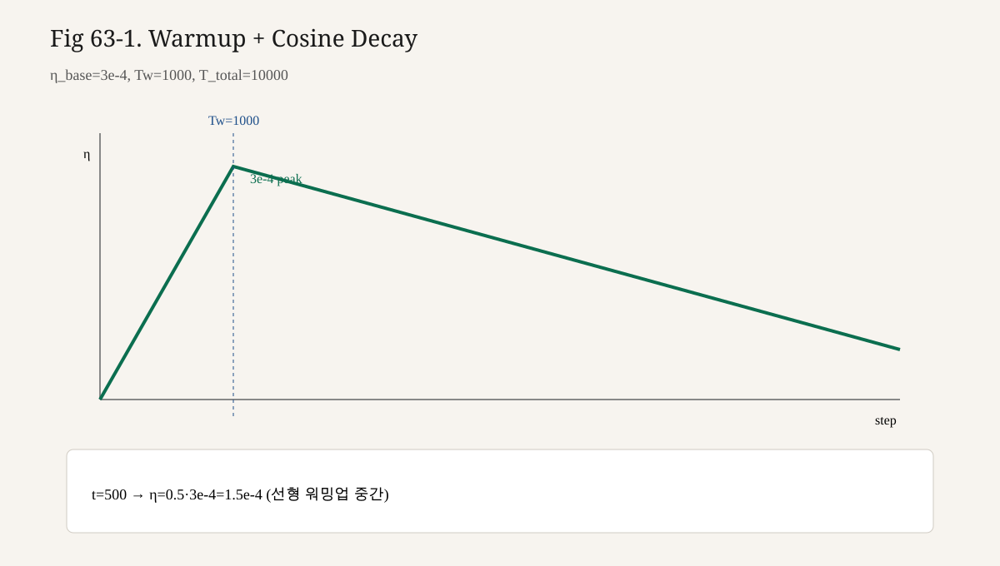

# 63강. Optimizer, Learning Rate, Scheduler
## 이번 강에서 배우는 내용

- Adam과 AdamW에서 weight decay가 적용되는 방식 차이를 설명한다.
- Warmup과 Cosine decay가 각각 무엇을 완화하려 하는지 말한다.
- 제12·23강의 Gradient Descent / Optimizer 개념을 LLM 스케일로 연결한다.
- step 또는 토큰 축에 묶인 LR 스케줄을 코드로 작성한다.
- “LR만 바꿔도 학습이 붕괴·정체할 수 있음”을 실험 설계 관점에서 이해한다.

## 왜 중요한가?
같은 모델·같은 데이터라도 **보폭(lr)** 과 **감쇠 규칙(weight decay, schedule)** 이 다르면 최종 Loss와 안정성이 달라진다. Pretraining은 재시작 비용이 크다. Optimizer 설정을 “관행 복사”만 하지 말고, 각 항이 루프에서 무엇을 하는지 봐야 한다.

```text
∇L  (backward)
  → (clip)
  → AdamW가 모멘트로 방향·보폭 조절
  → weight decay로 파라미터 자체에 약한 당김
  → scheduler가 스텝마다 η(t) 제공
```

## 선수 개념
1. **Gradient / GD** — 제12강
2. **SGD·Adam 직관, 학습 루프** — 제23강
3. **정규화로서의 weight decay 감각** — 제24강
4. **Train step / token budget** — 제62강

수식은 직관에 필요한 최소만 쓴다. 증명·최신 변형 전부는 목표가 아니다.

## 복습 — 제1권 Optimizer에서 이어지는 것
제23강에서의 핵심:

- **SGD**: $\theta \leftarrow \theta - \eta g$
- **Adam**: 기울기의 1차·2차 모멘트로 파라미터별 보폭을 적응
- **Learning rate $\eta$**: 한 스텝 이동 스케일

LLM 문맥에서 바뀌는 것:

| 유지되는 것 | 확장되는 것 |
|---|---|
| “기울기 방향으로 조금 이동” | 이동 규칙이 AdamW |
| lr이 핵심 하이퍼파라미터 | lr이 **시간에 따라 변함** |
| weight decay ≈ 큰 가중치 억제 | Adam과 **결합 방식**이 중요 (AdamW) |
| 한 모델 파라미터 목록 | 종종 decay 그룹 / no-decay 그룹 분리 |

## Adam 직관 (짧게)
**Adam**은 각 파라미터 $i$에 대해 대략 다음을 유지한다.

- $m_t$: 기울기의 지수이동평균 (1차 모멘트)
- $v_t$: 기울기 제곱의 지수이동평균 (2차 모멘트)

업데이트 방향은 대략 $m_t / (\sqrt{v_t}+\epsilon)$ 형태가 되어, 흔들리는 좌표는 小さく, 안정적인 좌표는 상대적으로 크게 움직인다.

직관 한 줄: “좌표마다 자동 변속기를 단다.”

사실: Adam의 $\beta_1,\beta_2,\epsilon$ 기본값은 구현 관행이 있으나, 과제마다 최적이라고 보장되지는 않는다.

## Weight Decay란 무엇인가
**Weight decay(가중치 감쇠)**는 파라미터 값 자체를 0 쪽으로 약간 당겨, 과도하게 커지는 가중치를 억제하려는 정규화다.

고전적 L2 정규화와 연결된 형태:

$$

L_{\text{total}} = L_{\text{data}} + \frac{\lambda}{2}\|\theta\|^2

$$

SGD에서는 “Loss에 L2를 더한다”와 “업데이트 때 $\theta \leftarrow (1-\eta\lambda)\theta$”가 거의 같은 길로 이어질 수 있다. 그러나 **적응형 Optimizer(Adam)** 에서는 이 둘이 더 이상 같지 않다.

### 5.1 Adam + L2 vs AdamW

- **Adam + L2 (coupled)**: 감쇠 항이 적응적 스케일링을 받는 쪽에 섞여, 의도와 다른 실효 감쇠가 될 수 있다.
- **AdamW (decoupled weight decay)**: 적응적 업데이트와 **별도로** $\theta \leftarrow \theta - \eta\lambda\theta$ 형태의 감쇠를 적용한다.

설명: AdamW는 “모멘트로 방향을 정한 뒤, 가중치 감쇠는 따로 빼서 적용”에 가깝다. LLM 학습 레시피에서 AdamW가 자주 등장하는 이유 중 하나로 이 분리가 꼽힌다.

사실: “AdamW가 모든 과제에서 Adam+L2보다 항상 좋다”는 보편 법칙이 아니라, 관행·경험·논문 설정에 많이 채택되어 있다는 점에 가깝다.

## AdamW 사용 코드
```python
import torch

def build_adamw(model, lr=3e-4, weight_decay=0.1, betas=(0.9, 0.95), eps=1e-8):
    """
    bias / LayerNorm 등 1D 파라미터에는 weight decay를 약하게 또는 0으로 두는
    관행이 있다. 아래는 흔한 분리 예.
    """
    decay = []
    no_decay = []
    for name, p in model.named_parameters():
        if not p.requires_grad:
            continue
        if p.ndim < 2 or name.endswith(".bias") or "norm" in name.lower():
            no_decay.append(p)
        else:
            decay.append(p)

    param_groups = [
        {"params": decay, "weight_decay": weight_decay},
        {"params": no_decay, "weight_decay": 0.0},
    ]
    return torch.optim.AdamW(param_groups, lr=lr, betas=betas, eps=eps)
```

주석으로 남길 포인트:

- `betas=(0.9, 0.95)` 등은 **특정 레시피 예시**이지 만능 값이 아니다.
- `weight_decay=0.1`도 마찬가지로 예시 스케일이다.
- no-decay 그룹 규칙은 팀 코드베이스마다 다르다. Norm/bias를 decay에 넣을지도 선택이다.

## Learning Rate — 왜 스케줄이 필요한가
고정 lr만으로도 작은 모델은 학습되지만, 긴 Pretraining에서는 보통 다음을 원한다.

1. **초반 안정화**: 초기 파라미터·배치 분산이 클 때 큰 보폭은 발산을 키울 수 있다 → **Warmup**.
2. **후반 미세 조정**: 충분히 내려간 곡면에서 보폭을 줄여 진동을 줄임 → **Decay**.
3. **비교 가능성**: token/step 축에 묶인 스케줄이면 재개·확장 실험이 쉽다.

**Warmup**: 학습 초반 $t=0\ldots T_w$ 동안 lr을 0(또는 작은 값)에서 목표 lr까지 올린다. 선형 warmup이 흔하다.

**Cosine decay**: warmup 이후 cosine 곡선으로 lr을 최소값 $\eta_{\min}$까지 낮춘다.

## Warmup + Cosine 수식
$t$: 현재 step (또는 토큰 축을 step에 매핑한 값)  
$T_w$: warmup steps  
$T$: 전체 schedule 길이 (보통 총 train steps)  
$\eta_{\text{base}}$: 정점 학습률  
$\eta_{\min}$: 최종 최소 학습률

$$

\eta(t) =
\begin{cases}
\eta_{\text{base}} \cdot \dfrac{t}{T_w} & t < T_w \\\\
\eta_{\min} + \tfrac{1}{2}(\eta_{\text{base}}-\eta_{\min})
\left(1+\cos\pi\dfrac{t-T_w}{T-T_w}\right) & t \ge T_w
\end{cases}

$$

그래프 스케치:

```text
lr
η_base |        /\
       |       /  \______ cosine
       |      /         ¯¯¯--__
       |     /                 ¯¯η_min
       |____/________________________ step
            Tw              T
```

설명: cosine은 급격한 계단 감소보다 부드러운 감쇠를 제공한다. 대안으로는 linear decay, constant+cooldown 등이 있다. 이 책이 cosine을 다루는 이유는 **교육·실무 모두에서 자주 만나기 때문**이지, 유일신이라서가 아니다.

## Scheduler 구현
### 9.1 LambdaLR로 직접

```python
import math
from torch.optim.lr_scheduler import LambdaLR

def build_warmup_cosine_scheduler(
    optimizer,
    warmup_steps: int,
    total_steps: int,
    min_lr_ratio: float = 0.1,
):
    """
    min_lr_ratio: η_min / η_base
    매 optimizer.step() 뒤에 scheduler.step()을 호출하는 전제.
    """
    assert total_steps > warmup_steps >= 0

    def lr_lambda(current_step: int):
        # LambdaLR는 base_lr에 곱할 계수를 반환
        if current_step < warmup_steps:
            # step=0에서 0이 되지 않게 살짝 올리고 싶으면 (step+1)/warmup 도 가능
            return float(current_step) / float(max(1, warmup_steps))
        progress = (current_step - warmup_steps) / float(
            max(1, total_steps - warmup_steps)
        )
        progress = min(max(progress, 0.0), 1.0)
        cosine = 0.5 * (1.0 + math.cos(math.pi * progress))
        return min_lr_ratio + (1.0 - min_lr_ratio) * cosine

    return LambdaLR(optimizer, lr_lambda)
```

루프 연결:

```python
loss.backward()
clip_grad_norm_(model.parameters(), 1.0)
optimizer.step()
scheduler.step()  # step 기반 스케줄
```

### 9.2 토큰 축에 묶고 싶을 때

Token budget을 쓰는 경우, “step” 대신 `tokens_seen / tokens_per_step`를 스케줄 입력으로 쓰거나, 애초에 total_steps를 budget으로부터 유도한다.

```python
# 설명용: 글로벌 배치 토큰 수가 일정하다는 가정
# total_steps ≈ token_budget / tokens_per_optimizer_step
```

가정이 깨지면(가변 길이·가변 accum) 스케줄이 의도와 달라진다. 제62강에서 토큰 집계 정책을 고정한 이유가 여기로 연결된다.

### 9.3 Warmup 중 로그

반드시 `lr`을 로그에 남겨 warmup이 실제로 올라가는지 확인한다. `LambdaLR` 계수 버그는 Loss보다 먼저 lr 곡선에서 드러난다.

## 하이퍼파라미터를 고르는 감각
숫자를 “정답표”처럼 외우지 말 것. 대신 **축**을 기억한다.

| 축 | 너무 작으면 | 너무 크면 |
|---|---|---|
| $\eta_{\text{base}}$ | 학습이 지나치게 느림 | Loss spike·발산 |
| warmup 길이 | 초반 불안정 | 정점 도달이 늦어 예산 낭비 가능 |
| weight decay | 과파라미터화·불안정 가능 | underfit·표현력 과도 억제 |
| total_steps vs 실제 학습 길이 | cosine이 너무 일찍 바닥에 붙음 | 끝나기 전 감쇠 부족 |

설명: 작은 모델로 lr range test 비슷한 스윕을 한 뒤 스케일업하는 실무 흐름이 있다. 이 책 범위에서는 “한 번에 여러 축을 바꾸지 말고, 로그에 lr·loss·grad_norm을 함께 보라”만 규칙으로 둔다.

## Optimizer 상태와 Checkpoint 예고
AdamW는 파라미터뿐 아니라 **$m,v$ 버퍼**를 가진다. 학습을 재개할 때 Optimizer state를 버리면, 모멘트가 리셋되어 재개 직후 거동이 달라질 수 있다. 제65강 Checkpoint는 다음을 함께 저장하는 이유를 여기서 이미 예고한다.

```text
model weights
optimizer state (m, v, ...)
scheduler state (last_epoch 등)
global_step / tokens_seen
```

## 제62강 루프에 붙인 최소 예
```python
optimizer = build_adamw(model, lr=3e-4, weight_decay=0.1)
scheduler = build_warmup_cosine_scheduler(
    optimizer,
    warmup_steps=100,
    total_steps=2000,
    min_lr_ratio=0.1,
)

for step in range(1, total_steps + 1):
    batch = next_batch()
    optimizer.zero_grad(set_to_none=True)
    loss = compute_loss(model, batch)
    loss.backward()
    torch.nn.utils.clip_grad_norm_(model.parameters(), 1.0)
    optimizer.step()
    scheduler.step()

    if step % 10 == 0:
        lr = scheduler.get_last_lr()[0]
        print(f"step={step} loss={loss.item():.4f} lr={lr:.2e}")
```

AMP·accumulation이 붙으면 `backward/step` 사이에 scaler가 끼어든다(제64강). Scheduler 호출 시점은 “실제로 optimizer.step이 성공한 뒤”가 안전하다.

## AdamW 업데이트 — 직관용 의사 수식
교육용으로만 단순화한다. 실제 구현은 bias correction·eps·foreach 커널 등이 더 있다.

매 step, 각 파라미터에 대해 대략:

$$

\begin{aligned}
g_t &\leftarrow \nabla_\theta L_t \\
m_t &\leftarrow \beta_1 m_{t-1} + (1-\beta_1) g_t \\
v_t &\leftarrow \beta_2 v_{t-1} + (1-\beta_2) g_t^2 \\
\hat{m}_t &\leftarrow m_t / (1-\beta_1^t),\quad
\hat{v}_t &\leftarrow v_t / (1-\beta_2^t) \\
\theta_t &\leftarrow \theta_{t-1} - \eta_t \left(
\frac{\hat{m}_t}{\sqrt{\hat{v}_t}+\epsilon} + \lambda \theta_{t-1}
\right)
\end{aligned}

$$

마지막 항 $\lambda\theta$가 **decoupled weight decay**의 자리에 해당한다(표기 세부는 구현마다 조금씩 다름).  
SGD 시절 “Loss에 $\frac{\lambda}{2}\|\theta\|^2$를 더한다”와 식이 달라도, **의도(큰 가중치 억제)** 는 제24강 정규화 이야기와 같은 계열이다.

## Warmup을 빼면 생기는 일 (사고 실험)
초기 step에서:

- 랜덤 초기화 근처의 곡면이 거칠 수 있다.
- 첫 배치들의 기울기 분산이 클 수 있다.
- Adam의 $v_t$가 아직 “적응”되기 전이다.

여기에 큰 $\eta_{\text{base}}$를 바로 적용하면 Loss spike가 나기 쉽다. Warmup은 “처음부터 전력 질주하지 않기”다.

반대로 warmup이 **과도하게 길면** 예산의 상당 부분을 작은 lr로 쓰게 된다. token budget이 빠듯한 작은 실험에서는 warmup 비율을 함께 재조정한다.

## Cosine 외 스케줄 — 왜 대안을 아는가
이 책이 cosine을 기본으로 다루는 이유: 구현이 단순하고, 많은 공개 레시피에서 만난다.

알아둘 대안(이름만):

| 스케줄 | 아이디어 |
|---|---|
| Constant + cooldown | 대부분 고정 lr, 끝에만 감소 |
| Linear decay | warmup 후 직선 감소 |
| Step decay | 특정 step에서 계단식 감소 |

사실: “cosine이 항상 최고”는 아니다.  
설명: 스케줄을 바꿀 때는 **total length와 정점 lr을 함께** 적고, 다른 축(데이터·모델)을 고정한 채 비교한다.

## 로그로 스케줄을 검증하기
학습 시작 직후 반드시 확인할 곡선:

```text
step → lr
  0 ... Tw : 거의 선형 상승이어야 함
  Tw ... T : 완만히 감소 (cosine)
```

코드로 단위 테스트:

```python
def probe_lrs(scheduler, optimizer, steps):
    lrs = []
    for _ in range(steps):
        lrs.append(optimizer.param_groups[0]["lr"])
        optimizer.step()   # LambdaLR은 step 호출로 진각
        scheduler.step()
    return lrs

# 모델 없이 param 하나만 있어도 probe 가능
# 상승 구간에서 lrs[i] <= lrs[i+1] (선형 warmup)
# 후반에서 대체로 감소
```

Loss보다 **먼저** lr 곡선을 검증하면, “모델이 안 배우는 줄 알았는데 스케줄이 죽어 있었다”는 사고를 줄인다.

## 배치 크기와 LR — 연결만, 법칙은 금지
실효 배치가 커지면 기울기 추정이 덜 시끄러워지는 **경향**이 있다. 그래서 배치와 lr을 함께 키우는 논의가 문헌·레시피에 등장한다.

이 강의의 규칙:

- 관계를 **경향**으로만 서술한다.
- “배치 2배 ⇒ lr 2배” 같은 만능 비례를 **사실처럼 적지 않는다**.
- 제64강에서 accumulation으로 $B_{\text{eff}}$를 바꿀 때, lr·warmup을 **같이 재검토**하라는 체크리스트만 남긴다.

## 흔한 오해
1. **“Adam이라서 lr은 대충”**  
   적응형이라도 $\eta_{\text{base}}$ 스케일은 여전히 치명적이다.

2. **“weight decay = Dropout”**  
   둘 다 정규화 계열이지만 작용 지점이 다르다. 대체재가 아니다.

3. **“cosine만 있으면 warmup 불필요”**  
   초반 안정화가 목표면 warmup은 cosine과 목적이 다르다.

4. **“scheduler.step을 epoch 끝에서만”**  
   PyTorch 일부 구형 패턴과 혼동. LLM은 대개 **매 optimizer step**.

5. **사실 오인: 특정 lr 수치가 업계 표준 고정값**  
   모델 크기·배치·토크나이저·정밀도에 따라 달라진다. 벤치마크 수치를 이 강의에서 단정하지 않는다.

6. **“no-decay 그룹은 무조건 정답”**  
   관행이지 증명의 끝이 아니다. 팀 규약을 문서화하라.

## 수식 보강 — AdamW 감쇠

AdamW는 그라디언트 적응과 별도로

$$
\theta \leftarrow \theta - \eta\lambda\theta
$$

형태의 가중치 감쇠를 적용합니다($\lambda$: weight decay). L2를 loss에 더하는 것과 최적화가 미묘하게 다릅니다.


<!-- enrich-batch2-63 -->
## AdamW · LR 스케줄

Adam 모멘트:

$$
m_t=\beta_1 m_{t-1}+(1-\beta_1)g_t
$$

$$
v_t=\beta_2 v_{t-1}+(1-\beta_2)g_t^2
$$

$$
\theta\leftarrow\theta-\eta\,\hat{m}/(\sqrt{\hat{v}}+\varepsilon)
$$

Warmup:

$$
\eta_t=\eta_{\mathrm{peak}}\cdot\frac{t}{t_{\mathrm{wu}}}\quad(t\le t_{\mathrm{wu}})
$$

```python
import math
def cosine_lr(t, T, peak=1e-3, floor=1e-5):
    # t in [0,T]
    return floor + 0.5*(peak-floor)*(1+math.cos(math.pi*t/T))
print(cosine_lr(0,1000), cosine_lr(500,1000))
```


<!-- enrich-pass-1f64 -->
## 수식 전개 — Warmup + Cosine 다시 쓰기

워밍업 구간 $t < T_w$에서

$$
\eta_t
=
\eta_{\mathrm{max}}\cdot\frac{t}{T_w}
$$

이후 cosine decay（$t\in[T_w, T]$）:

$$
\eta_t
=
\eta_{\min}
+
\frac{1}{2}(\eta_{\mathrm{max}}-\eta_{\min})
\left(
1+\cos\pi\frac{t-T_w}{T-T_w}
\right)
$$

입니다. $T$는 총 옵티마이저 스텝입니다. Accumulation을 쓰면 **micro-step이 아니라 opt-step**에 맞춰 $t$를 증가시키세요.

### AdamW 감쇠

가중치 감쇠를 경사와 분리하면（개념）

$$
\theta
\leftarrow
\theta
-
\eta\big(\hat m / (\sqrt{\hat v}+\varepsilon) + \lambda\theta\big)
$$

입니다. $\lambda$는 weight decay입니다. Bias correction $\hat m,\hat v$는 Adam 정의를 따릅니다.

## Shape / 상태 표 — Optimizer

| 항목 | Shape | 비고 |
|---|---|---|
| $\theta$ | 파라미터와 동일 | |
| $m$（1차 모멘트） | $\theta$와 동일 | Adam |
| $v$（2차 모멘트） | $\theta$와 동일 | Adam |
| $\eta_t$ | scalar | 스케줄러 |
| $\lambda$ | scalar（그룹별 가능） | decay 그룹 |

Decay에서 bias/Norm을 빼는 관례는 구현·라이브러리마다 다르니, **파라미터 그룹 표**를 로그에 남기세요.

## 구현 스케치 — 스케줄 검증 로그

```python
def log_lrs(opt, sched, step):
    lrs = [pg["lr"] for pg in opt.param_groups]
    print({"step": step, "lrs": lrs, "sched": type(sched).__name__})
```

초반 $T_w$ 동안 lr이 선형으로 오르는지, 이후 단조 감소하는지 그래프 없이도 표로 확인할 수 있습니다.

## 실패 모드 — LR / Optimizer

| 실패 | 증상 | 처방 |
|---|---|---|
| Warmup 0 + 큰 lr | 초반 폭발 | warmup 추가 |
| sched를 micro마다 step | 너무 빨리 식음 | opt-step에만 |
| decay를 모든 파라미터에 | 성능 악화 가능 | bias/Norm 분리 |
| ckpt에 optim 미저장 | resume 시 점프 | 상태 포함（65강） |

## 실습 코드 — Cosine with warmup（순수 함수）

```python
import math

def lr_at(step, tmax, warmup, lr_max, lr_min=0.0):
    if step < warmup:
        return lr_max * step / max(warmup, 1)
    progress = (step - warmup) / max(tmax - warmup, 1)
    progress = min(max(progress, 0.0), 1.0)
    cos = 0.5 * (1.0 + math.cos(math.pi * progress))
    return lr_min + (lr_max - lr_min) * cos
```

이 함수 출력을 스케줄러 API 결과와 대조하면 배선 버그를 빨리 잡습니다.

## 수식 보강 — 실효 배치와 LR 감각

실효 배치 토큰 $N_{\mathrm{eff}}=B\cdot T\cdot K\cdot\eta$가 $c$배 커질 때, 선형 스케일 감각은

$$
\eta' \approx c\cdot\eta
$$

입니다. 다만 LLM에서는 상한·워밍업·안정성이 더 중요합니다. **공식처럼 맹신하지 말고** 작은 그리드만 시도하세요.

<!-- visual-example-63 -->
## 숫자로 따라가기 — Warmup LR



$\eta_{\mathrm{base}}=3\times 10^{-4}$, 워밍업 $T_w=1000$ 스텝.

$$
t < T_w:\quad \eta(t)=\eta_{\mathrm{base}}\cdot\frac{t}{T_w}
$$

| $t$ | $\eta(t)$ |
|---|---|
| 0 | 0 |
| 500 | $1.5\times 10^{-4}$ |
| 1000 | $3\times 10^{-4}$ (피크) |

초반에 lr을 천천히 올려 **큰 스텝으로 가중치가 폭주하는 것**을 막습니다. 이후 cosine 등으로 줄입니다.

## LLM에서는 어디에 사용될까?

이번 63강에서 배운 개념은 이후 Transformer · GPT · 서빙 강의에서 반복해서 등장합니다. 각 수식·코드 블록을 “실제 모델의 어느 단계인가”와 연결해 다시 읽어 보세요.

## 핵심 요약
- Adam은 좌표별 적응 보폭을, AdamW는 여기에 **분리된 weight decay**를 더한다.
- Weight decay는 파라미터를 0 쪽으로 당기는 정규화다.
- Warmup은 초반 lr을 올리고, Cosine은 이후 부드럽게 낮춘다.
- Scheduler는 보통 **optimizer step 축**(또는 그에 상응하는 토큰 축)에 묶는다.
- Optimizer/Scheduler 상태는 Checkpoint에 함께 넣어야 재개가 일관된다.

## 용어 사전
| 용어 | 의미 |
|---|---|
| Adam | 1·2차 모멘트 기반 적응형 Optimizer |
| AdamW | Decoupled weight decay를 쓰는 Adam 변형 |
| Weight decay | 파라미터 크기 감쇠 정규화 |
| Learning rate ($\eta$) | 업데이트 보폭 스케일 |
| Warmup | 초반 lr 상승 구간 |
| Cosine schedule | cosine 곡선으로 lr 감쇠 |
| Param group | lr/decay를 달리 줄 파라미터 묶음 |
| Optimizer state | $m,v$ 등 내부 버퍼 |
| Bias correction | 초기 모멘트 편향 보정 |
| $\eta_{\min}$ | 스케줄 바닥 학습률 |

## 연습문제
### 문제 1 (개념)

Adam에 L2를 그냥 더하는 것과 AdamW의 decoupled weight decay가 왜 같아지지 않을 수 있는지, “적응적 스케일링” 관점에서 한 문단으로 설명하시오.

### 문제 2 (수식 읽기)

Warmup 중 $t=T_w/2$일 때 $\eta(t)$는 $\eta_{\text{base}}$의 몇 배 근처인가? (선형 warmup 가정)

### 문제 3 (코드)

다음 루프의 스케줄 관련 버그를 지적하시오.

```python
for epoch in range(num_epochs):
    for batch in loader:
        optimizer.zero_grad()
        loss = compute_loss(model, batch)
        loss.backward()
        optimizer.step()
    scheduler.step()  # warmup+cosine을 step 단위로 설계했는데
```

### 문제 4 (연결)

제24강의 정규화 이야기와 weight decay를 한 문장으로 연결하시오.

### 문제 5 (설계)

Token budget을 2배로 늘렸는데 total_steps만 예전 값으로 cosine을 돌리면 어떤 일이 생기는지 설명하시오.

### 문제 6 (디버깅)

Train loss가 전혀 안 내려간다. 로그에 `lr=0.00e+00`이 찍힌다. 가능한 원인 두 가지를 쓰시오.

---

## 정답 및 해설
### 문제 1

Adam은 기울기(및 가산된 L2 항의 기울기)를 $v_t$ 등으로 나눠 스케일링한다. L2를 Loss에 섞으면 감쇠 성분도 그 적응 스케일을 받아, “매 step $\theta$에 $(1-\eta\lambda)$를 곱한다”는 decoupled 감쇠와 실효가 달라질 수 있다. AdamW는 감쇠를 그 적응 경로에서 분리한다.

### 문제 2

약 $1/2$배.

### 문제 3

Scheduler가 epoch 끝에 한 번만 호출되어, 설계한 step 단위 warmup/cosine과 호출 빈도가 불일치한다. 매 `optimizer.step()` 뒤 호출해야 한다.

### 문제 4

Weight decay는 큰 가중치를 억제해 과적합·불안정에 대응하는 정규화 수단 중 하나다.

### 문제 5

스케줄이 실제 학습 중반에 이미 $\eta_{\min}$ 근처로 내려가, 남은 예산 동안 보폭이 과도하게 작아질 수 있다. total_steps(또는 토큰 축)를 새 budget에 맞춰 재정의해야 한다.

### 문제 6

예: LambdaLR 계수가 step 0에서 0으로 고정·진각 실패, `lr`을 잘못 0으로 설정, 체크포인트 재개 후 scheduler만 리셋·불일치 등.

## 다음 강의와 연결
Optimizer와 LR 스케줄이 준비되었다. 이제 한 번에 큰 배치를 올리지 못하는 **메모리 벽**을 넘어야 한다.

다음 **제64강. Mixed Precision과 Gradient Accumulation**에서는 FP16/BF16의 아이디어, loss scaling 개념, 여러 micro-batch로 실효 배치를 키우는 방법을 다룬다. 사실과 구현 설명을 구분해 적는다.

이전 강의: **제62강. Training Loop 설계**  
다음 강의: **제64강. Mixed Precision과 Gradient Accumulation**

<!-- LECTURE_NAV -->

---

### 강의 이동

- **이전 강:** [62강. Training Loop 설계](62강_Training_Loop_설계.md)
- **다음 강:** [64강. Mixed Precision과 Gradient Accumulation](64강_Mixed_Precision과_Gradient_Accumulation.md)

<!-- /LECTURE_NAV -->
