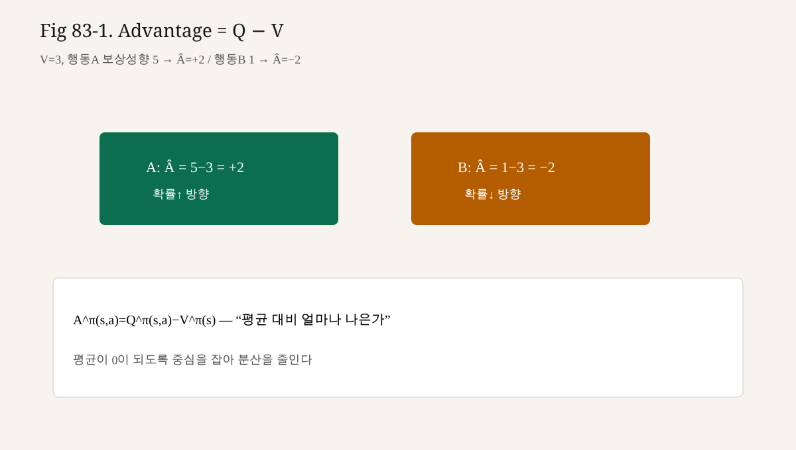

# 83강. Advantage
## 이번 강에서 배우는 내용

- Advantage의 정의와 직관（“평균보다 얼마나 나은가”）
- Baseline / $V$를 빼도 기댓값 기울기가 보존되는 이유
- 왜 분산 감소가 LLM RL에 치명적인지
- 작은 숫자로 $A$를 계산
- PPO·GRPO가 Advantage（또는 그룹 상대값）를 쓰는 위치
- 제84강 Preference Dataset으로 넘어가기 전 RL 기초 매듭

## 왜 중요한가?
LLM 롤아웃의 현실:

| 현상 | 결과 |
|---|---|
| 프롬프트 난이도 천차만별 | 쉬운 문제 $R=1$, 어려운 문제 $R=0$이 혼재 |
| 보상 스케일 불안정 | RM 점수가 배치마다 이동 |
| 긴 시퀀스 | 같은 $R$를 수백 토큰에 곱함 |

순수 $\sum\nabla\log\pi\cdot R$는 “원래 쉬운 프롬프트에서 운 좋게 맞춘 토큰”을 과대 강화하기 쉽다.

Advantage는 이렇게 말한다.

> 이 상태에서 **평소（$V$）보다** 잘했는가?

PPO 논문·구현의 core update는 사실상

$$

\mathbb{E}_t\big[\nabla\log\pi_\theta(a_t\mid s_t)\,\hat{A}_t\big]

$$

이고, GRPO는 그룹 내 상대 점수로 비슷한 **상대화**를 수행한다.

## 선수 개념
- $V^\pi$, $Q^\pi$（제81강）
- REINFORCE · $\nabla\log\pi\cdot G$（제82강）
- Baseline 항등: $\mathbb{E}_{a\sim\pi}[\nabla\log\pi\cdot b(s)]=0$
- 분산（variance）: 추정기의 흔들림

GAE(Generalized Advantage Estimation) 전체 유도는 PPO 강에서 이어서 다룬다.  
오늘은 정의·동기·최소 추정.

## 핵심 개념
### 3.1 Advantage란

**Advantage(어드밴티지)** $A^\pi(s,a)$는 상태 $s$에서 행동 $a$를 택하는 것이  
정책의 **평균적 가치**보다 얼마나 이득（또는 손해）인지를 나타낸다.

$$

A^\pi(s,a)=Q^\pi(s,a)-V^\pi(s)

$$

성질:

$$

\mathbb{E}_{a\sim\pi(\cdot\mid s)}\big[A^\pi(s,a)\big]=0

$$

평균적으로는 0 — “상대 점수”이기 때문이다.

부호:

| $A(s,a)$ | 의미 | 정책 업데이트 |
|---|---|---|
| $>0$ | 평균보다 좋은 행동 | $\pi(a\mid s)$ ↑ |
| $<0$ | 평균보다 나쁨 | $\pi(a\mid s)$ ↓ |
| $\approx0$ | 평이 | 거의 변화 없음 |

### 3.2 Return − baseline 형태

$Q$를 모를 때 몬테카를로 반환 $G_t$로 대체:

$$

\hat{A}_t^{\mathrm{MC}} = G_t - b(s_t)

$$

$b=0$이면 고전 REINFORCE.  
$b(s_t)=V_\psi(s_t)$이면 **value baseline**.

$$

\hat{A}_t = G_t - V_\psi(s_t)

$$

### 3.3 TD 잔차 형태

한 스텝 bootstrap:

$$

\delta_t = r_t + \gamma V(s_{t+1}) - V(s_t)

$$

$\delta_t$ 자체가 Advantage의 한 추정이다.  
GAE는 $\delta_t$의 지수 가중 합으로 bias–variance를 조절한다（제87~88강）.

### 3.4 Policy Gradient with Advantage

$$

\nabla_\theta J(\theta)
=
\mathbb{E}\big[
\nabla_\theta\log\pi_\theta(a_t\mid s_t)\,
A^\pi(s_t,a_t)
\big]

$$

$A$ 대신 $Q$, $G$, $G-V$를 넣어도（적절한 조건에서）기댓값은 같은 계열이다.  
실무는 **분산이 작은 $A$ 추정**을 고른다.

### 3.5 정규화된 Advantage

배치·그룹 안에서:

$$

\hat{A}\leftarrow \frac{\hat{A}-\mathrm{mean}(\hat{A})}{\mathrm{std}(\hat{A})+\epsilon}

$$

를 자주 적용한다.  
GRPO는 같은 프롬프트에 대한 **여러 샘플 점수**를 평균·표준편차로 상대화해 Advantage 대용 신호를 만든다（제92강）.

## 직관적으로 이해하기
### 4.1 시험 곡선과 편차

반 평균이 60점일 때 70점은 “잘함”,  
반 평균이 90점일 때 70점은 “못함”.

절대 점수 70만 보면 정책을 잘못 민다.  
Advantage는 **반 평균（$V$）을 뺀 편차**다.

### 4.2 쉬운 프롬프트 / 어려운 프롬프트

| 프롬프트 | $V(s)$ | 실제 $R$ | $A\approx R-V$ |
|---|---|---|---|
| “1+1” | 0.95 | 1.0 | +0.05 |
| “난해한 증명” | 0.10 | 1.0 | +0.90 |

둘 다 정답（$R=1$）이지만, **어려운 쪽을 맞춘 행동**이 훨씬 큰 양의 Advantage를 받는다.  
원하는 신용 할당에 가깝다.

반대로 쉬운 문제를 틀린 경우 $R=0$, $V=0.95$ → $A\approx-0.95$로 강하게 억제한다.

### 4.3 “칭찬 인플레이션” 방지

RM이 전반적으로 점수를 $+3$만큼 올려 캘리브레이션이 밀려도,  
$V$가 같이 따라가면 $A=R-V$는 상대적으로 안정적일 수 있다.  
（완벽하진 않다. RM 해킹은 별 문제 — 제96강.）

## 수학적으로 이해하기
### 5.1 Baseline이 기댓값을 보존

고정 $s$에서:

$$

\begin{aligned}
&\mathbb{E}_{a\sim\pi(\cdot\mid s)}
\big[\nabla_\theta\log\pi_\theta(a\mid s)\,b(s)\big]\\
&=
b(s)\sum_a\nabla_\theta\pi_\theta(a\mid s)
=
b(s)\nabla_\theta\sum_a\pi_\theta(a\mid s)
=
b(s)\nabla_\theta 1
=0
\end{aligned}

$$

따라서

$$

\mathbb{E}[\nabla\log\pi\cdot Q]
=
\mathbb{E}[\nabla\log\pi\cdot(Q-V)]
=
\mathbb{E}[\nabla\log\pi\cdot A]

$$

**편향 없이**（이 항등 의미에서）분산만 줄일 여지가 생긴다.

### 5.2 분산이 줄어드는 직관

$G$의 스케일이 크고 상태마다 평균이 다르면 $\mathrm{Var}(G)$가 크다.  
$G-V(s)$는 상태별 평균을 빼 **중심화**하므로, 이상적으로 분산이 감소한다.

주의: 잘못된 $V$（편향 큰 근사）는 분산↓ 대신 **잘못된 방향**을 만들 수 있다.  
그래서 value learning이 PPO의 반쪽이다.

### 5.3 Advantage와 “상대 선호”

Preference $y_w\succ y_l$는 응답 단위의 상대 비교다.  
Advantage는 **상태–행동（토큰/스텝）단위의 상대 가치**다.

층위는 다르지만 “절대 점수보다 상대”라는 철학이 맞닿아 있다.  
제84강 데이터가 RM을 만들고, RM 점수가 다시 $G$/$A$로 정책에 흐른다.

## 작은 숫자로 직접 계산하기
### 6.1 표로 구하는 $A$

상태 $s$, 행동 $\{a_1,a_2,a_3\}$:

| $a$ | $Q(s,a)$ | $\pi(a\mid s)$ |
|---|---|---|
| $a_1$ | 2.0 | 0.5 |
| $a_2$ | 1.0 | 0.3 |
| $a_3$ | 0.0 | 0.2 |

$$

V=0.5\cdot2+0.3\cdot1+0.2\cdot0=1.3

$$

| $a$ | $A=Q-V$ |
|---|---|
| $a_1$ | $+0.7$ |
| $a_2$ | $-0.3$ |
| $a_3$ | $-1.3$ |

확인: $0.5\cdot0.7+0.3\cdot(-0.3)+0.2\cdot(-1.3)=0$.

### 6.2 MC Advantage

세 번 롤아웃, 같은 $s_0$:

| trial | $G_0$ | $V(s_0)=1.0$ | $\hat{A}$ |
|---|---|---|---|
| 1 | 1.5 |  | +0.5 |
| 2 | 0.2 |  | -0.8 |
| 3 | 1.1 |  | +0.1 |

$b=0$이면 가중치가 $1.5,0.2,1.1$로 흩어지고,  
$V$를 빼면 $+0.5,-0.8,+0.1$로 **상대 패턴**이 남는다.

### 6.3 토큰 단위（sparse $R$）

길이 3, 끝 보상 $R=2$, $\gamma=1$, 중간 $r=0$.  
$V(s_0)=1.2,\;V(s_1)=1.5,\;V(s_2)=1.8$ （예시）

MC: $G_0=G_1=G_2=2$

$$

\hat{A}_0=2-1.2=0.8,\;
\hat{A}_1=2-1.5=0.5,\;
\hat{A}_2=2-1.8=0.2

$$

앞쪽 토큰에 더 큰 Advantage가 갈 수 있다 — $V$가 진행되며 올라간다고 믿기 때문.  
（실제 추정은 데이터·GAE에 따라 달라진다.）

## 코드로 구현하기
```python
# advantage_basic.py
from __future__ import annotations

from typing import List, Sequence

def mc_returns(rewards: Sequence[float], gamma: float = 1.0) -> List[float]:
    G = 0.0
    out: List[float] = []
    for r in reversed(rewards):
        G = r + gamma * G
        out.append(G)
    out.reverse()
    return out

def advantage_mc(rewards: Sequence[float], values: Sequence[float], gamma: float = 1.0) -> List[float]:
    G = mc_returns(rewards, gamma)
    return [g - v for g, v in zip(G, values)]

def advantage_td(
    rewards: Sequence[float],
    values: Sequence[float],
    gamma: float = 1.0,
    last_value: float = 0.0,
) -> List[float]:
    """δ_t = r_t + γ V(s_{t+1}) - V(s_t)."""
    adv: List[float] = []
    values_next = list(values[1:]) + [last_value]
    for r, v, v_next in zip(rewards, values, values_next):
        adv.append(r + gamma * v_next - v)
    return adv

def normalize(xs: List[float], eps: float = 1e-8) -> List[float]:
    mean = sum(xs) / len(xs)
    var = sum((x - mean) ** 2 for x in xs) / len(xs)
    std = var ** 0.5
    return [(x - mean) / (std + eps) for x in xs]

if __name__ == "__main__":
    rewards = [0.0, 0.0, 2.0]
    values = [1.2, 1.5, 1.8]
    print("MC A", advantage_mc(rewards, values))
    print("TD A", advantage_td(rewards, values, last_value=0.0))
    print("norm", normalize(advantage_mc(rewards, values)))
```

## PyTorch — Advantage 가중 Policy loss
```python
# advantage_policy_loss.py
import torch
import torch.nn.functional as F

def policy_loss_from_advantage(
    logits: torch.Tensor,  # (B, T, V)
    actions: torch.Tensor,  # (B, T)
    advantages: torch.Tensor,  # (B, T)
    mask: torch.Tensor,  # (B, T) 1=응답 토큰
) -> torch.Tensor:
    logp_all = F.log_softmax(logits, dim=-1)
    logp = logp_all.gather(-1, actions.unsqueeze(-1)).squeeze(-1)
    # maximize E[A logπ] → loss = - mean(A logπ)
    weighted = -advantages.detach() * logp * mask
    return weighted.sum() / mask.sum().clamp_min(1.0)

if __name__ == "__main__":
    torch.manual_seed(0)
    B, T, V = 2, 3, 5
    logits = torch.randn(B, T, V, requires_grad=True)
    actions = torch.randint(0, V, (B, T))
    adv = torch.tensor([[0.5, -0.2, 0.1], [0.0, 0.8, -0.4]])
    mask = torch.ones(B, T)
    loss = policy_loss_from_advantage(logits, actions, adv, mask)
    loss.backward()
    print("loss", float(loss), "grad_norm", float(logits.grad.norm()))
```

`advantages.detach()` — $A$ 추정 경로로 정책 그라디언트가 새지 않게 하는 관례가 많다.  
Value는 별도 MSE로 학습한다.

## 실제 LLM · 알고리즘과의 연결
### 9.1 PPO

- 롤아웃 → reward（RM − $\beta$ KL 등）→ GAE로 $\hat{A}_t$
- surrogate: $\mathrm{clip}(r_t(\theta),1-\epsilon,1+\epsilon)\hat{A}_t$
- value loss로 $V_\psi$ 갱신

Advantage가 빠지면 PPO는 “클리핑된 REINFORCE”에 가깝지 않고 목표가 붕괴한다.

### 9.2 GRPO

동일 프롬프트에 $K$개 응답을 샘플하고 점수 $\{R_i\}$를 집단다.

$$

\hat{A}_i = \frac{R_i - \mathrm{mean}(R)}{\mathrm{std}(R)+\epsilon}

$$

형태가 흔하다.  
명시적 $V$ 네트워크 대신 **그룹 통계가 baseline** 역할을 한다.

### 9.3 DPO

명시 Advantage 대신, 선호 쌍의 로그비로 정책을 직접 민다.  
“상대 신호”라는 큰 그림은 공유하나, 토큰 Advantage 추정 루프는 없다.

### 9.4 RLHF 파이프라인에서의 위치

```text
Preference (84) → RM (85) → r(x,y)
  → 롤아웃 점수 → Advantage (83, 88)
    → Policy Gradient / PPO (82, 87)
```

오늘은 그 중 **상대화 모듈**을 닫는다.

## 실습
### 실습 A

$Q=[5,1,1]$, $\pi=[0.2,0.4,0.4]$일 때 $V$와 각 $A$를 구하시오. 가중합이 0인지 확인.

### 실습 B

`advantage_basic.py`에서 $\gamma=0.9$로 바꾸고 MC·TD 차이를 서술하시오.

### 실습 C

배치 Advantage를 정규화하지 않을 때와 할 때, `policy_loss_from_advantage`의 스케일이 어떻게 달라지는지 실험하시오.

### 실습 D

제79강 지도에서 “KL로 참조정책에 묶는다”와 Advantage가 **서로 다른 축**임을 한 문장으로 구분하시오.

## 자주 하는 실수
1. **$A=R$라고 부름**  
   → $A$는 상대값. 절대 보상과 혼동 금지.

2. **$V$를 학습하지 않고 랜덤 baseline**  
   → 이론상 기댓값은 유지될 수 있어도 분산·편향 실무가 망가진다.

3. **Advantage에 grad를 흘려 value와 정책을 한 그래프로 얽음**  
   → 보통 $A$는 detach, value는 별 loss.

4. **프롬프트 마스크 없이 전체 시퀀스 Advantage**  
   → 프롬프트 토큰까지 정책이 흔들릴 수 있다.

5. **정규화로 부호가 바뀌는 병적 배치**  
   → 샘플 수 너무 적을 때 std 불안정.

6. **Advantage만으로 reward hacking이 사라진다 믿음**  
   → RM 목표 자체가 잘못된 경우 $A$도 잘못을 증폭한다.

## 수식 보강 — Advantage 정의

$$
A(s,a)=Q(s,a)-V(s)
$$

또는 실무에서 GAE 등으로 추정합니다. 정책경사는 $\nabla\log\pi\cdot A$ 형태로 분산을 줄입니다.

## 정량 스케치 — Advantage 분산·GAE

$$

A^\pi(s,a)=Q^\pi(s,a)-V^\pi(s),\qquad
\mathbb{E}_{a\sim\pi}[A]=0
$$

몬테카를로: $\hat A_t=G_t-V(s_t)$.

TD 잔차:

$$

\delta_t=r_t+\gamma V(s_{t+1})-V(s_t)
$$

$$

\hat A_t^{\mathrm{GAE}(\gamma,\lambda)}=\sum_{l\ge0}(\gamma\lambda)^l\delta_{t+l}
$$

- $\lambda\to0$: 저분산·고편향  
- $\lambda\to1$: MC에 가까움  

LLM outcome 단순화: $\hat A(x,y)=R-V(x)$ 또는 배치/그룹 상대화 후 토큰에 방송.

### 숫자 예

$R\in\{10,10,10,0\}$, $\bar R=7.5$ → $R-\bar R\in\{2.5,2.5,2.5,-7.5\}$ (평균 0 상대 신호).

$V=1$, $Q(a_1)=1.5$, $Q(a_2)=0.2$ → $A=(0.5,-0.8)$.

Whitening:

$$

\hat A\leftarrow(\hat A-\mathrm{mean})/(\mathrm{std}+\varepsilon)
$$

스케일이 바뀌면 PPO lr·clip 체감이 달라진다.


## PPO·GRPO로 넘기는 한 줄

PPO: $\mathbb{E}[\min(\rho\hat A,\mathrm{clip}(\rho)\hat A)]$ — $\hat A$는 GAE/value.  
GRPO: 같은 clip 골격, $\hat A$는 그룹 상대 $r$.  
공통 뿌리: $\nabla\log\pi\cdot A$ (제82강).


<!-- visual-example-83 -->
## 숫자로 따라가기 — Advantage



같은 상태에서 행동 A 보상 5, 평균(가치) 3이면

$$
\hat A = 5-3 = +2
$$

행동 B 보상 1이면 $\hat A=-2$. PPO는 $+\hat A$ 행동을 올리고 $-\hat A$를 내립니다.

## LLM에서는 어디에 사용될까?

이번 83강에서 배운 개념은 이후 Transformer · GPT · 서빙 강의에서 반복해서 등장합니다. 각 수식·코드 블록을 “실제 모델의 어느 단계인가”와 연결해 다시 읽어 보세요.

## 핵심 요약
- Advantage $A=Q-V$는 “평균 대비 초과 가치”다.
- Policy Gradient에 $A$를 넣어도（적정 baseline 하）기댓값 방향은 보존되고 분산을 줄일 여지가 있다.
- 실무 추정: $G-V$, TD residual, GAE, 그룹 정규화（GRPO）.
- PPO의 중심 가중치가 $\hat{A}_t$다.
- RL 기초（80~83）를 닫고, 다음 강의부터 Preference 데이터로 들어간다.

## 용어 사전
| 용어 | 한 줄 의미 |
|---|---|
| Advantage $A(s,a)$ | $Q(s,a)-V(s)$ |
| Baseline | 기댓값 보존하며 분산을 줄이는 차감항 |
| MC Advantage | $G_t-V(s_t)$ |
| TD residual $\delta_t$ | $r_t+\gamma V(s_{t+1})-V(s_t)$ |
| GAE | $\delta$의 일반화 가중 합（이후 강） |
| Advantage normalization | 배치/그룹 표준화 |
| Variance reduction | 추정 흔들림을 줄이는 기법 전반 |

## 연습문제
### 문제 1

$A^\pi(s,a)$의 정의와 $\mathbb{E}_{a\sim\pi}[A]=0$이 성립하는 이유를 쓰시오.

### 문제 2

REINFORCE에 $V(s)$를 빼도 $\nabla J$의 기댓값이 남는 항등을 스케치하시오.

### 문제 3

쉬운 문제 $V=0.9$, $R=1$과 어려운 문제 $V=0.1$, $R=1$의 Advantage를 비교하시오.

### 문제 4

PPO와 GRPO가 Advantage（유사 신호）를 만드는 방식의 차이를 한 줄씩.

### 문제 5

제84강으로 가기 전, 제79~83강 한 줄 요약을 완성하시오.

```text
지도 → (s,a,r) → (π,V,Q) → Policy Gradient → (    )
```

---

## 정답 및 해설
### 문제 1

$A=Q-V$. $V=\mathbb{E}_{a\sim\pi}[Q]$이므로 평균 편차는 0.

### 문제 2

$\mathbb{E}[\nabla\log\pi\cdot b(s)]=b(s)\nabla\sum\pi=0$이므로 $G$와 $G-b$의 기댓값 기울기가 같다.

### 문제 3

각각 대략 $+0.1$, $+0.9$ — 어려운 쪽 성공이 더 큰 양의 신호.

### 문제 4

PPO: 학습된 $V$·GAE 등으로 $\hat{A}_t$.  
GRPO: 동일 프롬프트 그룹 점수 평균/표준편차로 상대화（전형적 패턴）.

### 문제 5

`Advantage`.

## 다음 강의와 연결
RL 기호의 기초 사슬이 끝났다.

```text
제79 지도
제80 State · Action · Reward
제81 Policy · Value · Q
제82 Policy Gradient
제83 Advantage
```

다음 **제84강. Preference Dataset**에서는  
“좋은 응답 / 나쁜 응답” 쌍을 어떻게 모으고 품질을 관리하는지로 내려간다.  
그 데이터가 Reward Model（제85강）과 DPO（제90강）의 연료가 된다.

수학 도구는 손에 쥐었다.  
이제 **정렬의 데이터**를 연다.

<!-- LECTURE_NAV -->

---

### 강의 이동

- **이전 강:** [82강. Policy Gradient](82강_Policy_Gradient.md)
- **다음 강:** [84강. Preference Dataset](84강_Preference_Dataset.md)

<!-- /LECTURE_NAV -->
