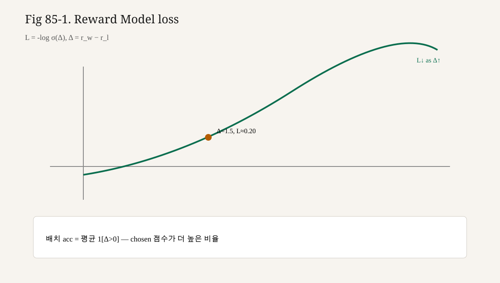

# 85강. Reward Model 구현
## 이번 강에서 배우는 내용

- RM을 “분류기처럼 학습하지만 추론 때는 스칼라 스코어러”로 설명하기
- Bradley-Terry 모델과 pairwise logistic 손실을 유도·계산하기
- Preference 배치로 RM을 한 스텝 학습하는 미니 구현 쓰기
- Chosen/Rejected 점수 차이가 커지도록 학습됨을 숫자로 확인하기
- 제86강 RLHF에서 RM 점수가 정책 업데이트에 어떻게 쓰이는지 예고하기

## 왜 중요한가?
강화학습 정책 업데이트는 매 샘플에 **보상 숫자**가 필요하다. 사람은 매번 점수를 줄 수 없다.

```text
사람:  "이 답이 저 답보다 낫다"   (상대, 드묾, 비쌈)
모델:  r = 2.37                  (절대 스칼라, 빠름, 저렴)
```

Preference는 상대적이고 희소하다. RM은 그 신호를 **밀도 있는 스칼라 함수**로 확장한다.

```text
유한한 쌍 데이터 D
        │
        ▼
   r_φ(x, y)  ← Reward Model
        │
        ├─ RLHF/PPO에서 reward로 사용 (제86~88강)
        ├─ best-of-N 샘플 선택
        └─ 평가용 scoring
```

RM이 잘못되면 PPO는 **잘못된 취향**을 열심히 최적화한다. “최적화 알고리즘이 틀렸다”기보다 “목표가 틀렸다”가 된다.

## 선수 개념
- Preference Dataset · chosen/rejected (제84강)
- Sigmoid · logistic 손실 (1권 분류 감각, 2권 Softmax와 연결)
- Causal LM backbone / last-token pooling 직관 (3권)
- Binary cross-entropy: 정답 확률을 높이는 손실
- 제80강 Reward: 환경이 주는 스칼라와의 대응

아직 깊게 들어가지 않는 것:

- PPO clip · GAE (제87강)
- KL 페널티 계수 β의 실무 튜닝 (제89강)
- DPO가 RM을 명시적으로 안 만드는 이유 (제90강)

## 핵심 개념
### 3.1 Reward Model이란?

**Reward Model**은 입력 $(x,y)$에 대해 실수 $r_\phi(x,y)\in\mathbb{R}$를 내는 신경망이다. 기호 $\phi$는 RM 파라미터.

전형적 구조:

```text
[Transformer backbone]  (종종 SFT 초기화)
        │
   last non-pad hidden
        │
   linear head → scalar r
```

분류기와의 관계:

| 관점 | 내용 |
|---|---|
| 학습 | 쌍 비교를 맞히는 **분류 문제**에 가깝다 |
| 추론 | 클래스 확률이 아니라 **스칼라 점수**를 쓴다 |
| 출력 | “chosen 클래스”가 아니라 $r(x,y)$ |

즉, 학습 목표는 pairwise preference likelihood이고, 배포·사용 형태는 scorer다.

### 3.2 왜 스칼라인가?

PPO·REINFORCE 계열은 궤적(또는 응답)에 대해 스칼라 보상을 가정하는 경우가 많다. LLM에서는 보통 **응답 전체**에 하나의 보상(outcome reward)을 준다.

```text
토큰 단위 dense reward  (가능하지만 설계가 어려움)
응답 단위 sparse reward (RM의 기본 형태)  ← 이번 강의
```

스칼라 하나라는 점은 단순하지만, “어느 문장이 나빴는지”를 직접 말해주지는 않는다. 그 신용 할당은 Advantage/GAE가 일부 담당한다(제83·87강).

### 3.3 Bradley-Terry 선호 모델

제84강에서 예고한 대로, 점수 차이가 승 확률을 결정한다고 본다.

$$
P_\phi(y_w \succ y_l \mid x)
=
\sigma\big(r_\phi(x,y_w)-r_\phi(x,y_l)\big)
$$

$\sigma(z)=1/(1+e^{-z})$.

가정(모델링 가정이지 자연법칙 주장 아님):

1. 각 응답에 잠재 점수(latent score)가 있다
2. 점수 차이가 클수록 선호 확률이 크다
3. 관측은 독립적인 pairwise 비교다

### 3.4 학습 손실

데이터 $\mathcal{D}$에 대해 음의 로그우도:

$$
\mathcal{L}_{\mathrm{RM}}(\phi)
=
-\mathbb{E}_{(x,y_w,y_l)\sim\mathcal{D}}
\big[
\log \sigma\big(r_\phi(x,y_w)-r_\phi(x,y_l)\big)
\big]
$$

이것은 라벨 1에 대한 **binary logistic loss**와 동일하다.  
$\Delta = r_w - r_l$로 두면 $\mathcal{L}=-\log\sigma(\Delta)$.

동치 형태:

$$
-\log\sigma(\Delta)=\log(1+e^{-\Delta})
$$

직관:

- $r_w \gg r_l$ → $\Delta$ 큼 → 손실 작음
- $r_w \approx r_l$ → 손실 $\approx \log 2$
- $r_w \ll r_l$ → 손실 큼 → 강하게 교정

### 3.5 “분류”이지만 Softmax 2클래스가 아닌 이유

두 응답을 한 네트워크에 넣어 2-way softmax를 낼 수도 있으나, 표준 RM은 **공유 스코어 함수** $r_\phi$를 두고 차이만 비교한다. 장점:

- 추론 때 응답 하나만 점수화 가능 (best-of-N)
- 여러 응답 순위에 일관된 점수 척도 제공
- PPO에서 단일 $y$에 보상 부여 가능

### 3.6 초기화

흔한 관례:

```text
φ ← SFT 정책의 가중치로 초기화
+ reward head (random linear)
```

이유: 언어·지시 분포를 이미 아는 표현 위에 “선호 점수”만 얹기 위해서다.  
**사실:** 초기화 전략은 구현체마다 다르다.  
**설명:** “무조건 SFT 복제가 유일한 정답”이 아니라, 표현 재사용이 실무적으로 흔하다는 뜻이다.

### 3.7 정규화와 스케일

$r$에 상수 $c$를 더해도 차이 $\Delta$는 불변이다.

$$
r' = r + c \quad\Rightarrow\quad \Delta'=\Delta
$$

따라서 RM 점수의 **절대 영점**은 자유도가 있다. 이후 RL에서는 다음으로 스케일을 묶는다.

- 보상 whitening / baseline
- KL 페널티 (제89강)
- clipping · running mean/std

학습 중 진단:

```text
mean(r_w - r_l) ↑  (좋아지는 방향의 경향)
pairwise accuracy = mean(r_w > r_l)
```

Accuracy만으로 충분치는 않다. 애매 데이터면 상한이 낮다(제84강).

### 3.8 Margin · 랭킹 변형

기본 BT 외에도:

$$
\log\sigma\big(r_w - r_l - m\big)
$$

처럼 margin $m>0$을 넣어 “조금만 이겨도 충분”을 막을 수 있다.  
또는 listwise(여러 응답)로 Plackett-Luce를 쓰기도 한다. 이 강의 구현은 **기본 pairwise BT**에 고정한다.

## 직관적으로 이해하기
심판 점수표:

```text
같은 질문 x에 출전한 두 선수 y_w, y_l
심판(RM)은 각자에게 점수 r을 줌
규칙: 승자는 패자보다 점수가 높아야 함
틀리면 점수표를 고침
```

중요한 점: 심판은 “승/패 클래스”를 외우는 것이 아니라, **모든 선수에게 점수를 매기는 법**을 배운다. 그래서 나중에 토너먼트에 새 선수(새 응답)가 나와도 점수를 줄 수 있다.

또 다른 비유: 음식 평점.

```text
사람: A가 B보다 맛있다
모델: taste(A)=4.2, taste(B)=3.1
차이로 승패를 설명
```

절대 4.2의 의미는 이후 메뉴 전체 분포·정규화로 해석한다.

## 수학적으로 이해하기
### 5.1 손실 미분 스케치

$\ell=-\log\sigma(\Delta)$, $\Delta=r_w-r_l$.

$\sigma'(\Delta)=\sigma(\Delta)(1-\sigma(\Delta))$이므로

$$
\frac{\partial\ell}{\partial\Delta}
=
\sigma(\Delta)-1
=
-\sigma(-\Delta)
$$

해석: 승 확률을 과소예측할수록 $\Delta$를 키우는 방향의 기울기가 나온다.

연쇄법칙:

$$
\frac{\partial\ell}{\partial r_w}=\frac{\partial\ell}{\partial\Delta},\quad
\frac{\partial\ell}{\partial r_l}=-\frac{\partial\ell}{\partial\Delta}
$$

즉 chosen 점수는 올리고 rejected 점수는 내린다(현재 $\Delta$가 작을 때).

### 5.2 배치 목표

미니배치 $B$개 쌍:

$$
\mathcal{L}
=
\frac{1}{|B|}\sum_{i\in B}\log\big(1+e^{-(r_w^{(i)}-r_l^{(i)})}\big)
$$

안정 구현에서는 `softplus(-Delta)` 또는 `logsigmoid`를 사용한다.

### 5.3 정확도와 손실의 관계

$$
\mathrm{Acc}=\frac{1}{|B|}\sum_i \mathbf{1}[r_w^{(i)}>r_l^{(i)}]
$$

Acc는 불연속이라 직접 미분이 안 된다. 손실은 Acc의 **부드러운 대리 목표**다.

## 작은 숫자로 직접 계산하기
교육용 배치 3개. 현재 RM 출력:

| i | $r_w$ | $r_l$ | $\Delta$ | $\sigma(\Delta)$ | $\ell=-\log\sigma(\Delta)$ |
|---|---|---|---|---|---|
| 1 | 1.0 | -1.0 | 2.0 | 0.8808 | 0.1269 |
| 2 | 0.2 | 0.1 | 0.1 | 0.5250 | 0.6444 |
| 3 | -0.5 | 1.5 | -2.0 | 0.1192 | 2.1269 |

배치 평균 손실:

$$
\mathcal{L}\approx\frac{0.1269+0.6444+2.1269}{3}\approx 0.9661
$$

배치 정확도: 쌍1·2만 맞춤 → $2/3\approx0.667$.

쌍3이 손실을 지배한다. 한 스텝의 정성 업데이트:

```text
쌍3: r_w=-0.5 → 상승 압력
     r_l= 1.5 → 하락 압력
```

학습 후 가상 점수:

| i | $r_w'$ | $r_l'$ | $\Delta'$ | $\ell'$ |
|---|---|---|---|---|
| 1 | 1.1 | -1.1 | 2.2 | 0.1054 |
| 2 | 0.35 | 0.05 | 0.30 | 0.5543 |
| 3 | 0.5 | 0.5 | 0.0 | 0.6931 |

평균 손실 $\approx 0.451$로 감소. **숫자는 교육용**이며 특정 논문 재현 결과가 아니다.

Sigmoid 테이블 (암기용):

| $z$ | $\sigma(z)$ |
|---|---|
| 0 | 0.5 |
| 1 | 0.731 |
| 2 | 0.881 |
| -2 | 0.119 |

## 코드로 구현하기 — NumPy로 손실만
```python
import numpy as np

def sigmoid(z):
    z = np.clip(z, -50, 50)
    return 1.0 / (1.0 + np.exp(-z))

def rm_pairwise_loss(r_w, r_l):
    """Bradley-Terry NLL. r_w, r_l: shape [B]."""
    delta = r_w - r_l
    # -log σ(δ) = softplus(-δ)
    loss = np.logaddexp(0.0, -delta)
    acc = (delta > 0).mean()
    return loss.mean(), acc

r_w = np.array([1.0, 0.2, -0.5])
r_l = np.array([-1.0, 0.1, 1.5])
loss, acc = rm_pairwise_loss(r_w, r_l)
print(loss, acc)
```

기대: 손실 약 0.97, 정확도 약 0.67 (부동소수 오차 허용).

## PyTorch로 구현하기
### 8.1 스칼라 헤드가 있는 RM

```python
import torch
import torch.nn as nn
import torch.nn.functional as F

class ToyBackbone(nn.Module):
    """교육용: embedding + mean pool. 실제로는 Transformer."""

    def __init__(self, vocab_size=100, d_model=32):
        super().__init__()
        self.emb = nn.Embedding(vocab_size, d_model, padding_idx=0)
        self.proj = nn.Linear(d_model, d_model)

    def forward(self, input_ids, attention_mask):
        x = self.emb(input_ids)  # [B,T,D]
        x = self.proj(torch.tanh(x))
        mask = attention_mask.unsqueeze(-1).float()
        summed = (x * mask).sum(dim=1)
        denom = mask.sum(dim=1).clamp(min=1.0)
        return summed / denom  # [B,D]

class RewardModel(nn.Module):
    def __init__(self, backbone, d_model=32):
        super().__init__()
        self.backbone = backbone
        self.v_head = nn.Linear(d_model, 1)

    def forward(self, input_ids, attention_mask):
        h = self.backbone(input_ids, attention_mask)
        r = self.v_head(h).squeeze(-1)  # [B]
        return r

def pairwise_reward_loss(r_w, r_l):
    # -log σ(r_w - r_l)
    return -F.logsigmoid(r_w - r_l).mean()
```

### 8.2 학습 스텝

```python
def train_rm_step(model, batch, optimizer):
    model.train()
    r_w = model(batch["chosen_input_ids"], batch["chosen_attention_mask"])
    r_l = model(batch["rejected_input_ids"], batch["rejected_attention_mask"])
    loss = pairwise_reward_loss(r_w, r_l)
    optimizer.zero_grad(set_to_none=True)
    loss.backward()
    optimizer.step()

    with torch.no_grad():
        acc = (r_w > r_l).float().mean()
        mean_margin = (r_w - r_l).mean()
    return {
        "loss": float(loss.item()),
        "acc": float(acc.item()),
        "mean_margin": float(mean_margin.item()),
    }
```

### 8.3 Last-token pooling (실무에 더 가까움)

Mean pool 대신 **마지막 유효 토큰** hidden을 쓰는 구현이 흔하다.

```python
def last_token_pool(hidden, attention_mask):
    # hidden: [B,T,D], attention_mask: [B,T]
    lengths = attention_mask.sum(dim=1) - 1  # last index
    lengths = lengths.clamp(min=0)
    b = torch.arange(hidden.size(0), device=hidden.device)
    return hidden[b, lengths]
```

Causal LM backbone을 쓸 때는 `transformer` 출력 hidden에 이 pooling 후 linear head를 얹는다.

### 8.4 전체 미니 루프

```python
def toy_rm_training_demo(steps=50, seed=0):
    torch.manual_seed(seed)
    backbone = ToyBackbone(vocab_size=50, d_model=32)
    model = RewardModel(backbone, d_model=32)
    opt = torch.optim.AdamW(model.parameters(), lr=1e-3)

    def make_batch(B=16, T=8):
        # 합성 데이터: chosen 쪽 id 합이 더 크게 (장난감 규칙)
        rejected = torch.randint(1, 50, (B, T))
        chosen = rejected + torch.randint(0, 3, (B, T))
        chosen = chosen.clamp(1, 49)
        mask = torch.ones(B, T, dtype=torch.long)
        return {
            "chosen_input_ids": chosen,
            "chosen_attention_mask": mask,
            "rejected_input_ids": rejected,
            "rejected_attention_mask": mask,
        }

    logs = []
    for t in range(steps):
        logs.append(train_rm_step(model, make_batch(), opt))
    return logs
```

합성 규칙이 일관되면 `acc`와 `mean_margin`이 상승하는 경향을 관찰할 수 있다. 이는 **구현 스모크 테스트**이지 언어 품질 증명가 아니다.

### 8.5 추론: 응답 점수화

```python
@torch.no_grad()
def score_responses(model, input_ids, attention_mask):
    model.eval()
    return model(input_ids, attention_mask)  # [B]
```

Best-of-N:

```python
def best_of_n(model, encode_fn, prompt, candidates):
    scores = []
    for y in candidates:
        ids, mask = encode_fn(prompt, y)
        s = score_responses(model, ids, mask)
        scores.append(s.item())
    best = int(max(range(len(scores)), key=lambda i: scores[i]))
    return candidates[best], scores
```

## 정량 스케치 — Bradley-Terry 마진

$$

P(y_w\succ y_l)=\sigma(\Delta),\quad
\Delta=r_w-r_l,\quad
\mathcal{L}=-\log\sigma(\Delta)
$$

$$

\partial\mathcal{L}/\partial\Delta=\sigma(\Delta)-1=-\sigma(-\Delta)
$$

$\Delta$가 크면 그래디언트↓(쉬운 쌍). 어려운 쌍이 학습을 지배한다.

| $\Delta$ | $\sigma$ | $-\log\sigma$ |
|---:|---:|---:|
| -2 | 0.119 | 2.127 |
| 0 | 0.500 | 0.693 |
| 2 | 0.881 | 0.127 |

마진 $m$: $\mathcal{L}=-\log\sigma(\Delta-m)$.

배치 모니터: $\mathrm{acc}=\mathbb{E}[\mathbf{1}(\Delta>0)]$와 loss를 함께 본다.

RLHF로 넘길 때 $R=r_\phi-\beta\,\mathrm{KL}$ — RM 스케일이 PPO 하이퍼와 결합한다.

<!-- visual-example-85 -->
## 숫자로 따라가기 — RM Loss



모델이 $r_w=2.0$, $r_l=0.5$를 냈다면 $\Delta=1.5$.

$$
\mathcal{L}_{\mathrm{RM}}=-\log\sigma(\Delta)=\log(1+e^{-\Delta})\approx 0.201
$$

| $\Delta$ | $\sigma(\Delta)$ | Loss |
|---|---|---|
| $0$ | $0.50$ | $0.693$ |
| $1.5$ | $0.82$ | $0.201$ |
| $3.0$ | $0.95$ | $0.049$ |

$\Delta$가 커질수록 Loss↓ — **chosen을 rejected보다 확실히 높게** 점수 매기입니다.

## LLM에서는 어디에 사용될까?
표준 RLHF 스택에서의 RM:

```text
π_SFT로 응답 샘플
→ 사람 선호 라벨
→ r_φ 학습
→ PPO에서 R(x,y)=r_φ(x,y) - β KL(...)
```

실무 디테일(개념):

1. **별도 체크포인트:** RM과 policy를 같은 가중치로 쓰지 않음
2. **평가 세트:** pairwise accuracy, 캘리브레이션, 길이 상관
3. **도메인 분리:** 안전 RM / 도움됨 RM을 나누기도 함
4. **과적합:** 선호 데이터가 작으면 RM이 주석 노이즈를 암기
5. **분포 이동:** PPO 중 policy가 바뀌면 RM 입력 분포가 이동 (reward hacking 위험)

Reward hacking 예(정성):

```text
RM이 "사과한다"는 문장에 높은 점수
→ 정책이 본문 없이 사과만 장황하게 생성
→ 겉보기 reward ↑, 실제 유용성 ↓
```

**사실:** 특정 상용 모델의 RM 구조·데이터 규모를 여기서 단정하지 않는다.  
**설명:** 공개 논문·프레임워크에서 반복되는 **패턴**만 정리한다.

DPO와의 관계 예고(제90강):

```text
RM 명시 학습 + PPO   vs   preference를 정책에 직접 흡수(DPO)
이번 강의는 전자의 전반부
```

## 실습
### 실습 A — 손계산

$r_w=0.0$, $r_l=0.0$일 때 손실이 $\log 2$임을 보이시오.  
$r_w=3$, $r_l=0$일 때 $\sigma(\Delta)$와 손실을 소수 3자리로 계산하시오.

### 실습 B — Toy RM 과적합 테스트

제84강에서 만든 10쌍으로 `RewardModel`을 학습하라.

1. 학습 쌍 accuracy가 올라가는지 기록
2. held-out 2쌍 accuracy와 비교
3. chosen/rejected 평균 길이 차와 점수 차의 상관을 대략 관찰

### 실습 C — 버그 주입

`pairwise_reward_loss`에서 실수로 `r_l - r_w`를 넣으면 어떤 증상이 나타나는지 실험하고 한 줄로 기록하라.

### 실습 D — Pooling 비교

동일 데이터에서 mean pool vs last-token pool의 train loss 곡선을 비교하라. (우열을 SOTA처럼 주장하지 말 것. 차이만 관찰)

### 실습 E — 문서화

팀원에게 설명할 한 문단:

```text
RM은 무엇을 입력으로 받아 무엇을 출력하며,
학습 라벨은 어디서 오고,
PPO에서는 어디에 꽂히는가?
```

## 자주 하는 실수
1. **손실 부호 반전** (`r_l - r_w`)  
   rejected를 더 좋아하게 학습한다.

2. **패딩을 점수에 포함**  
   마스크 없이 mean pool하면 짧은 응답이 불리/유리해질 수 있다.

3. **프롬프트 없이 응답만 인코딩**  
   질문 조건을 무시하는 점수 함수가 된다.

4. **템플릿 불일치**  
   chosen과 rejected에 다른 special token.

5. **Accuracy만 보고 early stop**  
   애매 데이터·클래스 불균형을 놓친다.

6. **RM을 policy와 동시에 같은 옵티마이저로 섞음**  
   역할이 붕괴한다. (별도 단계가 기본)

7. **절대 점수 해석 과신**  
   $r=10$이 “완벽”을 뜻하지 않는다. 차이와 분포가 중요하다.

8. **길이 정규화 없음**  
   장황함 해킹을 돕는다.

9. **평가 쌍 누수**  
   일반화되지 않은 RM을 “좋다”고 착각.

10. **너무 강한 모델 + 너무 적은 선호**  
    암기 후 PPO에서 취약.

## 핵심 요약
- RM은 $(x,y)\mapsto r_\phi(x,y)\in\mathbb{R}$ 스코어러다.
- 학습은 Bradley-Terry pairwise logistic loss로 한다.
- 손실 $-\log\sigma(r_w-r_l)$은 chosen·rejected 점수 간격을 벌린다.
- 추론 때는 단일 응답 스칼라를 정책 보상·BO-N에 쓴다.
- 절대 영점은 자유 → RL 단계에서 정규화·KL이 필요.
- 데이터 편향이 RM에 그대로 각인된다.
- 다음 강의에서 SFT→샘플→RM→RL의 전체 구조를 조립한다.

## 용어 사전
| 용어 | 의미 |
|---|---|
| Reward Model (RM) | 응답에 스칼라 보상을 부여하는 모델 |
| Bradley-Terry | 점수 차이로 승 확률을 정의하는 모델 |
| Pairwise logistic loss | $-\log\sigma(r_w-r_l)$ |
| Reward head | hidden → 스칼라 linear |
| Last-token pooling | 마지막 유효 토큰 표현 사용 |
| Margin | 승패 점수 차에 강제 간격 |
| Pairwise accuracy | $r_w>r_l$ 비율 |
| Reward hacking | 보상 허점을 악용하는 정책 행동 |
| Best-of-N | N개 샘플 중 RM 최댓값 선택 |
| Outcome reward | 응답 전체에 주는 보상 |

## 연습문제
### 문제 1（수식）

$r_w=r_l$일 때 $\mathcal{L}_{\mathrm{RM}}$의 한 샘플 값은?

### 문제 2（직관）

RM 학습이 분류처럼 보이는데, 배포 시 클래스 확률이 아니라 스칼라를 쓰는 이유는?

### 문제 3（계산）

$\Delta=1$일 때 $\sigma(\Delta)$와 $-\log\sigma(\Delta)$를 소수 3자리로 구하시오.

### 문제 4（구현）

`logsigmoid(r_w-r_l)` 대신 `logsigmoid(r_l-r_w)`를 쓰면 어떤 실패가 생기는가?

### 문제 5（연결）

제86강에서 RM 출력은 파이프라인의 어느 상자에 들어가는가?

### 문제 6（한계）

Preference 데이터가 길이 편향을 가지면 RM에 어떤 경향이 생기는가?

### 문제 7（수학）

$r \leftarrow r+c$로 모든 응답 점수에 상수를 더해도 손실이 불변인 이유를 한 줄로.

---

## 정답 및 해설
### 문제 1

$\sigma(0)=1/2$이므로 $-\log(1/2)=\log 2$.

### 문제 2

정책 최적화·BO-N은 응답별 비교 가능한 **점수**가 필요하고, 공유 $r$이 그 역할을 하기 때문이다.

### 문제 3

$\sigma(1)\approx0.731$, $-\log(0.731)\approx0.313$.

### 문제 4

rejected를 더 높게 밀어 선호와 반대 방향으로 학습한다.

### 문제 5

샘플된 응답을 점수화하는 보상 단계( RM score → RL update의 입력).

### 문제 6

긴 응답에 높은 $r$을 주는 경향 → 이후 정책이 장황해질 위험.

### 문제 7

손실이 $r_w-r_l$에만 의존하므로 공통 상수 $c$는 차이에서 상쇄된다.

## 다음 강의와 연결
이제 Preference → 스칼라 보상 함수까지의 다리가 놓였다.

다음 **제86강. RLHF 전체 구조**에서는 SFT 정책, 응답 샘플링, RM 점수, reference model, RL 업데이트가 한 장의 파이프라인으로 어떻게 맞물리는지 전체를 조감한다. 개별 부품(데이터·RM)을 **시스템**으로 올리는 강의다.

그 다음 제87·88강에서 그 시스템의 업데이트 규칙으로 PPO를 수식과 코드로 내려간다.

> RM은 “사람의 취향을 숫자로 압축한 함수”다. 압축이 왜곡되면 최적화는 왜곡을 가속한다.

<!-- LECTURE_NAV -->

---

### 강의 이동

- **이전 강:** [84강. Preference Dataset](84강_Preference_Dataset.md)
- **다음 강:** [86강. RLHF 전체 구조](86강_RLHF_전체_구조.md)

<!-- /LECTURE_NAV -->
