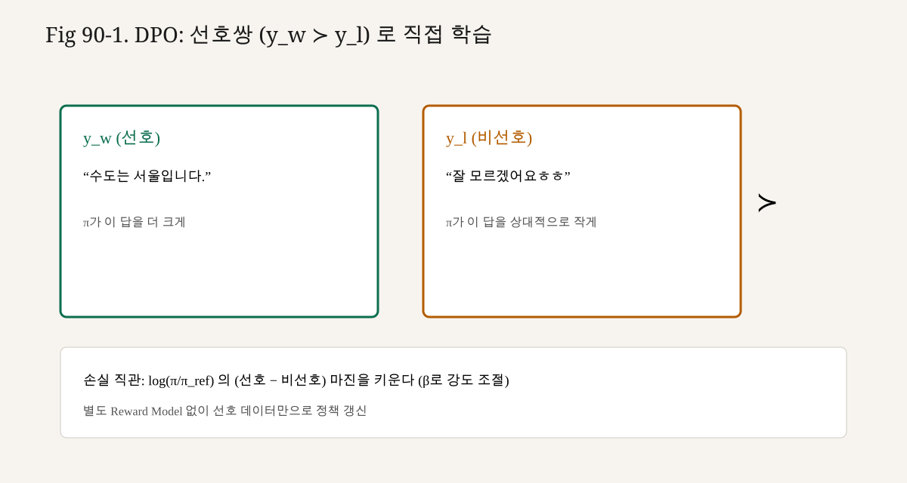

# 90강. DPO — Preference를 직접 학습하기
## 이번 강에서 배우는 내용

- Bradley–Terry 선호 모델과 RM의 관계
- KL-제약 보상 최대화의 최적 $\pi^\star$
- DPO 손실이 어떻게 RM을 소거하는지
- $\beta$, chosen/rejected 로그확률의 역할
- DPO가 “RL이 아니다/맞다” 논쟁을 어떻게 이해하면 좋은지
- PPO 파이프라인 대비 장단점

## 왜 중요한가?
실무에서 RLHF 전체가 부담일 때, 팀이 자주 고르는 대안이 DPO(및 그 변형)다.

```text
Preference pairs (x, y_w, y_l)
        │
        ▼
   π_θ, π_ref 만으로 loss
        │
        ▼
   정책 직접 업데이트
```

장점(전형적 주장):

1. 별도 Reward Model 학습·서빙이 없다.
2. PPO의 online 샘플링·value head가 없다.
3. 구현 표면이 SFT에 가깝다(오프라인 배치).

한계도 분명하다.

1. 선호 데이터 분포 밖 탐색이 약하다(오프라인).
2. $\beta$·참조 품질에 민감할 수 있다.
3. “RM이 없다”≠“보상 개념이 없다”. 암묵적 보상이 식에 남아 있다.

90강은 **유도의 뼈대**다. 91강에서 PyTorch로 같은 식을 구현한다.

## 선수 개념
- Preference dataset: $y_w\succ y_l\mid x$ (84강)
- Reward Model과 Bradley–Terry (85강)
- $\mathrm{KL}(\pi\Vert\pi_{\mathrm{ref}})$와 $\beta$ (89강)
- 시퀀스 로그확률 $\log\pi(y\mid x)$
- Logistic / softplus / $\sigma(z)=1/(1+e^{-z})$

## 핵심 개념
### 3.1 선호 확률 (Bradley–Terry)

사람(또는 심판 모델)이 $y_1$을 $y_2$보다 선호할 확률을 보상 차로 모델링한다.

$$

p^\star(y_1\succ y_2\mid x)=\sigma\big(r^\star(x,y_1)-r^\star(x,y_2)\big)

$$

여기서 $r^\star$는 “진짜” 보상(관측 불가). RM은 $r_\phi\approx r^\star$를 학습하고, RLHF는 $r_\phi$로 정책을 올린다.

DPO의 출발점: **같은 BT 모델**을 유지한 채, $r^\star$를 정책 비율로 바꿔 쓴다.

### 3.2 KL-제약 RL 목표

정책 목표를 다시 쓴다.

$$

\max_{\pi}\;\mathbb{E}_{x\sim\mathcal{D},\,y\sim\pi}\big[r(x,y)\big]
-\beta\,\mathrm{KL}\big(\pi(\cdot\mid x)\Vert\pi_{\mathrm{ref}}(\cdot\mid x)\big)

$$

이 목표의 최적해는 (적절한 조건 아래) 다음 형태다.

$$

\pi_r(y\mid x)=\frac{1}{Z(x)}\,\pi_{\mathrm{ref}}(y\mid x)\,\exp\left(\frac{1}{\beta}r(x,y)\right)

$$

$Z(x)$는 파티션 함수다. 직관:

- 참조 정책을 prior처럼 두고
- 보상이 큰 $y$의 확률을 $\exp(r/\beta)$로 불린다
- $\beta$가 크면 prior에 가깝고, 작으면 보상에 민감하다

### 3.3 보상을 정책으로 재매개

위 식을 $r$에 대해 정리한다.

$$

r(x,y)=\beta\log\frac{\pi_r(y\mid x)}{\pi_{\mathrm{ref}}(y\mid x)}+\beta\log Z(x)

$$

보상 차:

$$

r(x,y_w)-r(x,y_l)
=\beta\log\frac{\pi_r(y_w\mid x)}{\pi_{\mathrm{ref}}(y_w\mid x)}
-\beta\log\frac{\pi_r(y_l\mid x)}{\pi_{\mathrm{ref}}(y_l\mid x)}

$$

$Z(x)$는 차에 소거된다. 이것이 DPO의 마법 지점이다.

### 3.4 선호 우도에 대입

BT에 넣으면

$$

p^\star(y_w\succ y_l\mid x)
=\sigma\left(
\beta\log\frac{\pi^\star(y_w\mid x)}{\pi_{\mathrm{ref}}(y_w\mid x)}
-\beta\log\frac{\pi^\star(y_l\mid x)}{\pi_{\mathrm{ref}}(y_l\mid x)}
\right)

$$

관측된 선호 데이터에 대해 $\pi^\star$ 자리에 $\pi_\theta$를 넣고 **음의 로그우도**를 최소화한다.

$$

\mathcal{L}_{\mathrm{DPO}}(\theta)
=-\mathbb{E}_{(x,y_w,y_l)}\left[
\log\sigma\left(
\beta\log\frac{\pi_\theta(y_w\mid x)}{\pi_{\mathrm{ref}}(y_w\mid x)}
-\beta\log\frac{\pi_\theta(y_l\mid x)}{\pi_{\mathrm{ref}}(y_l\mid x)}
\right)
\right]

$$

한 줄 요약:

> chosen의 $\log(\pi/\pi_{\mathrm{ref}})$를 올리고, rejected의 그것을 내려, 그 차이가 $\beta$ 스케일로 sigmoid 안에 들어가게 한다.

### 3.5 암묵적 보상

DPO는 RM 네트워크를 안 두지만, 암묵 보상

$$

\hat r_\theta(x,y)=\beta\log\frac{\pi_\theta(y\mid x)}{\pi_{\mathrm{ref}}(y\mid x)}

$$

를 쓰는 것과 같다. “RM 없음”은 **별도 파라미터화된 RM이 없다**는 뜻이지, 보상 가설이 사라졌다는 뜻이 아니다.

### 3.6 $\beta$의 역할 (89강과 동일한 정신)

| $\beta$ | 효과 |
|---|---|
| 너무 작음 | 선호 차에 과민. $\pi_{\mathrm{ref}}$에서 급격히 이탈 |
| 적절 | chosen/rejected 로그비를 안정적으로 벌림 |
| 너무 큼 | 업데이트가 미미. SFT에 거의 머무름 |

DPO의 $\beta$는 89강의 KL 계수와 **같은 기호·같은 역할**에서 출발한다. 다만 최적화 경로(오프라인 NLL vs online PPO)가 달라 체감 튜닝 범위는 다를 수 있다.

## 직관적으로 이해하기
### 4.1 “승자를 더 말하게, 패자를 덜 말하게”

SFT는 정답 하나 $y^\star$의 가능도만 올린다. DPO는 **상대**다.

```text
같은 프롬프트 x
  y_w (chosen)  : π 상대 로그비 ↑
  y_l (rejected): π 상대 로그비 ↓
```

절대 가능도만 보면 둘 다 내려가거나 둘 다 올라갈 수도 있다. 중요한 것은 **차이**다. 실무에서 chosen NLL이 조금 나빠져도 margin이 커지면 선호 정렬에는 이득일 수 있다(모니터링은 둘 다).

### 4.2 왜 $\pi_{\mathrm{ref}}$로 나누나?

$\log\pi_\theta(y_w)-\log\pi_\theta(y_l)$만 쓰면, 길이·난이도 편향이 커지고 KL 닻이 사라진다. $\pi_{\mathrm{ref}}$로 정규화하면:

1. 89강의 KL-제약 최적성과 연결된다.
2. “원래 잘하던/못하던 정도”를 기준으로 **상대 변화**를 본다.

### 4.3 Online RL과의 감각 차이

| | PPO RLHF | DPO |
|---|---|---|
| 데이터 | 정책이 새로 샘플 | 고정 선호 쌍 |
| 보상 | 명시 RM | 암묵 $\hat r_\theta$ |
| KL | 보상/손실에 명시 | 손실 유도에 내장 |
| 가치 함수 | 보통 필요 | 없음 |
| 탐색 | 있음 | 약함(오프라인) |

DPO를 “RL을 수학적으로 우회한 선호 학습”으로 이해하면 실무 대화가 편하다. 연구 문헌에서는 occupancy·오프라인 RL 관점의 해석도 있다. **정의 논쟁보다 식과 가정이 무엇인지**가 중요하다.

## 작은 숫자 예제
한 샘플만 본다. 길이가 같다고 가정하고 시퀀스 로그확률(자연로그)이 다음과 같다.

| | $\log\pi_\theta$ | $\log\pi_{\mathrm{ref}}$ | $\log(\pi_\theta/\pi_{\mathrm{ref}})$ |
|---|---:|---:|---:|
| $y_w$ | -2.0 | -2.5 | +0.5 |
| $y_l$ | -2.2 | -1.8 | -0.4 |

$\beta=0.1$이면 sigmoid 인자

$$

z=\beta\big(0.5-(-0.4)\big)=0.1\times 0.9=0.09

$$

$$

\sigma(z)\approx 0.5225,\quad
\mathcal{L}=-\log\sigma(z)\approx 0.649

$$

아직 margin이 작다. 학습이 $y_w$의 상대 로그비를 더 올리고 $y_l$을 더 내린다고 가정해 margin이 $0.9\to 2.0$이 되면

$$

z=0.1\times 2.0=0.2,\quad
\sigma\approx 0.5498,\quad
\mathcal{L}\approx 0.598

$$

손실이 줄었다.

$\beta=1.0$이면 처음 margin $0.9$에서 $z=0.9$, $\sigma\approx0.710$, $\mathcal{L}\approx0.342$. 같은 로그비라도 $\beta$가 손실 곡면의 **온도**를 바꾼다.

거부 응답만 과하게 내려가는 경우:

- $\Delta_w=0.1$, $\Delta_l=-2.0$ → margin $2.1$ (좋아 보임)
- 그런데 chosen 품질이 같이 망가질 수 있다 → **chosen reward/NLL 모니터링**이 필요

## 그래디언트 스케치
$z=\beta\big(\Delta_w-\Delta_l\big)$, $\Delta=\log\pi_\theta-\log\pi_{\mathrm{ref}}$라 하면

$$

\mathcal{L}=-\log\sigma(z)

$$

$$

\frac{\partial\mathcal{L}}{\partial z}=-(1-\sigma(z))=-\sigma(-z)

$$

정책 로그확률로 전달되면, 대략

- $y_w$ 토큰: 가중치 $\beta\,\sigma(-z)$만큼 **증가** 방향
- $y_l$ 토큰: 같은 가중치만큼 **감소** 방향

$\sigma(-z)$는 “아직 선호를 못 맞춘 정도”다. 이미 $z$가 크면 가중치가 줄어 **쉬운 쌍에 과적합하는 압력**이 완화된다. (이것이 DPO 논문이 강조하는 가중 해석의 골자며, 세부는 91강 코드와 함께 본다.)

## 데이터와 실무 체크
1. **쌍의 품질**: $y_w$와 $y_l$이 너무 비슷하면 신호가 약하다. 너무 뻔하면 학습이 얕다.
2. **길이 편향**: 긴 쪽을 항상 선호한 데이터면 정책이 장황해질 수 있다.
3. **참조 모델**: 보통 SFT 체크포인트. DPO 정책의 초기값도 같은 SFT인 경우가 많다.
4. **평가**: preference accuracy, RM 점수(별도), 지시 추종 벤치, KL(또는 $\Delta\log p$)를 함께 본다.

## 변형이 많다는 사실 고지
DPO 이후 IPO, KTO, ORPO, SimPO, online DPO 등 변형이 빠르게 늘었다. 손실 형태·정규화·참조 사용 여부가 다르다.

이 책의 90~91강은 **원형 DPO 손실**을 고정 레퍼런스로 둔다. 최신 논문 수치·승패는 시대에 따라 바뀐다. **유도 가정(BT + KL-제약 최적 정책)** 을 기준으로 변형을 읽으면 덜 흔들린다.

## 유도 복습 — 칠판 한 장
기호를 다시 한 번만 정리한다.

1. 목표: $\max_\pi \mathbb{E}[r]-\beta\mathrm{KL}(\pi\Vert\pi_{\mathrm{ref}})$
2. 최적: $\pi_r(y\mid x)\propto \pi_{\mathrm{ref}}(y\mid x)\,e^{r(x,y)/\beta}$
3. 역산: $r(x,y)=\beta\log\frac{\pi_r}{\pi_{\mathrm{ref}}}+\beta\log Z(x)$
4. 차: $r_w-r_l=\beta(\Delta_w-\Delta_l)$ （$Z$ 소거）
5. BT: $p(y_w\succ y_l)=\sigma(r_w-r_l)$
6. NLL: $\mathcal{L}=-\log\sigma\big(\beta(\Delta_w-\Delta_l)\big)$

이 여섯 줄만 외우면 90강의 뼈대는 충분하다. 세부 regularity 조건·존재성 증명은 원논문 부록에 맡긴다.

## 길이·정규화·평균 로그확률
실무에서 자주 묻는 변형:

$$

\Delta^{\mathrm{avg}}(y)=\frac{1}{|y|}\big(\log\pi_\theta(y)-\log\pi_{\mathrm{ref}}(y)\big)

$$

합 대신 평균을 쓰면 긴 chosen이 유리/불리해지는 정도가 바뀐다.  
원형 DPO 식은 **시퀀스 joint logprob(합)** 을 쓰는 서술이 많다. 길이 편향이 관측되면:

1. 데이터에서 길이 매칭
2. 평균 로그확률 변형
3. 별도 길이 페널티

중 무엇을 쓸지는 실험으로 고른다. “평균이 항상 정답”은 아니다.

## 두 번째 숫자 예 — 배치 평균 손실
세 샘플의 margin $m=\Delta_w-\Delta_l$이 $0.5,\;0.0,\;-0.5$이고 $\beta=1$이면

$$

z\in\{0.5,0,-0.5\},\quad
\sigma(z)\approx\{0.622,0.500,0.378\}

$$

$$

\ell=-\log\sigma(z)\approx\{0.474,0.693,0.974\}

$$

배치 평균 loss $\approx 0.714$.  
세 번째 샘플(아직 rejected가 더 높은 암묵 보상)이 평균을 끌어올린다. 학습은 그 샘플에 더 큰 $\sigma(-z)$ 가중치를 준다.

## SFT 초기화와의 관계
보통 $\pi_\theta\leftarrow\pi_{\mathrm{SFT}}$, $\pi_{\mathrm{ref}}\leftarrow\pi_{\mathrm{SFT}}$(freeze)로 시작한다. 학습 초기에 $\Delta\approx 0$이므로

$$

z\approx 0,\quad\mathcal{L}\approx\log 2\approx 0.693

$$

이 값이 “출발선”이다. loss가 0.69에서 전혀 안 움직이면 마스크·부호·학습률을 의심한다.  
너무 빨리 0.1 아래로 떨어지면 과적합·모드 붕괴를 의심하고 margin·평가 생성 결과를 본다.

## Online DPO·반복 DPO (개념만)
고정 쌍만 쓰면 정책이 데이터 밖으로 나가기 어렵다. 변형으로

- 현재 $\pi$에서 응답을 생성해 심판(RM/인간)에게 순위를 묻고
- 새 쌍으로 DPO를 반복

하는 **online / iterative** 절차가 있다. 비용은 RLHF에 가까워진다.  
이 책 91강 코드는 offline 원형을 다룬다. 이름에 DPO가 들어 있어도 **데이터 수집 루프가 online인지**를 먼저 확인한다.

## 한계를 수식으로 느끼기
DPO 그래디언트는 관측된 $(y_w,y_l)$ 지지 위에서만 직접 움직인다.  
정책이 새 응답 $y_{\mathrm{new}}$를 탐험해도, 그 응답이 어떤 쌍에도 없으면 **그 방향의 선호 신호는 없다**.  
PPO/GRPO는 $y_{\mathrm{new}}$에 RM/verifier 점수를 바로 붙일 수 있다. 이것이 “DPO가 가볍다”와 “탐색이 약할 수 있다”가 동시에 참인 이유다.

## FAQ
**Q. Reward Model이 완전히 사라지나?**  
A. 학습 루프에서는 안 써도 된다. 평가·데이터 제작에는 여전히 RM·인간이 등장할 수 있다.

**Q. $\beta$를 1로 두면 되나?**  
A. 모델 크기·데이터·로그확률 스케일에 따라 다르다. 0.1 전후를 출발점으로 두고 margin·KL 감각을 본다. 절대 만능값은 없다.

**Q. chosen NLL이 오르면 실패인가?**  
A. 상대 margin이 개선되는 중일 수 있다. 다만 절대 품질 붕괴일 수도 있으니 generate 평가를 병행한다.

**Q. ORPO/KTO와 뭐가 다르나?**  
A. 참조 사용·손실 형태·필요 데이터(쌍 vs 단일)가 다르다. 90강 원형 식을 기준으로 “무엇이 빠지고 무엇이 대체됐는지”를 대조한다.

## 16b. 암묵 보상 곡선 읽기

학습 중 다음 네 스칼라를 같이 그린다.

1. $\mathbb{E}[\Delta_w]=\mathbb{E}[\log\pi_\theta(y_w)-\log\pi_{\mathrm{ref}}(y_w)]$
2. $\mathbb{E}[\Delta_l]$
3. margin $=\mathbb{E}[\Delta_w-\Delta_l]$
4. pair accuracy $=\mathbb{E}[\mathbf{1}\{z>0\}]$

이상적 패턴(설명용):

```text
margin ↑
pair acc ↑ (0.5 → 0.7+)
Δ_w 는 완만히 ↑ 또는 유지
Δ_l 은 ↓
KL(π||π_ref) 는 예산 안
```

위험 패턴:

- margin↑인데 generate 품질↓ → 데이터 노이즈·길이 해킹
- pair acc≈1, KL 폭주 → β 너무 작음 / lr 과다
- 모든 Δ가 크게 음수 → 정책이 참조에서 무너지며 상대만 맞춤

## 16c. Bradley–Terry가 깨질 때

BT는 전이성·쌍별 독립을 가정하는 단순 모델이다. 실제 선호에는

- 심판 불일치
- 문맥 의존(같은 쌍이라도 사용자마다 다름)
- 비전이적 사이클 ($A\succ B\succ C\succ A$)

이 있다. DPO는 그 가정 위에서 우도를 최대화할 뿐이므로, **데이터 정합**이 알고리즘보다 먼저다. 84~85강의 데이터 품질 이야기가 여기로 이어진다.

## 16d. 제88강·제89강과의 삼각 관계

```text
88 PPO: online, 명시 r, clip, (value)
89 KL:  r_total = r - β KL(π||π_ref)
90 DPO: 같은 KL-제약 최적성을 선호 NLL로 재매개
```

한 문장:

> DPO는 “PPO를 안 돌린다”가 핵심이 아니라, **KL-제약 보상 최대화의 해를 선호 손실로 직접 맞춘다**가 핵심이다.

## 16e. 한 줄 체크리스트 (90강 종료 조건)

이 강의를 닫기 전에 다음을 빈칸 없이 말할 수 있어야 한다.

1. BT: $p(y_w\succ y_l)=\sigma(r_w-r_l)$
2. 최적 정책: $\pi_r\propto\pi_{\mathrm{ref}}e^{r/\beta}$
3. 암묵 보상: $r=\beta\log(\pi/\pi_{\mathrm{ref}})+\beta\log Z$
4. 손실: $-\log\sigma\big(\beta(\Delta_w-\Delta_l)\big)$
5. $\beta$↑ → 참조에 붙음 / $\beta$↓ → 선호에 민감
6. 오프라인이라 탐색은 PPO/GRPO보다 약할 수 있음


<!-- visual-example-90 -->
## 숫자로 따라가기 — DPO 선호쌍



같은 질문 $x$에 대해 사람이 $y_w \succ y_l$을 골랐다고 합시다.

직관적 목표: 참조 모델 $\pi_{\mathrm{ref}}$ 대비

$$
\log\frac{\pi(y_w\mid x)}{\pi_{\mathrm{ref}}(y_w\mid x)}
\;\gt\;
\log\frac{\pi(y_l\mid x)}{\pi_{\mathrm{ref}}(y_l\mid x)}
$$

마진이 클수록 손실이 작아집니다. $\beta$가 크면 참조에서 덜 벗어나려 하고, 작으면 선호를 더 따릅니다.

## LLM에서는 어디에 사용될까?

이번 90강에서 배운 개념은 이후 Transformer · GPT · 서빙 강의에서 반복해서 등장합니다. 각 수식·코드 블록을 “실제 모델의 어느 단계인가”와 연결해 다시 읽어 보세요.

## 핵심 요약
- DPO는 KL-제약 보상 최대화의 최적 정책을 선호 우도에 대입해, RM·PPO 없이 $\pi_\theta$를 학습한다.
- 손실은 chosen/rejected의 $\beta\big(\log\frac{\pi}{\pi_{\mathrm{ref}}}\big)$ 차를 sigmoid에 넣는 NLL이다.
- $\beta$는 89강과 같은 “참조로부터의 이탈” 온도다.
- 암묵 보상 $\beta\log(\pi/\pi_{\mathrm{ref}})$가 RM 역할을 대체한다.
- 오프라인 선호 학습이므로 탐색·분포 이동에는 PPO식 online RL이 유리할 수 있다.
- 세부 식·정규화는 구현/논문마다 다르다. 원형 식을 먼저 체득한다.

## 용어 사전
| 용어 | 한 줄 의미 |
|---|---|
| DPO | 선호 쌍으로 정책을 직접 최적화하는 손실 |
| chosen / rejected | $y_w$ / $y_l$ |
| Bradley–Terry | 보상 차로 선호 확률을 $\sigma(\Delta r)$로 모델링 |
| 암묵 보상 | $\beta\log(\pi_\theta/\pi_{\mathrm{ref}})$ |
| $\beta$ | KL 강도·손실 온도 |
| 파티션 $Z(x)$ | 최적 정책 정규화 상수(보상 차에서 소거) |
| margin | $\Delta_w-\Delta_l$ |
| iterative DPO | 새 샘플로 쌍을 갱신하며 반복하는 절차 |

## 연습문제
### 문제 1（유도）

$r=\beta\log(\pi_r/\pi_{\mathrm{ref}})+\beta\log Z(x)$에서 $r(x,y_w)-r(x,y_l)$을 전개해 $Z$가 사라짐을 보이시오.

### 문제 2（계산）

$\Delta_w=1.0$, $\Delta_l=-0.5$, $\beta=0.2$일 때 $z$와 $\sigma(z)$(소수 셋째 자리)를 구하시오.

### 문제 3（개념）

DPO에서 $\pi_{\mathrm{ref}}$를 $\pi_\theta$와 **동일한 살아 있는 가중치**로 두면 어떤 문제가 생기는가?

### 문제 4（비교）

PPO RLHF 대비 DPO의 대표 장점 하나와 단점 하나를 쓰시오.

### 문제 5（연결）

제89강의 $r-\beta\mathrm{KL}$과 이번 DPO 손실의 관계를 한 문장으로. 제91강에서 코드로 확인할 핵심 텐서 두 개는?

### 문제 6（초기값）

$\pi_\theta=\pi_{\mathrm{ref}}$이고 배치 margin이 전부 0일 때 평균 DPO loss는 약 얼마인가?

### 문제 7（탐색）

오프라인 DPO가 새 응답 $y_{\mathrm{new}}$에 대해 직접 선호 신호를 주지 못하는 이유를 한 문장으로.

---

## 정답 및 해설
### 문제 1

$$

r_w-r_l
=\beta\log\frac{\pi_r(y_w)}{\pi_{\mathrm{ref}}(y_w)}+\beta\log Z
-\beta\log\frac{\pi_r(y_l)}{\pi_{\mathrm{ref}}(y_l)}-\beta\log Z
=\beta\left(\Delta_w-\Delta_l\right)

$$

### 문제 2

$z=0.2\times(1.0-(-0.5))=0.3$, $\sigma(0.3)\approx 0.574$.

### 문제 3

$\log(\pi/\pi_{\mathrm{ref}})\approx 0$이 되어 신호가 사라지고, KL 닻이 함께 움직여 제약이 붕괴한다. 참조는 고정 복사본이어야 한다.

### 문제 4

장점 예: 별도 RM·PPO 루프 없이 구현이 단순.  
단점 예: 고정 데이터에 묶여 online 탐색이 약함.

### 문제 5

DPO는 KL-제약 RL의 최적 정책을 BT 선호 우도로 재매개한 것이다.  
91강에서 확인할 텐서: chosen/rejected의 `logp_π - logp_ref` (또는 그 $\beta$ 배 차).

### 문제 6

$\log 2\approx 0.693$.

### 문제 7

그래디언트가 관측된 선호 쌍의 지지 위에서 정의되어, 쌍에 없는 $y_{\mathrm{new}}$에는 직접적인 선호 항이 없기 때문이다.

## 다음 강의와 연결
이론은 Sufficiency까지 왔다.  
다음 **제91강. DPO 구현**에서는 장난감 배치로 로그확률을 모으고, `F.logsigmoid`로 $\mathcal{L}_{\mathrm{DPO}}$를 직접 구현한 뒤, 최소 학습 루프 스케치를 붙인다.

> 식이 한 줄로 줄었으면, 이제 그 한 줄을 텐서로 옮길 차례다.

<!-- LECTURE_NAV -->

---

### 강의 이동

- **이전 강:** [89강. KL Divergence의 역할](89강_KL_Divergence의_역할.md)
- **다음 강:** [91강. DPO 구현](91강_DPO_구현.md)

<!-- /LECTURE_NAV -->
