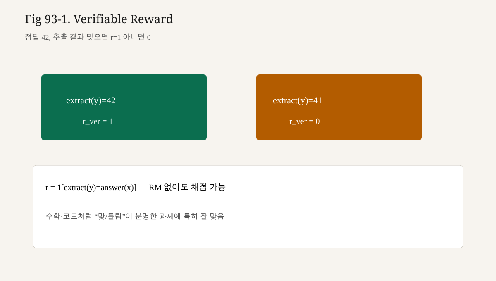

# 93강. RLVR과 Verifiable Reward
## 이번 강에서 배우는 내용

- 수학: 최종 답이 정답과 일치하는가
- 코드: 유닛테스트가 통과하는가
- 형식: JSON 스키마·체스 수 규칙·실행 트레이스 제약
- Verifiable reward의 정의와 RM과의 차이
- RLVR 파이프라인이 PPO/GRPO와 어떻게 맞물리는지
- Reasoning 모델 학습과의 연결(과정 vs 결과)

## 왜 중요한가?
Preference RM만으로는 부족해지는 지점이 있다.

1. 장문 추론에서 “말이 번지르르”해도 RM이 고점일 수 있다.
2. 수학·코딩은 **맞음/틀림**이 더 직접적인 목표다.
3. 검증기는 상대적으로 저렴하고 재현 가능하다(환경 구축 비용은 별개).

```text
문제 x
  → 모델이 풀이 y 생성 (장문 chain-of-thought 가능)
  → verifier(x, y) → r ∈ {0,1} 또는 부분 점수
  → PPO / GRPO / 기타 정책 경사로 π 업데이트
```

94강 Reasoning Training은 이 신호 위에서 “길게 생각하기”를 키우는 쪽을 다룬다. 93강은 **보상 쪽 정의**를 먼저 고정한다.

## 선수 개념
- Reward / Return (80강)
- RM 기반 RLHF (85~88강)
- KL 제약 (89강)
- GRPO 그룹 상대 (92강)
- 유닛테스트、결정적 체커의 일반 지식

## 핵심 개념
### 3.1 Verifiable Reward란?

**관측 가능한 규칙·실행·정답 대조**로 $r(x,y)$를 계산할 수 있는 보상이다.

| 유형 | 예 | 전형적 $r$ |
|---|---|---|
| Exact match | 수학 최종 답 | 0/1 |
| Execution | 코드 테스트 통과율 | 0~1 |
| Constraint | 스키마·금칙 토큰 | 0/1 또는 감점 |
| Formal | 증명 검사기 | 0/1 |

RM과의 대비:

| | Reward Model | Verifiable Reward |
|---|---|---|
| 출처 | 선호 데이터로 학습 | 규칙·실행 |
| 주관성 | 높음 | 낮음(과제 한에서) |
| 해킹 | 스타일·아첨 | 테스트 구멍·포맷 편법 |
| 적용 범위 | 개방 대화에 강함 | 검증 가능한 과제에 강함 |

둘은 배타가 아니다. 실무는 **형식 검증 + 품질 RM**을 합치기도 한다.

### 3.2 RLVR — 설명용 정의

이 책에서 RLVR은 다음을 가리킨다.

> Verifiable reward를 주 신호로 하여, (보통 online) 정책 경사·PPO·GRPO 등으로 LLM을 미세조정하는 학습 설정.

필수 요소:

1. **과제 분포** $x\sim\mathcal{D}$ (문제 은행)
2. **생성 정책** $\pi_\theta(y\mid x)$
3. **검증기** $v(x,y)\to r$
4. **RL 업데이트** (KL 닻을 포함하는 경우가 많음)

선호 쌍이 없어도 굴러갈 수 있다. 반대로 검증만으로 **문체·안전·거절 규칙**까지 커버하진 못한다.

### 3.3 결과 보상 vs 과정 보상

Verifiable reward는 대개 **결과(outcome)** 에 걸린다.

$$

r=\mathbf{1}[\mathrm{extract}(y)=\mathrm{answer}(x)]

$$

모델은 긴 추론 $y$를 쓸 수 있지만, 점수 자체는 최종 추출 답에만 의존할 수 있다. 그 결과:

- 맞는 답을 내는 **다양한 사고 경로**가 강화될 수 있다
- 동시에, 틀린 추론 후 운 좋게 정답을 적은 경로도 강화될 수 있다

과정(process) 보상 — 단계별 검증 — 은 매력적이지만 비용·설계가 어렵다. 연구 중 영역으로 남겨 두고, 기본선은 outcome verifier로 둔다.

### 3.4 GRPO와의 결합 (92강 연결)

이진 보상이면 같은 $x$에 $G$개 샘플을 뽑았을 때,

- 전원 오답: 신호 약함
- 전원 정답: 신호 약함
- **혼합**: 정답 응답에 양의 상대 advantage

난이도가 적절한 문제 은행 + 충분한 $G$가 RLVR+GRPO의 실무 레버다.

PPO+value도 가능하나, 희소 0/1 보상에서 value 학습이 어려울 수 있어 상대 그룹 baseline이 자주 거론된다. **항상 우위라고 단정하지 않는다.**

### 3.5 KL은 여전히 필요한가?

검증기가 “정답만 보면” 모델이

- 읽기 힘든 기호 나열
- 테스트만 통과하는 최소 코드
- 프롬프트 유출형 숏컷

으로 도망갈 수 있다. SFT 참조로의 KL(89강) 또는 형식 제약 보상은 **언어·형식 닻**으로 여전히 쓰인다. RLVR이 KL을 폐기한다는 뜻이 아니다.

## 직관적으로 이해하기
### 4.1 “심판을 신경망에서 실행기로”

RM은 미식 심사위원이다. Verifier는 스톱워치·골라인이다. 주관 경기와 기록 경기의 차이다. LLM post-training은 두 경기를 **종목별로** 섞는다.

### 4.2 희소 보상

긴 $y$ 끝에 0/1 하나면 크레딧 할당이 어렵다. 그럼에도 LLM에서는

- 사전학습·SFT가 이미 “풀이 형식”을 알고 있고
- 샘플을 많이 뽑을 수 있어

희소 신호로도 개선이 관측되는 설정이 많다. 이는 **현상에 대한 설명**이며, 모든 과제에서 보장되지 않는다.

### 4.3 Reward hacking의 새 얼굴

| RM 해킹 | Verifier 해킹 |
|---|---|
| 아첨、장황、안전 구호 | 테스트 케이스 과적합 |
| 평가자 편향 이용 | 정답만 하드코딩 |
| 스타일 점수 농락 | 파서 허점으로 거짓 통과 |

검증 가능하다고 해서 해킹 불가는 아니다. **테스트 스위트의 질**이 곧 보상 모델의 질이다.

## 작은 숫자·시나리오 예제
문제: “$17\times 19$?” 정답 323.

네 샘플과 검증기:

| $y$ 요약 | 추출 답 | $r$ |
|---|---:|---:|
| 올바른 전개 | 323 | 1 |
| 산수 실수 | 321 | 0 |
| 장황하지만 정답 | 323 | 1 |
| 수식만 나열, 답 없음 | — | 0 |

$G=4$, $\bar r=0.5$ → 상대 신호는 정답 두 개에 양의 무게.  
장황 정답과 간결 정답이 **같은 $r$** 이면, 길이 선호은 다른 항(길이 페널티、참조 KL、별도 스타일 RM)이 담당한다.

코드 예: 테스트 3개 중 2개 통과 → $r=2/3$. 부분 점수는 학습을 부드럽게 하지만, “거의 맞은 버그”를 남길 수 있다. 0/1 pass@all과 trade-off다.

## 최소 파이프라인 스케치
```text
1. SFT 모델 (풀이 형식·코드 블록 관례)
2. 문제 은행 D + verifier v
3. for x in batch:
     samples = [generate(π, x) for _ in range(G)]
     rewards = [v(x, y) for y in samples]
4. GRPO/PPO update with KL to π_ref
5. Eval: pass@k, exact match, 오염되지 않은 holdout
```

의사 검증기:

```python
def math_reward(problem, completion, gold):
    pred = extract_final_answer(completion)  # 과제별 파서
    return 1.0 if pred == gold else 0.0

def code_reward(problem, completion, tests, timeout_s=2.0):
    fn = extract_code(completion)
    ok, total = run_unit_tests(fn, tests, timeout_s=timeout_s)
    return ok / max(total, 1)
```

`extract_*`와 `run_unit_tests`의 견고함이 실험의 성패를 가른다. 모델보다 **파서·샌드박스**에 먼저 시간을 쓰는 편이 낫다.

## Reasoning 모델과의 연결 (94강 예고)
Reasoning 학습의 한 줄 이야기:

```text
길게 생각해도 된다
  → 다만 마지막에 검증을 통과해야 한다
    → 통과한 장문 궤적이 강화된다
```

Verifiable reward는 “긴 CoT를 허용하는 채점 기준”이 되어, 모델이 **중간 계산을 외부화**하도록 유도할 수 있다.  
다만 보상이 결과만 보면, 중간이 허위여도 통과 궤적이 남을 수 있다. 평가 때는 답뿐 아니라 **홀드아웃·변형 문제·과정 검사 샘플**을 섞는다.

94강에서 훈련 목표·데이터·평가를 더 붙인다. 93강은 채점기 축만 책임진다.

## 언제 RM이고 언제 Verifier인가
| 상황 | 우선 신호 |
|---|---|
| 오픈엔드 글쓰기·대화 톤 | RM / preference (DPO 등) |
| 수학·코딩·도구 사용 | Verifier (±형식) |
| 안전·정책 준수 | 분류기·규칙+선호 (복합) |
| 혼합 어시스턴트 | 라우팅 또는 가중합 |

가중합 예:

$$

r=\lambda_{\mathrm{ver}}r_{\mathrm{ver}}+\lambda_{\mathrm{rm}}r_{\mathrm{rm}}-\beta\,\mathrm{KL}

$$

가중치는 과제 제품 요구에 따른다. 숫자를 이 책이 규정하지 않는다.

## 한계와 논쟁 (유동적 연구)
다음을 **현재 설명**으로 적는다. 결론은 바뀔 수 있다.

1. Verifier가 있는 영역에서만 RLVR이 빛난다. 일반 대화 전부 대체가 아니다.
2. pass@k 개선이 곧 “이해”인지는 철학·평가 설계 문제다.
3. 데이터 오염(테스트 문제 누출)이 숫자를 부풀릴 수 있다.
4. 샌드박스 보안·결정성·타임아웃 정책이 재현성에 큰 영향을 준다.
5. 용어 RLVR·outcome RL·verifier RL이 혼용된다. 논문을 읽을 때 **보상이 어떻게 계산되는지**를 먼저 본다.

## 파서·샌드박스 실무 메모
검증기의 품질은 모델보다 **인프라**에 더 의존하는 경우가 많다.

수학 파서:

- `\boxed{323}`, `최종 답: 323`, `#### 323` 등 다중 포맷
- 분수·소수·단위 정규화 (`1/2` vs `0.5`)
- 복수 정답 허용 여부

코드 샌드박스:

- CPU/메모리/시간 쿼터
- 네트워크 차단
- 비결정적 테스트 금지
- 표준 라이브러리만 허용할지 정책

파서가 정답을 못 읽으면 모델이 맞아도 $r=0$이 되어 **거짓 음성**이 쌓인다. RL 전에 verifier 자체의 단위 테스트가 필요하다.

## Curriculum — 쉬운 문제부터
이진 보상에서는 초기에 전부 0이면 학습이 멈춘다. 커리큘럼 예:

```text
Stage A: 짧은 산술 · 단일 테스트
Stage B: 다단계 추론 · 테스트 3~5개
Stage C: 경진대회형 · 숨은 테스트
```

각 stage에서 pass율이 일정 수준을 넘기면 올린다. SFT 힌트 데이터(풀이 예시)를 소량 섞는 방법도 있다.

## 평가 프로토콜
학습 보상과 **다른** 문제로 평가한다.

| 지표 | 의미 |
|---|---|
| exact match / pass@1 | 한 번 시도 성공률 |
| pass@k | $k$번 중 적어도 하나 성공 |
| maj@k | $k$개 중 다수결 |
| format rate | 파서가 답을 추출한 비율 |
| KL / length | 부작용 모니터 |

pass@k만 올리고 format이 무너지면 서빙에 실패한다. 지표를 묶어서 본다.

## 안전·정책과의 경계
Verifier는 "맞음"을 말하지만 "해야 하는가"를 말하지 않는다.  
유해 요청에 정답 코드를 생성하는 정책을 RLVR만으로 막을 수 없다. 안전 분류기·거절 SFT·선호 데이터가 별도로 필요하다(96강).

## FAQ
**Q. 모든 LLM 정렬을 RLVR로 통일할 수 있나?**  
A. 아니다. 검증 가능한 종목에 강하다.

**Q. 과정 보상이 더 좋지 않나?**  
A. 원리적으로 매력적이나 비용·주석 품질이 병목이다. 기본선은 outcome이다.

**Q. RM과 verifier를 동시에 쓰면?**  
A. 가중합·다단계 필터가 가능하다. 가중 튜닝이 새 하이퍼파라미터가 된다.

**Q. GRPO 없이 PPO+verifier만으로도 RLVR인가?**  
A. 이 책의 설명용 정의에서는 그렇다. 핵심은 보상의 출처다.

## 수학적으로 이해하기 — 목적과 그래디언트

### 5b.1 RLVR 목적（설명용）

$$

J(\theta)=\mathbb{E}_{x\sim\mathcal{D},\, y\sim\pi_\theta(\cdot\mid x)}\big[r_v(x,y)\big]
-\beta\,\mathbb{E}\big[\mathrm{KL}(\pi_\theta\Vert\pi_{\mathrm{ref}})\big]

$$

$r_v$는 검증기 보상이다. KL 항은 89강과 같은 **언어 닻**이다.

### 5b.2 Policy Gradient 연결

제82강 골격 그대로:

$$

\nabla_\theta J \approx \mathbb{E}\big[\nabla_\theta\log\pi_\theta(y\mid x)\, \hat A(x,y)\big]

$$

이진 outcome이면 단순 MC는 $\hat A\approx r_v-\bar r$ 또는 GRPO 그룹 z-score다.

### 5b.3 Exact match 보상

추출 함수 $\mathrm{ex}(y)$, 정답 집합 $\mathcal{A}(x)$:

$$

r_v(x,y)=\mathbf{1}\big[\mathrm{ex}(y)\in\mathcal{A}(x)\big]
$$

포맷 실패 시 $\mathrm{ex}(y)=\bot$ → 보통 0.

### 5b.4 테스트 통과율

테스트 집합 $\mathcal{T}(x)=\{t_1,\ldots,t_m\}$:

$$

r_v(x,y)=\frac{1}{m}\sum_{j=1}^{m}\mathbf{1}\big[\mathrm{pass}(y,t_j)\big]
$$

또는 pass@all:

$$

r_v=\prod_{j=1}^{m}\mathbf{1}[\mathrm{pass}(y,t_j)]
$$

부분 점수 vs 전부 통과는 **탐색 밀도 vs 엄격성** 트레이드오프다.

### 5b.5 형식 제약 가산

$$

r = r_{\mathrm{task}} + \lambda_{\mathrm{fmt}} r_{\mathrm{fmt}} + \lambda_{\mathrm{len}} r_{\mathrm{len}}
$$

$r_{\mathrm{fmt}}\in\{0,1\}$, 길이 항은 상한 초과 시 음수 등. 가중치는 제품 요구에 따른다.

## 정량 스케치 — 그룹·희소 신호

### 6b.1 성공 확률과 그룹 혼합

프롬프트 $x$에서 현재 정책의 성공률을 $p$라 하자(설명용).  
$G$개 독립 샘플에서 “전부 0” 또는 “전부 1”이 아닐 확률:

$$

1-p^G-(1-p)^G
$$

이 값이 커야 GRPO 상대 신호가 **자주** 산다.

| $p$ | $G=4$ | $G=8$ |
|---:|---:|---:|
| 0.1 | $1-0.1^4-0.9^4\approx0.34$ | $\approx0.57$ |
| 0.5 | $1-2\cdot0.5^4=0.875$ | $0.992$ |
| 0.9 | $\approx0.34$ | $\approx0.57$ |

**해석:** 너무 쉽거나 너무 어려운 문제만 있으면 그룹 신호가 죽는다. 커리큘럼이 수학적으로도 필요하다.

### 6b.2 pass@k 스케치

동일 $p$ 가정(독립, 설명용):

$$

\mathrm{pass@}k = 1-(1-p)^k
$$

$p=0.2$, $k=5$ → $1-0.8^5\approx0.67$.  
**사실:** 실제 추정은 중복·비독립·평가 프로토콜에 민감하다. 식은 직관용이다.

### 6b.3 샘플 비용

배치 $B$, 그룹 $G$, 평균 생성 길이 $L$:

$$

N_{\mathrm{tokens}}\approx B\cdot G\cdot L
$$

verifier 비용이 토큰당이 아니라 **실행/파서당**이면,

$$

N_{\mathrm{verify}}\approx B\cdot G
$$

코드 샌드박스 한도가 $N_{\mathrm{verify}}$를 병목으로 만든다. GPU만 보고 계획을 세우지 말 것.

## Outcome vs Process — 수식 대비

Outcome:

$$

r=\mathbf{1}[\mathrm{final}(y)=\mathrm{gold}]
$$

Process(이상화):

$$

r=\sum_{s=1}^{S} w_s\cdot \mathbf{1}[\mathrm{step}_s\text{ valid}]
$$

또는 밀도 있는 부분 점수.  
과정 주석 비용이 $S$에 비례해 커지므로, 기본선은 outcome + 튼튼한 verifier다.

## 합성 보상과 KL — 한 줄 구현

```python
def total_reward(r_ver, r_fmt, kl_hat, lam_v=1.0, lam_f=0.2, beta=0.01):
    return lam_v * r_ver + lam_f * r_fmt - beta * kl_hat
```

$\hat{\mathrm{KL}}$ 추정은 89강. 부호·평균 위치를 팀 규약으로 고정한다.

## 파서 거짓음성 확률（사고실험）

모델이 맞출 확률 $p_{\mathrm{corr}}$, 파서가 정답을 인식할 확률 $p_{\mathrm{parse}}$(정답 조건부)라 하면, 관측 보상 기댓값 감각:

$$

\mathbb{E}[r]\approx p_{\mathrm{corr}}\cdot p_{\mathrm{parse}}
$$

$p_{\mathrm{parse}}=0.7$이면 진짜 실력의 30%가 **보상에서 사라진다**.  
RL 전에 verifier 단위 테스트로 $p_{\mathrm{parse}}$를 올리는 편이 모델 lr 튜닝보다 우선일 수 있다.

## 커리큘럼을 확률로 보기

스테이지 $s$의 목표: 배치에서 혼합 그룹 비율이 일정 이상이 되도록 $p$를 구간 $[p_{\min},p_{\max}]$에 둔다.

```text
너무 많은 전부0 → 문제 쉽게 / 온도↑ / G↑ / 힌트 SFT
너무 많은 전부1 → 문제 어렵게 / 숨은 테스트 / 온도↓
```

수치 목표는 과제마다 다르다. **로그에 frac_mixed_groups**를 남긴다.

## 평가 수식 — maj@k

$k$개 샘플의 추출 답 다수결:

$$

\hat a=\mathrm{mode}\{\mathrm{ex}(y_1),\ldots,\mathrm{ex}(y_k)\}
$$

$$

\mathrm{maj@}k=\mathbf{1}[\hat a\in\mathcal{A}(x)]
$$

pass@k와 달리 “한 번이라도”가 아니라 **합의**를 본다. 보고 시 두 지표를 섞어 쓰지 말 것.

## FAQ 보충

**Q. 보상을 0/1이 아니라 logits RM처럼 연속으로 만들면?**  
A. 가능하나 “verifiable”의 장점(재현·감사)이 약해질 수 있다. 규칙 점수를 세분화하는 편이 감사에 유리하다.

**Q. KL β=0이 가능한가?**  
A. 단기간 점수만 보면 오를 수 있으나 형식 붕괴·해킹 위험이 커진다. 모니터링 없이 0으로 두지 말 것.

**Q. 단위 테스트가 flaky하면?**  
A. 보상이 노이즈가 되어 advantage 분산이 폭발한다. 비결정 테스트를 먼저 제거한다.

## 체크리스트 — RLVR 실험 전

1. holdout 문제 분리
2. 파서 golden set 정확도
3. 샌드박스 쿼터·결정성
4. $G$, 온도, β 초기값 기록
5. frac_mixed_groups, pass@1, format rate 로그
6. 안전 필터가 필요한 과제인지 확인

<!-- visual-example-93 -->
## 숫자로 따라가기 — Verifiable Reward



문제 정답이 $42$일 때.

$$
r=\mathbf{1}[\mathrm{extract}(y)=\mathrm{answer}(x)]
$$

| 생성 답 | 추출 | $r$ |
|---|---|---|
| `... 답은 42` | 42 | 1 |
| `... 41` | 41 | 0 |
| 파서 실패 | — | 0 (보통) |

사람 RM 대신 **검증기로 0/1 보상**을 주는 것이 RLVR의 핵심입니다.

## LLM에서는 어디에 사용될까?

이번 93강에서 배운 개념은 이후 Transformer · GPT · 서빙 강의에서 반복해서 등장합니다. 각 수식·코드 블록을 “실제 모델의 어느 단계인가”와 연결해 다시 읽어 보세요.

## 핵심 요약
- Verifiable reward는 규칙·실행·정답 대조로 매기는 보상이다.
- RLVR은 그 신호를 주동력으로 정책을 올리는 학습 설정(설명용 총칭)이다.
- RM을 대체한다기보다, **검증 가능한 종목**에서 더 직접적인 목표를 제공한다.
- GRPO/PPO와 결합하기 좋고, 이진 보상에서는 그룹 혼합이 특히 중요하다.
- 해킹은 테스트 구멍으로 형태만 바뀐다. KL·형식·홀드아웃이 여전히 필요하다.
- 파서·샌드박스·커리큘럼이 실험의 성패를 가른다.
- Reasoning 모델 이야기의 채점기 축이 여기다. 다음은 94강.

## 용어 사전
| 용어 | 한 줄 의미 |
|---|---|
| Verifiable Reward | 자동 검증으로 계산하는 $r$ |
| RLVR | Verifiable reward 기반 RL 설정(총칭) |
| Outcome reward | 최종 결과만 채점 |
| Process reward | 중간 단계 채점(고비용) |
| Verifier / Checker | $v(x,y)$ 구현체 |
| pass@k | $k$번 시도 중 성공 확률 추정 |
| Sandbox | 코드 실행 격리 환경 |
| Curriculum | 쉬운 문제→어려운 문제 스케줄 |
| False negative reward | 맞았는데 파서 실패로 0점 |

## 연습문제
### 문제 1（개념）

RM 보상과 verifiable reward의 결정적 차이 한 가지는?

### 문제 2（설계）

유닛테스트가 2개뿐인 코딩 과제에서 RLVR을 돌릴 때 가장 먼저 보강할 것은?

### 문제 3（계산 감각）

$G=8$개 샘플이 모두 $r=0$이면 GRPO 상대 advantage는 대략 어떻게 되며, 실무에서 할 수 있는 대응 하나는?

### 문제 4（비교）

DPO만으로 수학 exact match를 올리는 것과 RLVR의 차이(데이터·탐색)를 한 문장으로.

### 문제 5（연결）

제94강 Reasoning Training으로 넘어갈 때, 이번 강의가 넘겨 주는 "채점 인터페이스"는 무엇인가? 제95강 프로젝트에서 이 인터페이스를 어떻게 쓸 수 있을까?

### 문제 6（인프라）

모델이 `\boxed{42}`로 맞게 썼는데 $r=0$이다. 어디를 먼저 의심하는가?

### 문제 7（평가）

학습 문제와 동일한 세트로만 pass@1을 보고하면 어떤 위험이 있는가?

---

## 정답 및 해설
### 문제 1

전자는 학습된 모델이 선호를 근사하고, 후자는 규칙·실행으로 **객관적으로(과제 한에서)** $r$를 계산한다.

### 문제 2

테스트 커버리지(경계값·실패 케이스)와 실행 샌드박스 견고성. 보상 구멍부터 막는다.

### 문제 3

advantage≈0으로 신호가 사라진다. 더 쉬운 커리큘럼, 샘플 수/온도 조절, 부분 점수, 힌트 SFT 등을 검토한다.

### 문제 4

DPO는 고정 선호 쌍에 묶인 오프라인 갱신이고, RLVR은 검증기로 online 샘플을 채점하며 새 궤적을 탐색할 수 있다.

### 문제 5

`verifier(x,y)→r` 인터페이스다. 95강에서는 작은 문제 은행+더미 체커로 GRPO/PPO 루프를 돌리는 실습의 보상 함수로 재사용한다.

### 문제 6

정답 추출 파서(포맷 미지원) 또는 정규화 규칙. 모델보다 verifier 버그를 먼저 본다.

### 문제 7

암기·오염으로 일반화 성능을 과대평가할 위험이 있다. holdout·변형 문제로 평가한다.

## 다음 강의와 연결
채점기가 준비되었다.  
다음 **제94강. Reasoning Training**에서는 긴 추론 궤적을 허용·장려하면서도 검증을 통과하게 만드는 학습 목표, 데이터, 평가(pass@k 등)를 다룬다. 92~93강이 엔진과 연료라면, 94강은 **운전 방식**에 가깝다.

> 검증 가능한 보상은 "맞았는가"를 말한다. Reasoning training은 그 위에서 "어떻게 생각해도 되는가"를 키운다.

<!-- LECTURE_NAV -->

---

### 강의 이동

- **이전 강:** [92강. GRPO](92강_GRPO.md)
- **다음 강:** [94강. Reasoning Training](94강_Reasoning_Training.md)

<!-- /LECTURE_NAV -->
